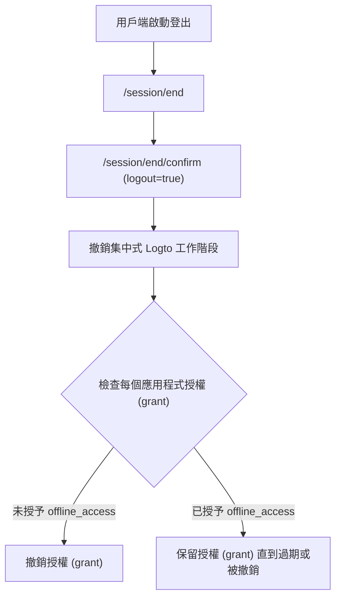

# 登出 (Sign-out)

Logto 的登出分為兩層：

- **Logto 工作階段登出**：結束 Logto 網域下的集中式登入工作階段。
- **應用程式登出**：清除用戶端應用程式中的本地工作階段狀態與權杖（tokens）。

想更深入瞭解 Logto 的工作階段運作方式，請參閱 [工作階段 (Sessions)](/sessions)。

## 登出機制 \{#sign-out-mechanisms}

### 1) 僅用戶端登出 \{#1-client-side-only-sign-out}

用戶端應用程式僅清除自身的本地工作階段與權杖（ID 權杖 (ID tokens) / 存取權杖 (Access tokens) / 重新整理權杖 (Refresh tokens)）。這只會讓使用者從該應用程式的本地狀態登出。

- Logto 工作階段可能仍然有效。
- 同一 Logto 工作階段下的其他應用程式仍可單一登入 (SSO)。

### 2) 在 Logto 結束工作階段（目前 Logto 實作為全域登出） \{#2-end-session-at-logto-global-sign-out-in-current-logto-implementation}

若要清除集中式 Logto 工作階段，應用程式需將使用者導向結束工作階段端點，例如：

`https://{your-logto-domain}/oidc/session/end`

目前 Logto SDK 行為如下：

1. `signOut()` 會導向 `/session/end`。
2. 接著進入 `/session/end/confirm`。
3. 預設確認表單會自動提交 `logout=true`。

因此，目前 SDK 的登出行為視為 **全域登出**。

:::note

- **全域登出**：撤銷集中式 Logto 工作階段。

:::

### 全域登出時會發生什麼事 \{#what-happens-during-global-sign-out}


```mermaid
flowchart TD
  A["用戶端啟動登出"] --> B["/session/end"]
  B --> C["/session/end/confirm (logout=true)"]
  C --> D["撤銷集中式 Logto 工作階段"]
  D --> E{"檢查每個應用程式授權 (grant)"}
  E -->|"未授予 offline_access"| F["撤銷授權 (grant)"]
  E -->|"已授予 offline_access"| G["保留授權 (grant) 直到過期或被撤銷"]
```

全域登出期間：

- 集中式 Logto 工作階段會被撤銷。
- 相關應用程式授權 (grant) 依各自授權狀態處理：
  - 若 **未**授予 `offline_access`，相關授權會被撤銷。
  - 若 **已**授予 `offline_access`，結束工作階段不會撤銷該授權。
- 若有 `offline_access`，重新整理權杖 (Refresh tokens) 與授權 (grant) 會持續有效，直到授權過期、重新整理權杖過期，或被明確撤銷為止。

## 授權 (grant) 存續時間與 `offline_access` 影響 \{#grant-lifetime-and-offline-access-impact}

- Logto 預設授權 (grant) 存續時間（TTL）為 **180 天**。
- 若授予 `offline_access`，結束工作階段預設不會撤銷該應用程式授權。
- 與該授權關聯的重新整理權杖 (Refresh token) 鏈可持續使用，直到授權過期、重新整理權杖過期，或授權被明確撤銷。
- 對於單頁應用程式（SPA），重新整理權杖輪替不會延長重新整理權杖 TTL，因此重新整理權杖可能會在授權過期前失效。

## 聯邦登出：後端通道登出 (back-channel logout) \{#federated-sign-out-back-channel-logout}

為確保跨應用程式一致性，Logto 支援 [後端通道登出 (back-channel logout)](https://openid.net/specs/openid-connect-backchannel-1_0-final.html)。

當使用者從某個應用程式登出時，Logto 會將登出權杖 (logout token) 發送至每個已註冊後端通道登出 URI 的應用程式，通知所有參與同一工作階段的應用程式。

若在應用程式後端通道設定中啟用「是否需要工作階段 (Is session required)」，則登出權杖會包含 `sid` 以識別 Logto 工作階段。

典型流程：

1. 使用者從某個應用程式啟動登出。
2. Logto 處理結束工作階段並將登出權杖發送至已註冊的後端通道登出 URI。
3. 各應用程式驗證登出權杖並清除自身本地工作階段 / 權杖。

## Logto SDK 的登出方法 \{#sign-out-methods-in-logto-sdks}

- **SPA 與網頁**：`client.signOut()` 會清除本地權杖儲存並導向 Logto 結束工作階段端點。你可以提供登出後導向的 URI。
- **原生（包含 React Native / Flutter）**：通常僅清除本地權杖儲存。無狀態 webview 意味著沒有持久性的 Logto 瀏覽器 cookie 可清除。

:::note
對於不支援無狀態 webview 或無法識別 `emphasized` 設定的原生應用程式（如使用 **React Native** 或 **Flutter** SDK 的 Android 應用程式），你可以在授權請求中傳遞 `prompt=login` 參數，強制使用者再次登入。
:::

## 強制每次存取都重新驗證 (Re-authentication) \{#enforce-re-authentication-on-every-access}

對於高安全性操作，在驗證請求中加入 `prompt=login`，可繞過單一登入 (SSO)，每次都強制輸入憑證。

若同時請求 `offline_access`（以取得重新整理權杖），也需加入 `consent`，即 `prompt=login consent`。

常見組合設定：

```txt
prompt=login consent
```

## 常見問題 \{#faqs}

<details>
  <summary>

### 我沒有收到後端通道登出通知 \{#im-not-receiving-the-back-channel-logout-notifications}

</summary>

- 請確認後端通道登出 URI 已正確註冊於 Logto 控制台。
- 請確認你的應用程式對同一使用者 / 工作階段上下文有有效登入狀態。

</details>

## 相關資源 \{#related-resources}

<Url href="https://blog.logto.io/oidc-back-channel-logout/">
  了解 OIDC 後端通道登出 (back-channel logout)。
</Url>
