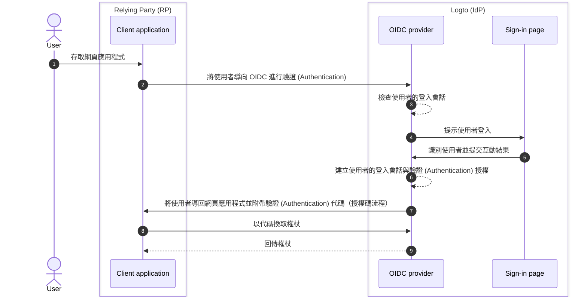

# 登出 (Sign-out)

在 Logto（作為基於 OIDC 的身分提供者）中，登出流程是一個多面向的概念，因為同時涉及由 Logto 管理的集中式登入會話，以及由用戶端應用程式管理的分散式驗證 (Authentication) 狀態。

## 登入會話 \{#sign-in-session}

為了更好地理解登出流程，首先需要了解 Logto 如何管理使用者的登入會話與其驗證 (Authentication) 狀態。



1. 使用者存取網頁應用程式（RP）。
2. 用戶端應用程式將使用者導向 Logto（IdP）進行[驗證 (Authentication)](https://auth.wiki/authentication)。
3. OIDC 提供者檢查使用者的登入會話狀態。若無會話或會話已過期，則提示使用者登入。
4. 使用者與登入頁面互動以完成驗證 (Authentication)。
5. 驗證 (Authentication) 成功後，Logto 為使用者建立新會話，並帶著授權碼導回用戶端應用程式。
6. OIDC 提供者為使用者建立新的登入會話與驗證 (Authentication) 授權。
7. OIDC 提供者將使用者導回用戶端並附帶驗證 (Authentication) 代碼（[授權碼流程 (Authorization Code flow)](https://auth.wiki/authorization-code-flow)）。
8. 用戶端收到驗證 (Authentication) 代碼並換取權杖以存取使用者資訊。
9. 將權杖授予用戶端應用程式。

## 組成元件 \{#components}

### 由 Logto 管理的集中式登入會話 \{#centralized-sign-in-session-managed-by-logto}

在上述流程中，集中式登入會話由 Logto 管理。當使用者成功登入時會建立會話，當使用者登出或會話過期時會銷毀會話。

Logto 的登入會話是透過會話 Cookie 管理。使用者登入時會設置會話 Cookie，所有驗證 (Authentication) 請求都會根據此 Cookie 驗證。如果會話 Cookie 存在且有效，使用者會自動驗證 (Authentication) 並直接導回用戶端應用程式並附帶授權碼。否則，會提示使用者登入。

1. 共享 Logto 會話 Cookie  
   若使用者從同一個使用者代理（如瀏覽器）登入多個用戶端應用程式，則會在 Logto 網域下擁有共享的會話 Cookie。這表示使用者只需登入一次，即可自動驗證 (Authentication) 其他用戶端應用程式。

   ```mermaid
    flowchart TD
    subgraph User [使用者代理 A]
      U[使用者]

      subgraph Layer1 [用戶端網域 A]
        A[用戶端應用程式 A]
      end

      subgraph Layer1 [用戶端網域 B]
        B[用戶端應用程式 B]
      end

      subgraph Layer2 [Logto 網域]
          C{{Logto 登入會話？}}
          D[登入頁面]
      end
    end

    U --> |登入| A
    A --> |導向 Logto| C
    U --> |登入| B
    B --> |導向 Logto| C
    C --> |否| D
    D --> |建立會話| C
   ```

2. 隔離 Logto 會話 Cookie  
   若使用者從不同裝置或瀏覽器登入不同用戶端應用程式，則會在 Logto 網域下擁有隔離的會話 Cookie。這表示每個用戶端應用程式都需分別登入。

   ```mermaid
    flowchart TD
    U[使用者]

    subgraph DeviceA [使用者代理 A]
      subgraph Layer1 [用戶端網域 A]
        A[用戶端應用程式 A]
      end

      subgraph Layer2 [Logto 網域]
          C{{Logto 登入會話？}}
          D[登入頁面]
      end
    end

    subgraph DeviceB [使用者代理 B]
      subgraph Layer3 [用戶端網域 B]
        B[用戶端應用程式 B]
      end

      subgraph Layer4 [Logto 網域]
          E{{Logto 登入會話？}}
          F[登入頁面]
      end
    end

    U --> |登入| A
    A --> |導向 Logto| C
    U --> |登入| B
    B --> |導向 Logto| E
    C --> |否| D
    E --> |否| F
    D --> |建立會話| C
    F --> |建立會話| E
   ```

## 由用戶端應用程式管理的分散式驗證 (Authentication) 狀態 \{#distributed-authentication-status-managed-by-the-client-applications}

每個用戶端應用程式都會維護自己的驗證 (Authentication) 狀態。無論是 Native、SPA 或 Web 應用程式，都有各自管理使用者驗證 (Authentication) 狀態的方式。

登入成功後，用戶端應用程式可能會收到 [ID 權杖 (ID token)](https://auth.wiki/id-token) 與 [存取權杖 (Access token)](https://auth.wiki/access-token)。用戶端應用程式可利用 ID 權杖判斷使用者身分，並用存取權杖存取使用者資源。使用者的驗證 (Authentication) 狀態由存取權杖的過期時間表示。

- Native 與 SPA 應用程式：  
  用戶端應用程式需安全地儲存並管理這些權杖以維持使用者驗證 (Authentication) 狀態。例如，將權杖儲存在 local storage 或 session storage，並於使用者登出時清除權杖。
- Web 應用程式：  
  例如使用 Next.js 等框架建構的 Web 應用程式，通常會在 Logto 發放的權杖之外，額外管理自己的登入使用者會話。當使用者登入並收到 Logto 的權杖後，可以像 SPA 應用程式一樣將權杖儲存在前端，或將權杖儲存在後端並透過 Cookie 或其他機制管理會話。

## 登出機制 \{#sign-out-mechanisms}

### 清除用戶端本地權杖與會話 \{#clear-tokens-and-local-session-at-the-client-side}

在用戶端，簡單的登出操作即為清除本地會話並移除權杖（ID 權杖、存取權杖、重新整理權杖）於 local storage 或 session storage。這僅會造成用戶端本地登出，集中式會話仍然存在。以此方式登出的使用者，仍可能在集中式授權伺服器會話有效期間內存取其他應用程式，直到集中式會話過期或被主動銷毀。

### 清除 Logto 的登入會話 \{#clear-sign-in-session-at-logto}

若需明確登出使用者並清除 Logto 的會話，用戶端應用程式需將使用者導向 Logto 的 **end session endpoint**。

例如：`https://{your-logto-domain}/oidc/session/end`

**end session endpoint** 是標準 OIDC 端點，允許用戶端應用程式通知授權伺服器使用者已登出。此端點會清除 Logto 的集中式登入會話。

會話清除後，任何後續授權請求都需使用者重新登入。

若有提供 **post-logout redirect URI**，會話清除後會將使用者導向指定 URI；否則，會導向 Logto 預設的登出後頁面。

## 聯合登出：後端通道登出 (Back-channel logout) \{#federated-sign-out-back-channel-logout}

為了更一致地管理登出，Logto 支援 [後端通道登出 (Back-channel logout)](https://openid.net/specs/openid-connect-backchannel-1_0-final.html)。這是一種機制，讓 Logto 能在使用者登出時通知所有同一登入會話下的用戶端應用程式。

這在使用者從某一用戶端應用程式登出時，期望同時從所有同一 Logto 登入會話下的應用程式登出時特別有用。

若要為你的用戶端應用程式啟用後端通道登出，請至 Logto 控制台的應用程式詳細頁面，註冊後端通道登出 URI。當使用者從任一用戶端應用程式發起登出請求時，Logto 會向所有註冊的 URI 發送登出權杖。

若你的用戶端應用程式需要在登出權杖中包含登入會話，請在後端通道登出設定中開啟 `Is session required` 選項。Logto 會在登出權杖中加入 `sid` 宣告 (Claim) 以識別 Logto 上的使用者登入會話。

1. 使用者從某一用戶端應用程式發起登出請求。
2. Logto 收到結束會話請求，產生登出權杖，並將其發送至所有註冊的後端通道登出 URI。
3. 各用戶端應用程式收到登出權杖並執行登出動作。

各用戶端應用程式收到登出權杖後的登出動作：

- 驗證登出權杖。
- 清除本地會話並移除 local storage 或 session storage 中的權杖。

## Logto SDK 的登出方法 \{#sign-out-methods-in-logto-sdks}

若你透過 Logto SDK 整合用戶端應用程式：

- 對於 SPA 與 Web 應用程式，`client.signOut()` 方法會清除本地權杖儲存並將使用者導向 Logto 的 end session endpoint。你可指定 **post-logout redirect URI**，於會話清除後導向使用者。
- 對於原生應用程式（包含 **React Native**、**Flutter** 等混合應用程式），僅會清除本地權杖儲存。這是因為原生應用程式登入流程採用無會話 WebView，原生瀏覽器不會儲存會話 Cookie，因此無需清除 Logto 的登入會話。每次驗證 (Authentication) 請求都是獨立請求，不會帶有會話 Cookie。

:::note
若原生應用程式不支援無會話 WebView 或無法識別 `emphasized` 設定（如 Android 應用程式使用 **React Native** 或 **Flutter** SDK），可在授權請求中傳入 `prompt=login` 參數，強制提示使用者重新登入。
:::

## 強制每次存取都重新驗證 (Authentication) \{#enforce-re-authentication-on-every-access}

在高安全性場景（如在敏感操作前驗證使用者身分），你可能希望每次存取都要求使用者重新驗證 (Authentication)。可在驗證 (Authentication) 請求中加入 `prompt=login` 來強制此行為。

設定 `prompt=login` 會讓 Logto 每次都顯示登入頁面，不論使用者是否已有有效會話或剛登入過。這會繞過單一登入 (SSO, Single Sign-On) 行為，確保每次都提示使用者輸入憑證。

若你的應用程式請求 offline_access 權限範圍（以獲取重新整理權杖），根據 OpenID Connect 規範，也需包含 `prompt=consent`。
大多數情況下，若要同時強制重新驗證 (Authentication) 並確保發放重新整理權杖，請設定：

```
prompt=login consent
```

這可保證使用者重新驗證 (Authentication) 並明確同意離線存取。

## 常見問題 \{#faqs}

<details>
  <summary>

### 我沒有收到後端通道登出通知 \{#im-not-receiving-the-back-channel-logout-notifications}

</summary>

- 請確認後端通道登出 URI 已正確註冊於 Logto 控制台。
- 請確認你的用戶端應用程式有有效的登入會話，且與發起登出請求的會話相同。

</details>

## 相關資源 \{#related-resources}

<Url href="https://blog.logto.io/oidc-back-channel-logout/">
  了解 OIDC 後端通道登出 (Back-channel logout)。
</Url>
