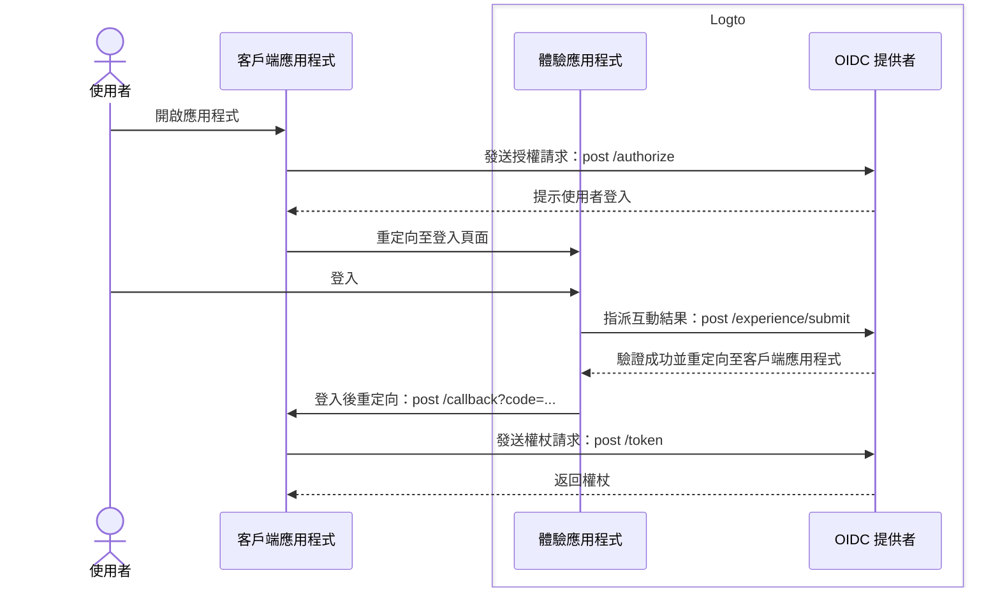
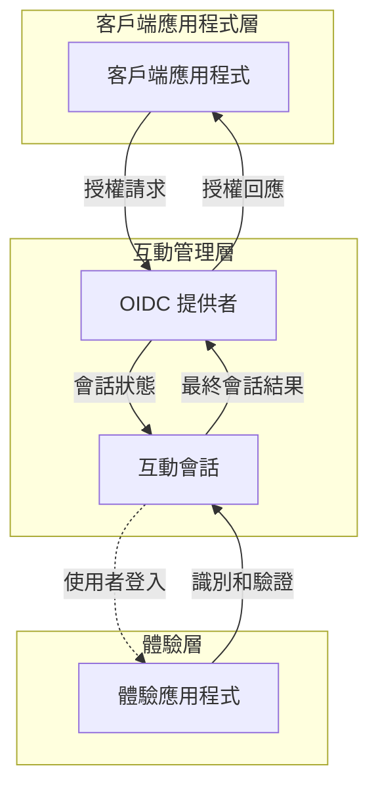

# 註冊與登入

註冊與登入是終端使用者驗證 (Authentication) 並授權 (Authorization) 存取客戶端應用程式的核心互動過程。作為一個基於 OIDC 的集中式 [CIAM](https://auth.wiki/iam) 平台，Logto 為多個客戶端應用程式和平台上的使用者提供統一的登入體驗。

## 使用者流程 \{#user-flow}

在典型的 [OIDC](https://auth.wiki/openid-connect) 驗證 (Authentication) 流程中，使用者首先開啟客戶端應用程式。客戶端應用程式向 Logto OIDC 提供者發送 [授權請求 (Authorization request)](https://auth.wiki/authorization-request)。如果使用者沒有活躍的會話，Logto 會將使用者引導至 Logto 託管的登入體驗頁面。使用者與 Logto 體驗頁面互動，並通過提供必要的憑證進行驗證。一旦使用者成功驗證，Logto 會將使用者重定向回客戶端應用程式，並附上 [授權碼 (Authorization code)](https://auth.wiki/authorization-code-flow#how-does-authorization-code-flow-work)。客戶端應用程式隨後向 Logto OIDC 提供者發送 [權杖請求 (Token request)](https://auth.wiki/token-request)，以獲取權杖。

## 使用者互動 \{#user-interaction}

每當客戶端應用程式發起授權請求時，會為每次使用者互動創建一個 **互動會話**。此會話集中管理多個客戶端應用程式的使用者互動狀態，使 Logto 能夠提供一致的登入體驗。當使用者在客戶端應用程式之間切換時，互動會話保持一致，維持使用者的驗證狀態，減少跨平台重複登入的需求。一旦建立 **互動會話**，使用者將被提示登入 Logto。

Logto 中的 **體驗應用程式** 是一個專用的託管應用程式，促進登入體驗。當使用者需要驗證時，他們會被引導至 **體驗應用程式**，在那裡完成登入並與 Logto 互動。**體驗應用程式** 利用活躍的互動會話來追蹤和支持使用者的互動進度。

為支持和控制此使用者旅程，Logto 提供了一組基於會話的 **Experience API**。這些 API 使 **體驗應用程式** 能夠通過即時更新和訪問互動會話狀態來處理各種使用者識別和驗證方法。

一旦使用者滿足所有驗證和核實要求，互動會話將以向 OIDC 提供者提交結果的方式結束，使用者完全驗證並提供同意，完成安全的登入過程。

## 登入體驗自訂 \{#sign-in-experience-customization}

Logto 提供靈活且可自訂的使用者體驗，以滿足各種業務需求，包括自訂品牌、使用者介面和使用者互動流程。**體驗應用程式** 可以根據客戶端應用程式的品牌和安全需求進行調整。

繼續了解 Logto 中的登入體驗 [設定](/end-user-flows/sign-up-and-sign-in/sign-up) 和 [自訂](/customization)。

## 常見問題 \{#faqs}

  

### 每個應用程式的登入體驗方法或品牌 \{#per-app-sign-in-experience-method-or-branding}

對於需要不同 **登入 UI** 的應用程式或組織，Logto 支援 [應用程式專屬品牌設定](/customization/match-your-brand#app-specific-branding) 和 [組織專屬品牌設定](/customization/match-your-brand#organization-specific-branding) 的自訂。

如果你需要根據使用者類型或網站提供不同的 **登入方法**，只需使用 [驗證參數](/end-user-flows/authentication-parameters)（例如，`first_screen` 和 `direct_sign_in`）將使用者引導至具有量身定制登入選項的終端使用者頁面。

  

### 限制電子郵件域 / IP 地址 / 區域 \{#limit-email-domain--ip-address--region}

對於基於屬性的存取控制，例如，根據電子郵件域、IP 地址或區域限制登入，你可以使用 Logto 的 [自訂權杖宣告](/developers/custom-token-claims/) 功能，根據使用者的屬性拒絕或允許授權請求。

  

### 無頭 API 用於登入和註冊 \{#headless-api-for-sign-in-and-sign-up}

目前，Logto 不提供用於登入和註冊的無頭 API。然而，你可以使用 [自帶 UI](/customization/bring-your-ui/) 來自訂登入和註冊體驗。

## 相關資源 \{#related-resources}

<Url href="https://blog.logto.io/deprecated-ropc-grant-type">
  為什麼你應該棄用資源擁有者密碼憑證 (ROPC) 授權類型
</Url>

<Url href="https://blog.logto.io/implicit-flow-is-dead">
  為什麼你應該使用授權碼流程而不是隱式流程？
</Url>

<Url href="https://blog.logto.io/token-based-authentication-vs-session-based-authentication">
  比較基於權杖的驗證 (Authentication) 和基於會話的驗證 (Authentication)
</Url>