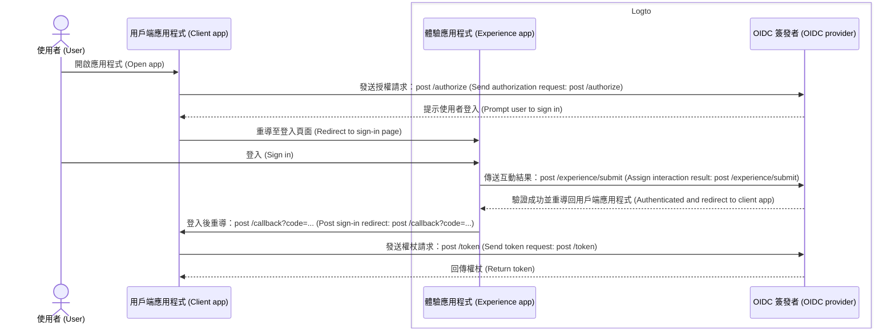

# 註冊與登入

註冊與登入是終端使用者進行驗證 (Authentication) 與授權 (Authorization) 存取用戶端應用程式的核心互動流程。作為一個以 OIDC 為基礎的集中式 [CIAM](https://auth.wiki/iam) 平台，Logto 為多個用戶端應用程式與平台上的使用者提供統一的登入體驗。

## 使用者流程 \{#user-flow}

在典型的 [OIDC](https://auth.wiki/openid-connect) 驗證流程中，使用者首先開啟用戶端應用程式。用戶端應用程式會向 Logto OIDC 簽發者 (Issuer) 發送 [授權請求 (Authorization request)](https://auth.wiki/authorization-request)。若使用者尚未有有效的互動階段，Logto 會將使用者導向 Logto 託管的登入體驗頁面。使用者在 Logto 體驗頁面上互動並輸入必要的憑證完成驗證。一旦驗證成功，Logto 會將使用者重導回用戶端應用程式，並附帶 [授權碼 (Authorization code)](https://auth.wiki/authorization-code-flow#how-does-authorization-code-flow-work)。用戶端應用程式再以授權碼向 Logto OIDC 簽發者發送 [權杖請求 (Token request)](https://auth.wiki/token-request) 以取得權杖。

```mermaid
sequenceDiagram
  actor user as 使用者 (User)
  participant client as 用戶端應用程式 (Client app)

  box Logto
    participant experience as 體驗應用程式 (Experience app)
    participant oidc as OIDC 簽發者 (OIDC provider)
  end

  user ->> client: 開啟應用程式 (Open app)
  client ->> oidc: 發送授權請求：post /authorize (Send authorization request: post /authorize)
  oidc -->> client: 提示使用者登入 (Prompt user to sign in)
  client ->> experience: 重導至登入頁面 (Redirect to sign-in page)
  user ->> experience: 登入 (Sign in)
  experience ->> oidc: 傳送互動結果：post /experience/submit (Assign interaction result: post /experience/submit)
  oidc -->> experience: 驗證成功並重導回用戶端應用程式 (Authenticated and redirect to client app)
  experience ->> client: 登入後重導：post /callback?code=... (Post sign-in redirect:  post /callback?code=...)
  client ->> oidc: 發送權杖請求：post /token (Send token request: post /token)
  oidc -->> client: 回傳權杖 (Return token)
```

## 使用者互動 \{#user-interaction}

每當用戶端應用程式發起授權請求時，系統會為每次使用者互動建立一個 **互動階段 (Interaction session)**。此階段集中管理多個用戶端應用程式間的使用者互動狀態，使 Logto 能提供一致的登入體驗。當使用者在不同用戶端應用程式間切換時，互動階段保持一致，維持使用者的驗證狀態，減少跨平台重複登入的需求。建立 **互動階段** 後，系統會提示使用者登入 Logto。

Logto 的 **體驗應用程式 (Experience app)** 是專為登入體驗設計的託管應用程式。當使用者需要驗證時，會被導向 **體驗應用程式**，在此完成登入並與 Logto 互動。**體驗應用程式** 會利用現有的互動階段追蹤並支援使用者的互動進度。

為支援並控制這段使用者旅程，Logto 提供一組以階段為基礎的 **使用體驗 API (Experience APIs)**。這些 API 讓 **體驗應用程式** 能即時更新與存取互動階段狀態，處理多種使用者識別與驗證方式。

當使用者通過所有驗證與驗證要求後，互動階段會將結果提交給 OIDC 簽發者，完成驗證與授權，確保登入流程安全結束。

```mermaid
flowchart TD
  %% 層級
  subgraph Layer1 [用戶端應用程式層 (Client Application Layer)]
      A[用戶端應用程式 (Client Application)]
  end

  subgraph Layer2 [互動管理層 (Interaction Management Layer)]
      B[OIDC 簽發者 (OIDC Provider)]
      C[互動階段 (Interaction Session)]
  end

  subgraph Layer3 [體驗層 (Experience Layer)]
      D[體驗應用程式 (Experience App)]
  end

  %% 連線
  A --> |授權請求 (Authorization Request)| B
  B --> |階段狀態 (Session State)| C
  C -.-> |使用者登入 (User Sign-In)| D
  D --> |識別與驗證 (Identification and Verification)| C
  C --> |最終階段結果 (Finalized Session Result)| B
  B --> |授權回應 (Authorization Response)| A
```

:::note
體驗頁面僅設計於驗證流程中存取。為防止搜尋引擎索引這些頁面並避免直接存取，Logto 會自動在體驗 HTML 頁面加入 `<meta name="robots" content="noindex, nofollow" />`。
:::

## 登入體驗自訂 \{#sign-in-experience-customization}

Logto 提供靈活且可自訂的使用者體驗，滿足各種業務需求，包括自訂品牌、使用者介面與互動流程。**體驗應用程式** 可依用戶端應用程式的品牌與安全需求進行調整。

繼續深入瞭解 Logto 的登入體驗 [設定](/end-user-flows/sign-up-and-sign-in/sign-up) 與 [自訂](/customization)。

## 常見問題 \{#faqs}

  

### 每個應用程式專屬登入體驗方法或品牌 \{#per-app-sign-in-experience-method-or-branding}

針對需要不同 **登入 UI** 的應用程式或組織，Logto 支援 [應用程式專屬品牌設定](/customization/match-your-brand#app-specific-branding) 與 [組織專屬品牌設定](/customization/match-your-brand#organization-specific-branding) 的自訂。

若需根據使用者類型或站點提供不同 **登入方式**，可利用 [驗證參數](/end-user-flows/authentication-parameters)（如 `first_screen` 與 `direct_sign_in`）將使用者導向自訂登入選項的終端頁面。

  

### 限制電子郵件網域 / IP 位址 / 地區 \{#limit-email-domain--ip-address--region}

若需基於屬性進行存取控制（如限制登入電子郵件網域、IP 位址或地區），可利用 Logto 的 [自訂權杖宣告 (Custom token claims)](/developers/custom-token-claims/) 功能，根據使用者屬性拒絕或允許授權請求。

  

### 登入與註冊的 Headless API \{#headless-api-for-sign-in-and-sign-up}

目前 Logto 尚未提供登入與註冊的 Headless API。不過，你可以透過 [自帶 UI (Bring your own UI)](/customization/bring-your-ui/) 來自訂登入與註冊體驗。

## 相關資源 \{#related-resources}

<Url href="https://blog.logto.io/deprecated-ropc-grant-type">
  為什麼你應該棄用 Resource Owner Password Credentials (ROPC) 授權類型
</Url>

<Url href="https://blog.logto.io/implicit-flow-is-dead">
  為什麼你應該使用授權碼流程 (Authorization code flow) 而非隱式流程 (Implicit flow)？
</Url>

<Url href="https://blog.logto.io/token-based-authentication-vs-session-based-authentication">
  權杖式驗證 (Token-based authentication) 與階段式驗證 (Session-based authentication) 比較
</Url>
