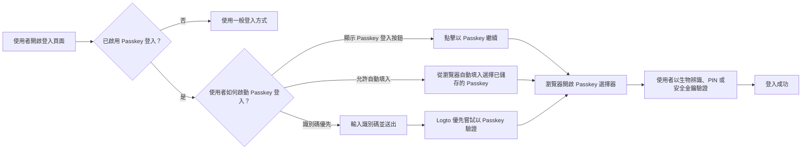
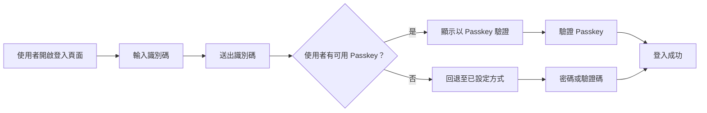
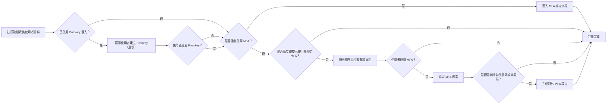

# Passkey 登入

Passkey 登入讓使用者可以在登入時直接以 WebAuthn 憑證進行驗證，無需先輸入密碼或驗證碼。在 Logto 中，Passkey 登入所用的憑證與多重要素驗證 (MFA, Multi-factor authentication) 使用的 WebAuthn 憑證模型相同，因此登入與 MFA 體驗密切相關。

本文說明 Passkey 登入在 Logto 內建登入體驗中的運作方式、終端使用者的不同進入路徑，以及與 MFA 的互動關係。

## Passkey 登入的運作方式 \{#how-passkey-sign-in-works}

要使用 Passkey 登入，需先在 <CloudLink to="/sign-in-experience/sign-up-and-sign-in">登入體驗</CloudLink> 設定中啟用。啟用後，Logto 可在登入頁面以最多三種方式提供 Passkey 登入：

- 在第一個登入畫面顯示專屬的 `以 Passkey 繼續` 按鈕。
- 識別碼優先流程：使用者輸入電子郵件、手機號碼或使用者名稱後，嘗試 `以 Passkey 驗證`。
- 識別碼輸入框支援瀏覽器自動填入，瀏覽器可直接從當前裝置建議可用的 Passkey。

整體體驗流程如下：

## 三種 Passkey 登入路徑 \{#three-passkey-sign-in-paths}

### 1. 顯示「以 Passkey 繼續」按鈕已啟用 \{#1-show-continue-with-passkey-button-enabled}

當啟用 `顯示「以 Passkey 繼續」按鈕` 選項時，登入頁面會在第一個畫面底部顯示 `以 Passkey 繼續` 按鈕。

使用者流程如下：

1. 開啟登入頁面。
2. 點擊 `以 Passkey 繼續`。
3. 從瀏覽器或作業系統提示中選擇 Passkey。
4. 完成生物辨識、PIN 或硬體金鑰驗證。
5. 成功登入。

這是最直接的路徑，適合已知自己有儲存 Passkey 並想要一步登入體驗的使用者。

### 2. 顯示「以 Passkey 繼續」按鈕未啟用 \{#2-show-continue-with-passkey-button-disabled}

當 `顯示「以 Passkey 繼續」按鈕` 選項未啟用時，Logto 會在第一個畫面切換為識別碼優先體驗。頁面僅先要求使用者輸入識別碼。

使用者送出識別碼後：

1. Logto 檢查是否啟用 Passkey 登入，以及該識別碼對應的使用者是否有可用的 Passkey。
2. 若有可用 Passkey，Logto 會優先啟動「以 Passkey 驗證」流程。
3. 使用者可立即完成 Passkey 驗證並登入。
4. 若無可用 Passkey，或使用者偏好其他方式，Logto 會回退至其他已設定的驗證方式。

可用的回退方式取決於目前租戶的登入體驗設定。例如，使用者可依啟用的因素切換為密碼、電子郵件驗證碼或手機驗證碼。

### 3. 允許提示與自動填入 \{#3-allow-prompting-and-autofill}

當啟用 `允許提示與自動填入` 選項時，相容的瀏覽器可直接在識別碼輸入欄位顯示已儲存的 Passkey。

使用者流程如下：

1. 在登入頁面聚焦識別碼輸入框。
2. 瀏覽器針對當前網域建議已儲存的 Passkey。
3. 使用者從自動填入清單選擇 Passkey。
4. 瀏覽器要求使用者以生物辨識、PIN 或硬體金鑰驗證。
5. 登入成功。

此流程特別適用於平台已同步 Passkey 的裝置，因為使用者無需手動切換頁面或點擊專屬 Passkey 按鈕即可登入。

## 註冊與 Passkey 綁定流程 \{#sign-up-and-passkey-binding-flow}

Passkey 登入不僅是登入入口，也影響註冊後的流程，因為同一組 WebAuthn 憑證可重複用於登入與 MFA。

使用者完成一般註冊步驟後，Logto 可提示使用者建立 Passkey。此提示對終端使用者為選填，但一旦建立 Passkey，下一步將依租戶的 MFA 政策與使用者自身 MFA 狀態而定。

主要邏輯如下：

## Passkey 登入與 MFA 的關係 \{#relationship-between-passkey-sign-in-and-mfa}

### Passkey 登入自動跳過 MFA 驗證 \{#passkey-sign-in-automatically-skips-mfa-verification}

用於 Passkey 登入的 Passkey 由 WebAuthn 憑證支援，該憑證同時也視為 WebAuthn MFA 因素。因此，Passkey 登入與 WebAuthn MFA 在憑證層面上等價。

這帶來兩個重要行為：

- 使用者以 Passkey 登入時，Logto 會自動跳過額外的 MFA 驗證步驟。
- 若使用者在啟用 Passkey 登入前已綁定 WebAuthn 作為 MFA 因素，該憑證可直接作為 Passkey 登入憑證，無需再次綁定。

換句話說，成功的 Passkey 登入已滿足原本 MFA 所需的 WebAuthn 身分驗證。

### 綁定 Passkey 不會自動強制啟用 MFA（對於使用者可控租戶） \{#binding-a-passkey-does-not-automatically-force-mfa-for-user-controlled-tenants}

對於未強制啟用 MFA 的租戶，使用者在註冊或帳號設定時綁定 Passkey 並不會自動開啟帳號的 MFA。

相反地，Passkey 建立後，Logto 會顯示標題為「開啟兩步驟驗證」的確認頁面。

在該頁面，使用者可以：

- 點擊「啟用兩步驟驗證」按鈕，明確開啟 MFA 並進入後續綁定步驟。
- 略過提示，完成當前流程而不啟用 MFA。

若使用者選擇啟用 MFA，Logto 會進入一般 MFA 設定流程，並根據租戶 MFA 設定可能要求綁定其他因素。例如，若租戶啟用其他 MFA 因素，Logto 可繼續綁定其他因素或備用碼。

### 關閉 Passkey 登入後會發生什麼事 \{#what-happens-when-passkey-sign-in-is-disabled-later}

若日後關閉 Passkey 登入，先前綁定的 Passkey 仍為 WebAuthn 憑證。只要租戶仍支援 WebAuthn MFA，該憑證即可繼續作為 MFA 因素使用。

停用 Passkey 登入僅移除 Passkey 作為直接登入入口，但不會使底層 WebAuthn MFA 憑證失效。

## 限制與相容性 \{#limitations-and-compatibility}

- Passkey 登入不適用於企業級單一登入 (Enterprise SSO) 使用者。
- Passkey 登入依賴瀏覽器與平台對 WebAuthn 的支援。
- 「允許提示與自動填入」僅適用於支援 Passkey 自動填入 / 條件式 UI 的瀏覽器與環境。
- Passkey 受限於網域。註冊於某一網域的 Passkey 無法用於其他網域。

## 問與答 \{#q-a}

  

### Passkey 登入還需要 MFA 驗證嗎？ \{#does-passkey-sign-in-still-require-mfa-verification}

  

不需要。成功的 Passkey 登入已滿足 WebAuthn 驗證要求，因此 Logto 會自動跳過額外的 MFA 驗證步驟。

  

### 關閉 Passkey 登入後，原本綁定的 Passkey 還能作為 MFA 因素使用嗎？ \{#can-a-passkey-bound-for-passkey-sign-in-still-be-used-as-an-mfa-factor-after-passkey-sign-in-is-disabled}

  

可以。Passkey 登入與 WebAuthn MFA 由相同的憑證模型支援。若日後停用 Passkey 登入，已綁定的 Passkey 仍可作為 WebAuthn MFA 因素使用。

  

### 企業級單一登入 (Enterprise SSO) 使用者可以用 Passkey 登入嗎？ \{#can-enterprise-sso-users-use-passkey-sign-in}

  

不行。企業級單一登入 (Enterprise SSO) 使用者無法使用 Passkey 登入。

  

### Passkey 登入還需要驗證碼（CAPTCHA）嗎？ \{#does-passkey-sign-in-still-require-captcha}

  

不需要。Passkey 登入本身不需額外的驗證碼（CAPTCHA）步驟。CAPTCHA 仍可套用於頁面上的其他登入行為（如密碼或驗證碼送出），但不會影響 Passkey 驗證流程。

