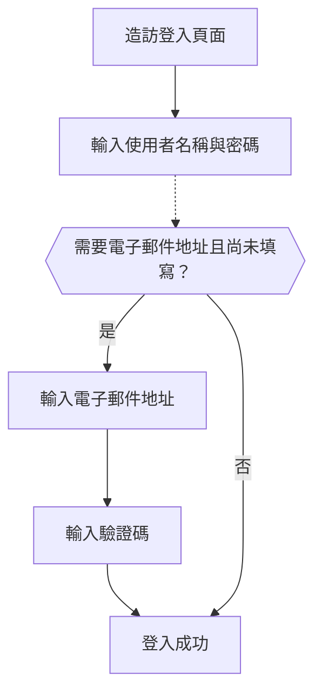

# 電子郵件 / 電話 / 使用者名稱登入

## 設定識別子登入流程 \{#configure-the-identifier-sign-in-flow}

如前所述，可以在 [註冊流程](/end-user-flows/sign-up-and-sign-in/sign-up) 或 [在 Logto 直接建立帳號](/user-management/manage-users#add-users) 時，從使用者收集各種識別子類型。此外，使用者在探索與使用產品時，也可能輸入並補全額外資訊。這些識別子可用於在 Logto 系統中唯一識別使用者，並允許他們驗證並登入與 Logto 整合的應用程式。

無論你選擇使用 Logto 提供的預設登入頁面，還是計劃 [自訂登入 UI](/customization#custom-ui)，你都需要為終端使用者設定可用的登入方式與驗證設定。

## 設定識別子與驗證設定 \{#set-up-the-identifier-and-authentication-settings}

### 1. 設定支援的登入識別子 \{#1-set-the-supported-sign-in-identifiers}

你可以從下拉選單新增多個支援的識別子，作為終端使用者可用的登入方式。可用選項包括：

- **使用者名稱 (Username)**
- **電子郵件地址 (Email address)**
- **電話號碼 (Phone number)**

調整識別子的順序會改變它們在登入頁面上的顯示順序。第一個識別子將成為主要登入方式。

### 2. 設定驗證設定 \{#2-set-the-authentication-settings}

對於每個登入識別子，你需要設定至少一種有效的驗證因子來驗證使用者身分。你可以選擇以下兩種因子：

- **密碼 (Password)**：適用於所有類型的登入識別子。啟用後，使用者必須輸入密碼才能完成登入流程。
- **驗證碼 (Verification code)**：僅適用於 **電子郵件地址 (Email address)** 與 **電話號碼 (Phone number)** 識別子。啟用後，使用者必須輸入發送到其電子郵件或電話號碼的驗證碼才能完成登入流程。

若同時啟用兩種因子，使用者可選擇任一方式完成登入。你也可以調整因子的順序，改變它們在登入頁面上的顯示順序。第一個因子將作為主要驗證方式，第二個則以替代連結顯示。

## 識別子登入流程使用者體驗 \{#identifier-sign-in-flow-user-experience}

登入體驗會根據所選識別子與可用驗證因子自動調整。

- **多識別子智慧輸入：**
  若啟用多種識別子登入方式，Logto 內建登入頁面會自動偵測使用者輸入的識別子類型，並顯示對應的驗證選項。例如，若同時啟用 **電子郵件地址 (Email address)** 與 **電話號碼 (Phone number)**，登入頁面會自動偵測使用者輸入的識別子類型並顯示對應驗證選項。若連續輸入數字則切換為帶區碼的電話號碼格式，輸入「@」符號則切換為電子郵件格式。
  - 電話號碼國碼預設為使用者瀏覽器語系；使用者可手動切換。你可以使用 [`ui_locales`](/end-user-flows/authentication-parameters/ui-locales) 參數設定特定預設國碼。詳見 [多語系設定](/customization/localized-languages#how-can-i-set-a-default-phone-number-country-code-for-the-sign-in-experience)。
- **啟用的驗證因子：**
  - **僅密碼 (Password only)：** 首頁面同時顯示識別子與密碼欄位。
  - **僅驗證碼 (Verification code only)：** 首頁面顯示識別子欄位，下一頁顯示驗證碼欄位。
  - **密碼與驗證碼 (Password and verification code)：** 首頁面先輸入識別子，下一頁依驗證順序輸入密碼或驗證碼。頁面提供切換連結，讓使用者選擇驗證方式。

### 範例 \{#examples}

  

### 範例 1：電子郵件地址搭配密碼驗證 \{#example-1-email-address-with-password-verification}

新增 **電子郵件地址 (Email address)** 作為登入識別子，並啟用 **密碼 (Password)** 驗證因子。

  

### 範例 2：電子郵件 / 電話同時啟用密碼（主要）與驗證碼（替代）驗證 \{#example-2-emailphone-with-passwordprimary-and-verification-code-alternative-verification-enabled}

同時新增 **電子郵件地址 (Email address)** 與 **電話號碼 (Phone number)** 作為登入識別子。
並為兩者啟用 **密碼 (Password)** 與 **驗證碼 (Verification code)** 驗證因子。

## 登入時收集額外使用者資料 \{#collect-additional-user-profile-on-sign-in}

在 Logto 的登入流程中，若註冊識別子設定有更新，可能會觸發資料補全流程，確保所有使用者（包含既有使用者）都需補齊新要求的識別子。

當開發者新增新的識別子（如電子郵件地址）時，所有使用者都必須填寫。若回訪使用者以既有識別子（如使用者名稱）登入，且其資料中缺少新識別子，則會被要求補填並驗證新識別子。完成此步驟後，才能進入應用程式，確保平順且一致地過渡到新規則。

流程拆解如下：

1. 先前設定 **使用者名稱 (Username)** 為註冊識別子，並自動啟用 **建立密碼 (Create your password)** 設定。
2. 之後設定 **電子郵件地址 (Email address)** 為註冊識別子，該識別子會自動新增為啟用的登入選項。
3. 回訪使用者以使用者名稱與密碼登入。
4. 使用者登入後會被要求補填並驗證電子郵件地址。

同樣流程也適用於 **建立密碼 (Create your password)** 註冊設定。若在註冊流程中啟用 **建立密碼**，則你選擇的所有登入識別子都會自動啟用 **密碼 (Password)** 驗證因子。所有尚未設定密碼的回訪使用者，登入時都會被要求建立密碼。

:::note
注意：如需自訂登入流程，請參考 [自帶 UI (Bring your UI)](/customization/bring-your-ui/) 功能。
:::

## 常見問題 \{#faqs}

  

### 自架登入體驗（嵌入式登入） \{#self-hosted-sign-in-experience-embedded-sign-in}

Logto 目前尚未支援 headless API 進行登入與註冊。不過，你可以利用 [自帶 UI (Bring your UI)](/customization/bring-your-ui/) 功能，將自訂登入表單上傳至 Logto。我們也支援多種登入參數，可用於預填從你的應用程式收集的使用者識別子，或直接以第三方社交或企業級單一登入 (SSO) 供應商登入。詳見 [驗證參數 (Authentication parameters)](/end-user-flows/authentication-parameters/)。

## 相關資源 \{#related-resources}

<Url href="https://www.youtube.com/watch?v=64rBXpWbScc">電子郵件註冊與登入體驗</Url>

<Url href="https://www.youtube.com/watch?v=chQxCJX6e6w">使用者名稱註冊與登入體驗</Url>
