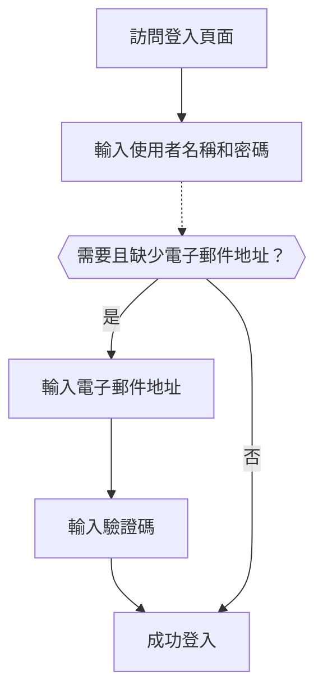

# 電子郵件 / 電話 / 使用者名稱登入

## 設定識別碼登入流程 \{#configure-the-identifier-sign-in-flow}

如前所述，各種識別碼類型可能會在 [註冊流程](/end-user-flows/sign-up-and-sign-in/sign-up) 或 [在 Logto 中直接建立帳戶](/user-management/manage-users#add-users) 時從使用者那裡收集。此外，使用者在探索和使用產品時可能會輸入並完成其他資訊。這些識別碼可用於在 Logto 系統中唯一識別使用者，並允許他們驗證並登入與 Logto 整合的應用程式。

無論你選擇使用 Logto 提供的預建登入頁面，或計劃 [建立自訂登入 UI](/customization#custom-ui)，你都需要為終端使用者設定可用的登入方法和驗證設置。

## 設定識別碼和驗證設置 \{#set-up-the-identifier-and-authentication-settings}

### 1. 設定支援的登入識別碼 \{#1-set-the-supported-sign-in-identifiers}

你可以從下拉列表中新增多個支援的識別碼作為終端使用者的啟用登入方法。可用選項有：

- **使用者名稱**
- **電子郵件地址**
- **電話號碼**

重新排序識別碼將改變它們在登入頁面上的顯示順序。第一個識別碼將是使用者的主要登入方法。

### 2. 設定驗證設置 \{#2-set-the-authentication-settings}

對於每個登入識別碼，你需要至少設定一個有效的驗證因素來驗證使用者的身分。你可以選擇以下兩個因素：

- **密碼**：適用於所有類型的登入識別碼。一旦啟用，使用者必須提供密碼才能完成登入流程。
- **驗證碼**：僅適用於 **電子郵件地址** 和 **電話號碼** 識別碼。一旦啟用，使用者必須輸入發送到其電子郵件或電話號碼的驗證碼才能完成登入流程。

如果兩個因素都啟用，使用者可以選擇任一方法來完成登入流程。你也可以重新排序因素以改變它們在登入頁面上的顯示順序。第一個因素將用作使用者的主要驗證方法，第二個將顯示為替代連結。

## 識別碼登入流程使用者體驗 \{#identifier-sign-in-flow-user-experience}

登入體驗會根據選擇的識別碼和可用的驗證因素進行調整。

- **多重識別碼的智能輸入：**
  如果啟用了多個識別碼登入方法，Logto 的內建登入頁面將自動檢測使用者輸入的識別碼類型並顯示相應的驗證選項。例如，如果啟用了 **電子郵件地址** 和 **電話號碼**，登入頁面將自動檢測使用者輸入的識別碼類型並顯示相應的驗證選項。當連續輸入數字時，會切換到帶有區域代碼的電話號碼格式；當使用「@」符號時，則切換到電子郵件格式。
- **啟用的驗證因素：**
  - **僅密碼：** 第一個畫面將顯示識別碼和密碼欄位。
  - **僅驗證碼：** 第一個畫面顯示識別碼欄位，接著在第二個畫面顯示驗證碼欄位。
  - **密碼和驗證碼：** 首先在第一個畫面輸入識別碼，接著根據驗證順序在第二個畫面輸入密碼或驗證碼。提供切換連結以允許使用者在兩種驗證方法之間切換。

### 範例 \{#examples}

  

### 範例 1：電子郵件地址與密碼驗證 \{#example-1-email-address-with-password-verification}

新增 **電子郵件地址** 作為登入識別碼，並啟用 **密碼** 因素進行驗證。

  

### 範例 2：電子郵件 / 電話號碼啟用密碼（主要）和驗證碼（替代）驗證 \{#example-2-emailphone-with-passwordprimary-and-verification-code-alternative-verification-enabled}

新增 **電子郵件地址** 和 **電話號碼** 作為登入識別碼。
啟用 **密碼** 和 **驗證碼** 因素以供兩個識別碼使用。

## 在登入時收集額外的使用者資料 \{#collect-additional-user-profile-on-sign-in}

在 Logto 的登入流程中，如果註冊識別碼設置更新，可能會觸發資料填充流程。這確保所有使用者，包括現有使用者，提供任何新要求的識別碼。

當開發者新增新識別碼（如電子郵件地址）時，這將成為所有使用者的必填項。如果回訪使用者使用現有識別碼（如使用者名稱）登入，且其資料中缺少新識別碼，將提示他們提供並驗證新識別碼。只有完成此步驟後，他們才能訪問應用程式，確保順利且一致地過渡到更新的要求。

流程分解：

1. **使用者名稱** 先前設為註冊識別碼，並自動啟用 **建立你的密碼** 設置。
2. **電子郵件地址** 後來設為註冊識別碼。**電子郵件地址** 識別碼自動新增為啟用的登入選項。
3. 回訪使用者使用其使用者名稱和密碼登入。
4. 使用者在初次登入步驟後被提示提供並驗證電子郵件地址。

同樣的流程也適用於 **建立你的密碼** 註冊設置。如果在註冊流程中新啟用了 **建立你的密碼** 設置，則 **密碼** 因素將自動啟用於你選擇的所有登入識別碼。所有沒有密碼的回訪使用者將在登入過程中被提示建立一個密碼。

:::note
注意：對於自訂登入流程，請參考 [Bring your UI](/customization/bring-your-ui/) 功能。
:::

## 常見問題 \{#faqs}

  

### 自託管登入體驗（嵌入式登入） \{#self-hosted-sign-in-experience-embedded-sign-in}

Logto 目前不支援無頭 API 進行登入和註冊。不過，你可以使用我們的 [Bring your UI](/customization/bring-your-ui/) 功能將自訂登入表單上傳到 Logto。我們還支援多個登入參數，你可以用來預填從應用程式收集的使用者識別碼，或直接使用第三方社交或企業級單一登入 (SSO) 提供者進行登入。詳情請參閱 [驗證參數](/end-user-flows/authentication-parameters/)。

## 相關資源 \{#related-resources}

<Url href="https://www.youtube.com/watch?v=64rBXpWbScc">電子郵件註冊和登入體驗</Url>

<Url href="https://www.youtube.com/watch?v=chQxCJX6e6w">使用者名稱註冊和登入體驗</Url>
