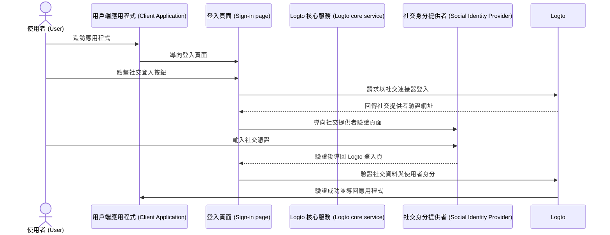
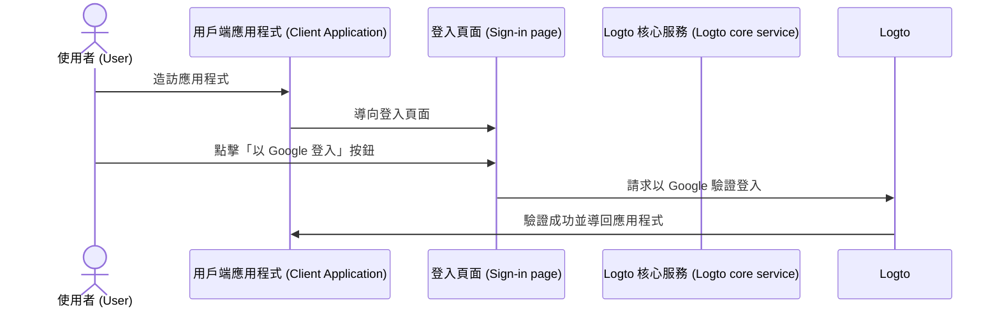

# 社交登入 (Social sign-in)

社交登入是一種廣泛使用的驗證 (Authentication) 方法，允許使用者利用現有的社群媒體帳號（如 Google、Facebook、Twitter、LinkedIn）進行登入與註冊。

社交登入的優點：

- **簡化導入流程**：社交登入讓使用者只需點擊一次即可註冊或登入，無需建立新帳號或記住另一組密碼，降低摩擦並提升使用者參與度。
- **提升信任與安全性**：藉由利用 Google 或 Facebook 等知名且受信任的平台，使用者對你的應用程式更有信心。
- **豐富使用者資料**：社交登入可讓你從社群平台獲取更多個人資料，如姓名、電子郵件地址、大頭貼等。

## 實作社交登入 \{#implement-social-sign-in}

1. **設定你的社交連接器 (Connectors)**：<br/>
   前往 <CloudLink to="/connectors/social">Console > Connectors > Social connectors</CloudLink>。點擊「新增社交連接器」按鈕，找到你想新增的社交連接器（如 Google 或 Github）。詳細步驟請參考 [社交連接器](/connectors/social-connectors/)。
2. **新增社交登入按鈕**：<br/>
   預設情況下，剛新增的社交連接器不會顯示在終端使用者的登入頁面。若要在登入頁面新增社交登入按鈕，需在登入體驗 (Sign-in experience) 設定中啟用該社交連接器。

   前往 <CloudLink to="/sign-in-experience/sign-up-and-sign-in">Console > Sign-in experience > Sign-up and sign-in</CloudLink>。點擊「新增社交連接器」按鈕，即可在註冊與登入頁面整合社交登入按鈕，並可拖曳調整其在 UI 上的順序。

3. **設定帳號連結選項**：<br/>
   對於使用 [社交身分 (Social identities)](/user-management/user-data#social-identities) 註冊的新使用者，Logto 支援將其社交帳號與 Logto 系統內既有的電子郵件或手機號碼帳號連結。預設情況下，社交註冊流程會顯示相關的 [帳號連結](#account-linking) 頁面，讓使用者選擇將社交帳號連結至現有帳號或建立新帳號。

   若想簡化流程，可在登入體驗設定中啟用 **自動帳號連結 (Automatic account linking)**，系統會自動根據電子郵件或手機號碼是否相符來連結帳號。

4. **儲存變更**：<br/>
   仔細檢查並儲存設定，以套用你的變更。

## 社交登入的使用者體驗 \{#user-experience-of-social-sign-in}

透過社交登入，Logto 的註冊與登入流程對使用者來說更加順暢。



1. **以社交登入**：使用者在登入頁面點擊社交登入按鈕。
2. **重導向**：使用者被導向至社交身分提供者的驗證頁面。
3. **社交驗證**：使用者輸入社交憑證並通過驗證。若已登入社交提供者，可能自動驗證。若偵測到多個登入會話，可能需選擇正確帳號（如多個 Google 帳號）。
   :::note
   Google 的「prompt」參數可在 Google 連接器中設定，讓你自訂 Google 登入時的帳號選擇與授權頁面體驗。
   :::
4. **返回 Logto**：驗證成功後，社交提供者會將使用者導回 Logto 登入頁並帶回驗證資料。
5. **社交身分驗證**：Logto 驗證社交資料與使用者身分。若無對應帳號，將自動建立新帳號。
6. **使用者驗證**：Logto 完成驗證並導回用戶端應用程式，完成驗證流程。

## 帳號連結 (Account linking) \{#account-linking}

如前所述，Logto 允許使用者將社交帳號與 Logto 系統內既有的電子郵件或手機號碼帳號連結。這對於維持跨不同驗證 (Authentication) 方法與身分提供者 (IdP) 的統一帳號至關重要。

- **新帳號建立**：
  當使用者以 [社交身分](/user-management/user-data#social-identities) 登入且該身分在 Logto 系統中不存在，且提供的電子郵件或手機號碼也未與任何現有帳號相符時，Logto 會直接建立新帳號。
- **既有帳號連結**：
  若社交身分提供的電子郵件或手機號碼已與 Logto 既有帳號綁定，則會進入彈性的帳號連結流程。

  - **自動帳號連結**：若在 <CloudLink to="/sign-in-experience/sign-up-and-sign-in">登入體驗</CloudLink> 設定中啟用「自動帳號連結」，Logto 會根據電子郵件或手機號碼自動將社交帳號連結至既有帳號，使用者不會被提示連結帳號，並直接登入既有帳號。社交帳號將被連結，未來可用任一方式登入。
  - **手動帳號連結**：若未啟用「自動帳號連結」，使用者在登入流程中會被提示將社交帳號連結至既有帳號，或選擇建立新帳號。

    

    ```mermaid
    flowchart TD
    A[以社交身分驗證] --> B{{社交身分已存在於 Logto？}}
    B -- 是 --> C[以既有帳號登入]
    B -- 否 --> D{{電子郵件／手機號碼與既有帳號相符？}}
    D -- 是 --> E{{啟用自動帳號連結？}}
    E -- 是 --> G[將社交身分連結至既有帳號]
    G --> C
    D -- 否 --> H[建立新帳號並登入]
    E -- 否 --> I{{連結社交帳號？}}
    I -- 是 --> G
    I -- 否 --> H
    ```

:::note
若在社交註冊流程中，找到與既有帳號相符的電子郵件或手機號碼，但使用者選擇不連結帳號，該電子郵件或手機號碼將不會同步至 Logto 新帳號，確保所有帳號的電子郵件與手機號碼唯一性。

若電子郵件或手機號碼為必填註冊識別項，使用者將被要求於註冊流程中提供其他電子郵件或手機號碼。詳見 [收集額外使用者資料](#collect-additional-user-profile-data)。
:::

## 收集額外使用者資料 \{#collect-additional-user-profile-data}

### 收集註冊識別項 \{#collect-sign-up-identifiers}

在社交註冊流程中，根據你設定的必填註冊識別項（**電子郵件地址**、**手機號碼**、**使用者名稱**），使用者可能需在通過社交驗證後，補充額外的驗證資訊以完成註冊或登入流程。

例如，若設定 **電子郵件地址** 與 **使用者名稱** 為必填註冊識別項：

1. **以提供驗證過電子郵件的社交身分註冊**

   若社交身分提供驗證過的電子郵件，該電子郵件將同步至使用者資料，並提示使用者輸入使用者名稱以完成註冊。

   ```mermaid
   flowchart TD
      A[以社交身分驗證] --> B{{包含驗證過的電子郵件？}}
      B -- 是 --> C[輸入使用者名稱]
      C --> D[註冊成功]
   ```

2. **以未提供驗證過電子郵件的社交身分註冊**

   若社交身分未提供驗證過的電子郵件，註冊流程會提示使用者輸入電子郵件，並需輸入驗證碼完成驗證。

   ```mermaid
   flowchart TD
      A[以社交身分驗證] --> B{{包含驗證過的電子郵件？}}
      B -- 否 --> C[輸入電子郵件]
      C --> D[輸入驗證碼]
      D --> E[輸入使用者名稱]
      E --> F[註冊成功]
   ```

3. **以提供已註冊電子郵件的社交身分註冊**

   若社交身分提供的電子郵件已在 Logto 系統註冊，使用者會被提示連結社交帳號至既有帳號或建立新帳號。若選擇建立新帳號，需輸入新電子郵件並驗證。

   ```mermaid
      flowchart TD
       A[以社交身分驗證] --> B{{電子郵件與既有帳號相符？}}
       B -- 是 --> C{{連結社交帳號？}}
       C -- 是 --> D[將社交身分連結至既有帳號]
       D --> E[登入成功]
       C -- 否 --> F[輸入新電子郵件]
       F --> G[輸入驗證碼]
       G --> H[輸入使用者名稱]
       H --> I[註冊成功]
       B -- 否 --> H
   ```

### 收集其他使用者資料 \{#collect-other-user-profile}

除了必填註冊識別項外，你也可在社交註冊流程中收集其他個人資料，如姓名、生日或自訂欄位。

**選項 1：收集使用者資料**

將 Logto 預設的「告訴我們你的資訊」步驟加入註冊流程。使用者需填寫所有必填欄位後才能完成註冊。此方式無需寫程式，直接套用。

透過 <CloudLink to="/sign-in-experience/collect-user-profile">Console > Sign-in experience > Collect user profile</CloudLink> 設定，選擇預設欄位或自訂欄位並設驗證規則。詳見：[收集使用者資料](/end-user-flows/collect-user-profile)

:::note

收集註冊識別項（電子郵件、手機、使用者名稱）與社交登入時收集其他個人資料有所不同：

- **註冊識別項**：新舊使用者皆需填寫，因其為身分識別與通知所必須。
- **其他個人資料**（如姓名、生日）：僅於新註冊時收集，非識別所必須，日後可透過 Account API 補充。

:::

**選項 2：自建導入流程**

註冊成功後將使用者導向你自訂的導入流程，彈性收集所需資料。此方式可完全自訂體驗，支援多步驟複雜流程。

可透過 [Account API](/end-user-flows/account-settings/by-account-api) 程式化管理使用者資料。

## Google One-tap \{#google-one-tap}

Logto 亦支援 Google 連接器的 [Google One-tap](https://developers.google.com/identity/gsi/web/guides/features) 登入方式，讓使用者一鍵登入。此功能進一步簡化登入流程，無需重導向至 Google 驗證頁。

啟用 Google One-tap，請依 [Google 連接器](/integrations/google) 設定說明操作。啟用後，使用者進入登入頁時會看到「以 Google 登入」彈窗，點擊即可自動驗證並導回應用程式。




## 連結或解除連結社交帳號 \{#link-or-unlink-social-accounts}

首次社交登入後，使用者可在帳號設定中管理已連結的社交帳號。這讓使用者能將更多社交帳號連結至現有個人檔案，或移除不再使用的社交連結。

使用者可透過自助帳號中心操作，靈活：

- **連結新社交帳號**：將更多社交提供者連結至同一個人檔案
- **解除連結既有社交帳號**：移除社交連結，仍可用其他方式登入
- **檢視已連結帳號**：查看所有已連結的社交身分

更多帳號管理功能請參閱 [帳號設定](/end-user-flows/account-settings) 文件。

## 儲存權杖並呼叫第三方 API \{#store-tokens-and-call-third-party-apis}

你可選擇為支援的社交連接器啟用第三方權杖儲存，讓使用者驗證並授權後，提供者發出的存取權杖 (Access token) 與重新整理權杖 (Refresh token) 會安全儲存在 Logto 的秘密保管庫。你的應用程式可透過 Account API 取得並用於呼叫第三方 API（例如讓你的應用程式幫使用者新增 Google 行事曆事件），無需再次社交驗證。詳見 [第三方權杖儲存](/secret-vault/federated-token-set) 設定說明。

## 常見問題 \{#faqs}

<details>
  <summary>

### 如何在網站上新增社交登入按鈕並直接以社交登入？ \{#how-to-add-social-login-buttons-and-directly-sign-in-with-social-on-my-website}

</summary>

Logto 允許你在網站上新增社交登入按鈕，並直接啟動社交登入流程，無需顯示預設登入表單。詳見 [直接登入](/end-user-flows/authentication-parameters/direct-sign-in/) 指南。

</details>

<details>
  <summary>

### 為什麼以社交註冊後電子郵件或手機號碼沒有同步？ \{#why-my-emails-or-phone-numbers-are-not-populated-after-signing-up-with-social}

</summary>

在 Logto 中，電子郵件與手機號碼可作為登入識別項，用於唯一識別使用者。僅接受已驗證的電子郵件與手機號碼作為識別項。若社交身分未提供 `email_verified` 或 `phone_number_verified` 宣告 (Claim)，該電子郵件或手機號碼將不會同步至使用者資料，但仍可在使用者檔案的社交身分資料中查詢。

支援未驗證電子郵件或手機號碼作為使用者資料的功能即將推出。

</details>

## 相關資源 \{#related-resources}

<Url href="https://www.youtube.com/watch?v=sv60N9eW8Ew">社交登入體驗</Url>

<Url href="https://blog.logto.io/maximize-google-sign-in-conversions">
  6 個設定提升 Google 登入轉換率
</Url>
