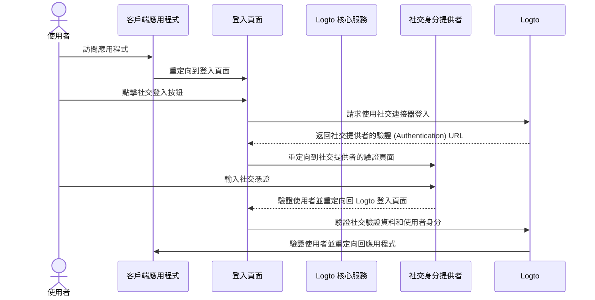
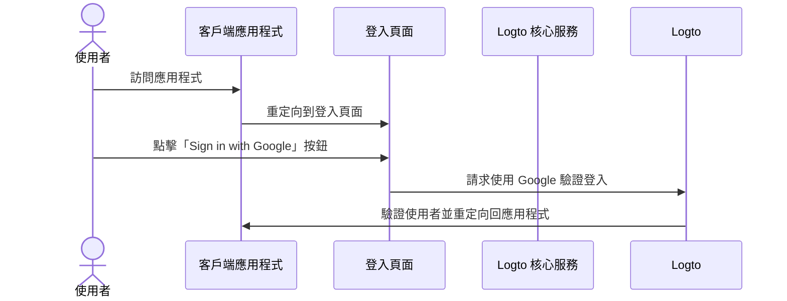

# 社交登入

社交登入是一種廣泛使用的驗證 (Authentication) 方法，允許使用者使用現有的社交媒體帳戶（如 Google、Facebook、Twitter 和 LinkedIn）進行登入和註冊。

社交登入的好處：

- **簡化的上手流程**：社交登入允許使用者只需點擊一次即可註冊或登入，無需創建新帳戶或記住另一個密碼。這減少了摩擦並提高了使用者參與度。
- **增加信任和安全性**：通過利用 Google 或 Facebook 等已建立的可信平台，使用者對你的應用程式更有信心。
- **使用者資料豐富化**：社交登入使你能夠從社交平台獲取額外的個人資料資訊，如姓名、電子郵件地址、個人資料圖片等。

## 實現社交登入 \{#implement-social-sign-in}

1. **配置你的社交連接器**：<br/>
   前往 <CloudLink to="/connectors/social">Console > Connectors > Social connectors</CloudLink>。點擊「Add Social Connector」按鈕，找到你想添加的社交連接器（例如 Google 或 Github）。詳細的添加 [社交連接器](/connectors/social-connectors/) 指南請參閱我們的文件。
2. **添加社交登入按鈕**：<br/>
   默認情況下，新添加的社交連接器不會顯示在終端使用者的登入頁面上。要在登入頁面上添加社交登入按鈕，你需要在登入體驗設置中啟用社交連接器。

   前往 <CloudLink to="/sign-in-experience/sign-up-and-sign-in">Console > Sign-in experience > Sign-up and sign-in</CloudLink>。點擊「Add social connector」按鈕，在你的註冊和登入頁面上整合社交登入按鈕。使用拖放功能在 UI 上排列它們的順序。

3. **設置帳戶連結選項**：<br/>
   對於使用 [社交身分](/user-management/user-data#social-identities) 註冊的新使用者，Logto 允許將其社交帳戶連結到 Logto 系統中的現有電子郵件或電話號碼帳戶。默認情況下，相關的 [帳戶連結](#account-linking) 頁面會在社交註冊過程中顯示給使用者，允許他們將社交帳戶連結到現有帳戶或創建新帳戶。

   為簡化此過程，你可以在登入體驗設置中啟用 **自動帳戶連結** 選項。如果電子郵件或電話號碼匹配，這將自動將社交帳戶連結到現有帳戶。

4. **保存更改**：<br/>
   仔細檢查你的更改並保存以應用配置。

## 社交登入的使用者體驗 \{#user-experience-of-social-sign-in}

使用社交登入，Logto 中的註冊和登入流程對使用者來說更加簡化。



1. **使用社交登入**：使用者點擊顯示在登入頁面的社交登入按鈕。
2. **重定向**：使用者被重定向到社交身分提供者的驗證頁面。
3. **社交驗證**：使用者輸入其社交憑證並在社交提供者處驗證。如果使用者已登入社交提供者，他們可能會自動驗證。如果檢測到多個登入會話，使用者可能會被提示選擇正確的帳戶（例如，多個 Google 帳戶）。
   :::note
   Google 的「prompt」參數可以在 Google 連接器中設置，允許你自訂 Google 登入的選擇帳戶和使用者授權頁面的使用者體驗。
   :::
4. **返回 Logto**：成功驗證後，社交提供者將使用者重定向回 Logto 登入頁面，並附帶驗證資料。
5. **社交身分驗證**：Logto 驗證社交驗證資料和使用者身分。如果沒有與社交身分相關聯的使用者帳戶，將創建一個新帳戶。
6. **使用者驗證**：Logto 驗證使用者並重定向他們回到客戶端應用程式以完成驗證過程。

### Google One-tap \{#google-one-tap}

Logto 也支援 Google 連接器的 [Google One-tap](https://developers.google.com/identity/gsi/web/guides/features) 登入方法，允許使用者只需點擊一次即可登入。此功能進一步簡化了登入過程，無需將使用者重定向到 Google 驗證頁面。

要啟用 Google One-tap 登入，請按照 [Google 連接器](/integrations/google) 設置中的說明進行操作。啟用後，當使用者進入登入頁面時，將看到「Sign in with Google」彈出窗口。當他們點擊它時，將自動使用其 Google 帳戶進行驗證並重定向回應用程式。




## 帳戶連結 \{#account-linking}

如上所述，Logto 允許使用者將其社交帳戶連結到 Logto 系統中的現有電子郵件或電話號碼帳戶。此過程對於在不同驗證方法和身分提供者之間維持統一的使用者帳戶至關重要。

- **新帳戶創建**：
  當使用者使用 Logto 系統中不存在的 [社交身分](/user-management/user-data#social-identities) 登入，且提供的電子郵件或電話號碼不匹配任何現有使用者帳戶時，將直接在 Logto 中創建一個新帳戶。
- **現有帳戶連結**：
  如果社交身分提供的電子郵件或電話號碼已與 Logto 中的現有帳戶關聯，我們提供靈活的帳戶連結過程。

  - **自動帳戶連結**：如果在你的 <CloudLink to="/sign-in-experience/sign-up-and-sign-in">Sign-in experience</CloudLink> 設置中啟用了「自動帳戶連結」選項，Logto 將根據匹配的電子郵件或電話號碼自動將社交帳戶連結到現有帳戶。使用者不會被提示連結帳戶，並將立即登入其現有帳戶。社交帳戶將被連結，允許使用者未來使用任一方法登入。
  - **手動帳戶連結**：如果「自動帳戶連結」選項被禁用，使用者將在登入過程中被提示將其社交帳戶連結到現有帳戶。他們可以選擇連結帳戶或創建新帳戶。

    

    ```mermaid
    flowchart TD
    A[使用社交身分驗證] --> B{{Logto 中是否存在社交身分？}}
    B -- 是 --> C[使用現有帳戶登入]
    B -- 否 --> D{{電子郵件/電話號碼是否匹配任何現有帳戶？}}
    D -- 是 --> E{{啟用了自動帳戶連結？}}
    E -- 是 --> G[將社交身分連結到現有帳戶]
    G --> C
    D -- 否 --> H[創建新帳戶並登入]
    E -- 否 --> I{{連結社交帳戶？}}
    I -- 是 --> G
    I -- 否 --> H
    ```

:::note
如果在社交註冊過程中找到相關帳戶，且電子郵件或電話號碼與現有帳戶匹配，而使用者選擇不連結帳戶，則電子郵件或電話號碼將不會同步到 Logto 中的新帳戶。這確保電子郵件和電話號碼在所有使用者帳戶中保持唯一。

如果電子郵件或電話號碼是必需的註冊識別符，使用者將在註冊過程中被提示提供另一個電子郵件或電話號碼。詳情請參閱 [收集額外的使用者個人資料](#collect-additional-user-profile-data)。
:::

## 收集額外的使用者個人資料 \{#collect-additional-user-profile-data}

在社交註冊過程中，根據你配置的必需註冊識別符（**電子郵件地址**、**電話號碼**和**用戶名**）設置，使用者可能會被提示提供額外的已驗證資訊，以完成註冊或登入過程。

例如，**電子郵件地址**已設為註冊識別符：

1. **使用提供已驗證電子郵件地址的社交身分註冊**

   如果社交身分提供了已驗證的電子郵件地址，使用者將自動使用社交身分註冊，並將電子郵件地址同步到使用者個人資料。

2. **使用未提供已驗證電子郵件地址的社交身分註冊**

   如果社交身分未提供已驗證的電子郵件地址，使用者將在註冊過程中被提示提供電子郵件地址。使用者必須通過輸入發送到提供的電子郵件地址的驗證碼來驗證電子郵件地址。

   ```mermaid
   flowchart TD
      A[使用社交身分驗證] --> B{{需要電子郵件地址且缺失？}}
      B -- 是 --> C[輸入電子郵件地址]
      C --> D[輸入驗證碼]
      D --> E[成功註冊]
      B -- 否 --> E
   ```

3. **使用提供已註冊電子郵件地址的社交身分註冊**

   如果社交身分提供的電子郵件地址已在 Logto 系統中註冊，使用者將被提示將社交帳戶連結到現有帳戶或創建新帳戶。如果使用者選擇創建新帳戶，將被提示提供新電子郵件地址並驗證。

   ```mermaid
      flowchart TD
       A[使用社交身分驗證] --> B{{電子郵件地址是否匹配任何現有帳戶？}}
       B -- 是 --> C{{連結社交帳戶？}}
       C -- 是 --> D[將社交身分連結到現有帳戶]
       D --> E[成功登入]
       C -- 否 --> F[輸入新電子郵件地址]
       F --> G[輸入驗證碼]
       G --> E
       B -- 否 --> E
   ```

## 常見問題 \{#faqs}

<details>
  <summary>

### 如何在我的網站上添加社交登入按鈕並直接使用社交登入？ \{#how-to-add-social-login-buttons-and-directly-sign-in-with-social-on-my-website}

</summary>

Logto 允許你在網站上添加社交登入按鈕，並直接啟動社交登入過程，而不顯示默認的登入表單。查看我們的 [直接登入](/end-user-flows/authentication-parameters/direct-sign-in/) 指南以獲取詳細說明。

</details>

<details>
  <summary>

### 為什麼在使用社交註冊後我的電子郵件或電話號碼沒有填入？ \{#why-my-emails-or-phone-numbers-are-not-populated-after-signing-up-with-social}

</summary>

在 Logto 中，電子郵件地址和電話號碼可以用作登入識別符，以唯一識別使用者。只有已驗證的電子郵件地址和電話號碼才被接受為識別符。如果社交身分未提供 `email_verified` 或 `phone_number_verified` 宣告，則電子郵件地址或電話號碼將不會同步到使用者個人資料。你仍然可以在使用者個人資料的社交身分資料中找到它們。

對未驗證的電子郵件或電話號碼作為使用者個人資料的支援即將推出。

</details>

## 相關資源 \{#related-resources}

<Url href="https://www.youtube.com/watch?v=sv60N9eW8Ew">社交登入體驗</Url>

<Url href="https://blog.logto.io/maximize-google-sign-in-conversions">
  通過 6 種配置最大化 Google 登入轉換
</Url>
