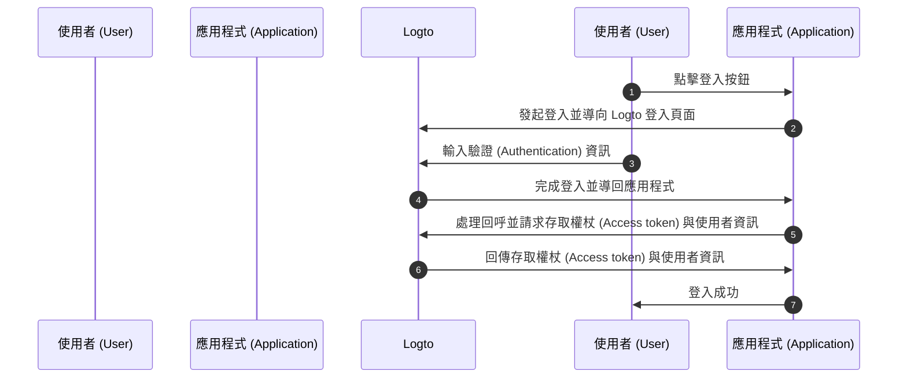
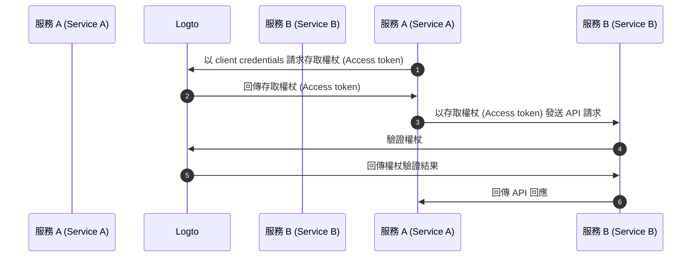
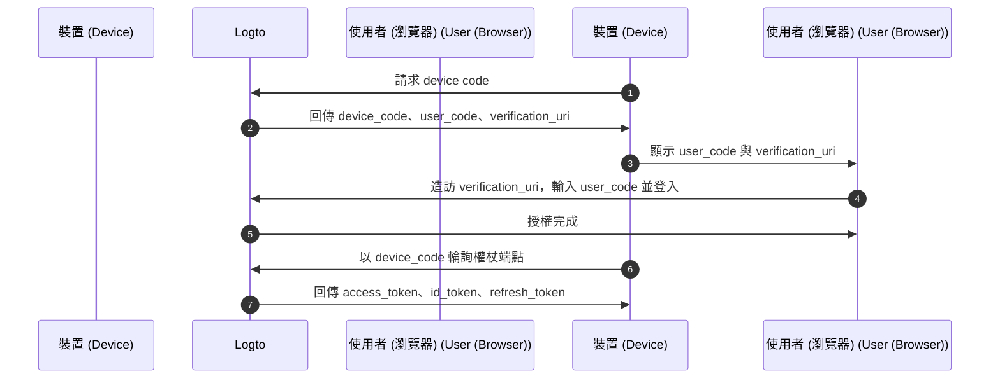
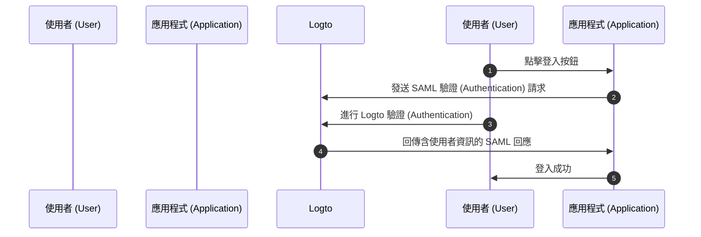

# 理解 OIDC 驗證 (Authentication) 流程

Logto 建立於 [OAuth 2.0](https://auth.wiki/oauth-2.0) 與 [OpenID Connect (OIDC)](https://auth.wiki/openid-connect) 標準之上。理解這些驗證 (Authentication) 標準能讓整合流程更加順暢與直接。

### 使用者驗證 (Authentication) 流程 \{#user-authentication-flow}

以下是使用者透過 Logto 登入時的流程：

在此流程中，有幾個整合時的重要概念：

- `Application`：代表你在 Logto 中的應用程式。你需要在 Logto Console 建立應用程式設定，以建立你的實際應用程式與 Logto 服務的連結。詳見 [Application](/integrate-logto/application-data-structure/#introduction)。
- `Redirect URI`：使用者在 Logto 登入頁完成驗證 (Authentication) 後，Logto 會透過此 URI 導回你的應用程式。你需要在應用程式設定中配置 Redirect URI。詳見 [Redirect URIs](/integrate-logto/application-data-structure/#redirect-uris)。
- `Handle sign-in callback`：Logto 導回使用者時，你的應用程式需處理驗證 (Authentication) 資料並請求存取權杖 (Access token) 與使用者資訊。別擔心，Logto SDK 會自動處理這部分。

以上為快速整合的重點。若想深入了解，請參閱 [登入體驗 (Sign-in experience) 詳解](/concepts/sign-in-experience/) 指南。

### 機器對機器驗證 (Authentication) 流程 \{#machine-to-machine-authentication-flow}

Logto 提供 [機器對機器 (M2M, Machine-to-Machine) 應用程式](/quick-starts/m2m) 類型，基於 [OAuth 2.0 Client Credentials flow](https://auth.wiki/client-credentials-flow) 實現服務間直接驗證 (Authentication)：

此機器對機器 (M2M) 驗證 (Authentication) 流程適用於無需使用者互動（無 UI）的應用程式，例如 API 服務更新 Logto 使用者資料，或統計服務拉取每日訂單。

在此流程中，服務以 client credentials（[Application ID](/integrate-logto/application-data-structure/#application-id) 與 [Application Secret](/integrate-logto/application-data-structure/#application-secret) 組合）進行驗證 (Authentication)，這組憑證能唯一識別並驗證服務身分。這些憑證作為服務請求 [存取權杖 (Access token)](https://auth.wiki/access-token) 時的身分。

### 裝置流程（輸入受限裝置）\{#device-flow}

針對輸入能力有限的裝置（如智慧電視、遊戲主機、CLI 工具、IoT 裝置），Logto 支援 [OAuth 2.0 Device Authorization Grant](https://auth.wiki/device-flow)。裝置顯示一組代碼與網址，使用者在另一台有瀏覽器的裝置上完成驗證 (Authentication)：

此流程中：

- 裝置向 Logto 請求 device code，取得短暫的 `user_code` 與 `verification_uri`
- 使用者在另一台裝置（手機、筆電）造訪驗證網址，輸入代碼並登入
- 裝置持續輪詢權杖端點，直到使用者完成授權，然後取得權杖

與標準使用者流程不同，裝置流程不需裝置本身具備 Redirect URI 或瀏覽器能力。詳見 [裝置流程快速上手](/quick-starts/device-flow)。

### SAML 驗證 (Authentication) 流程 \{#saml-authentication-flow}

除了 OAuth 2.0 與 OIDC，Logto 亦支援 SAML（Security Assertion Markup Language）驗證 (Authentication)，可作為身分提供者 (IdP) 整合企業應用。目前 Logto 支援 SP 發起的驗證 (Authentication) 流程：

#### SP 發起流程 \{#saml-authentication-flow-sp-init}

在 SP 發起流程中，驗證 (Authentication) 從服務提供者（你的應用程式）開始：

此流程中：

- 使用者從你的應用程式（服務提供者）啟動驗證 (Authentication) 流程
- 應用程式產生 SAML 請求並導向 Logto（身分提供者）
- 使用者在 Logto 完成驗證 (Authentication) 後，Logto 回傳 SAML 回應至應用程式
- 應用程式處理 SAML 回應並完成驗證 (Authentication)

#### IdP 發起流程 \{#saml-authentication-flow-idp-init}

Logto 未來將支援 IdP 發起流程，讓使用者可直接從 Logto 入口啟動驗證 (Authentication) 流程。請持續關注此功能更新。

此 SAML 整合讓企業應用程式可將 Logto 作為身分提供者 (IdP)，同時支援現代與傳統 SAML 型服務提供者。

## 相關資源 \{#related-resources}

<Url href="https://blog.logto.io/secure-cloud-apps-with-oauth-and-openid-connect">
  部落格：使用 OAuth 2.0 與 OpenID Connect 保護雲端應用程式
</Url>

<Url href="https://blog.logto.io/sso-is-better">為什麼多應用程式採用單一登入 (SSO) 更好</Url>

<Url href="https://blog.logto.io/centralized-identity-system">
  為什麼多應用程式業務需要集中式身分系統
</Url>
