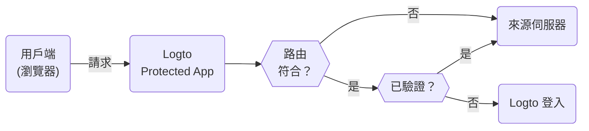

# Protected App — 非 SDK 驗證 (Authentication) 整合

Protected App 的設計目的是將 [驗證 (Authentication)](https://auth.wiki/authentication) 層從你的應用程式中分離，消除 [SDK 整合](/quick-starts) 的複雜性。我們負責驗證 (Authentication)，讓你專注於核心功能。使用者驗證後，Protected App 會從你的伺服器提供內容。

## Protected App 如何運作 \{#how-protected-app-works}

Protected App 由 Cloudflare 提供支援，運行於全球邊緣網路，確保你的應用程式擁有低延遲與高可用性。

Protected App 維護會話狀態與使用者資訊。如果使用者尚未驗證，Protected App 會將其導向登入頁面。驗證後，Protected App 會將使用者的請求包裝上驗證與使用者資訊，再轉發至來源伺服器。

若要限制哪些已驗證的使用者可以存取 Protected App，請在應用程式的 **規則 (Rules)** 分頁設定 [應用程式層級存取控制](/authorization/app-level-access-control)。

此流程可用下方流程圖表示：


```mermaid
graph LR
  A("用戶端<br/>(瀏覽器)") -->|請求| B(Logto<br/>Protected App)
  B --> Condition{{路由<br/>符合？}}
  Condition -->|是| Matched{{已驗證？}}
  Matched -->|是| C(來源伺服器)
  Matched -->|否| D(Logto 登入)
  Condition -->|否| C
```

## 保護你的來源伺服器 \{#protect-your-origin-server}

來源伺服器可以是 Logto Protected App 不擁有的實體或虛擬設備，是你的應用程式內容所在之處。類似於內容傳遞網路（CDN）伺服器，Protected App 管理驗證流程並從來源伺服器取得內容。因此，若使用者能直接存取來源伺服器，將可繞過驗證，應用程式將不再受保護。

因此，保護來源連線非常重要，這可防止攻擊者在未經驗證的情況下發現並存取你的來源伺服器。常見做法如下：

1. HTTP 標頭驗證
2. JSON Web Token (JWT) 驗證

### HTTP 標頭驗證 \{#http-header-validation}

你可以使用 [HTTP 基本驗證 (Basic Authentication)](https://developer.mozilla.org/en-US/docs/Web/HTTP/Authentication#basic_authentication_scheme) 來保護你的來源伺服器。

每個來自 Protected App 的請求都包含以下標頭：

```
Authorization: Basic base64(appId:appSecret)
```

透過驗證此標頭，你可以確認請求來自 Protected App，並拒絕未包含此標頭的請求。

若你使用 Nginx 或 Apache，可參考下列指南於來源伺服器實作 HTTP 基本驗證：

1. Nginx：[設定 HTTP 基本驗證](https://docs.nginx.com/nginx/admin-guide/security-controls/configuring-http-basic-authentication/)
2. Apache：[驗證 (Authentication) 與授權 (Authorization)](https://httpd.apache.org/docs/2.4/howto/auth.html)

若要在應用程式內檢查標頭，可參考 Cloudflare 提供的 [HTTP Basic Authentication 範例](https://developers.cloudflare.com/workers/examples/basic-auth/)，學習如何使用 HTTP Basic 機制限制存取。

### JSON Web Token (JWT) 驗證 \{#json-web-tokens-jwt-validation}

另一種保護來源伺服器的方法是使用 JSON Web Token (JWT)。

每個經驗證的 Protected App 請求都包含以下標頭：

```
Logto-ID-Token: <JWT>
```

此 JWT 稱為 [ID 權杖 (ID Token)](https://auth.wiki/id-token)，由 Logto 簽署並包含使用者資訊。驗證此 JWT 可確認請求來自 Protected App，並拒絕未包含此標頭的請求。

權杖以 [JWS](https://auth.wiki/jws) 權杖格式加密並簽署。

驗證步驟如下：

1. [驗證 JWT](https://datatracker.ietf.org/doc/html/rfc7519#section-7.2)
2. [驗證 JWS 簽章](https://datatracker.ietf.org/doc/html/rfc7515#section-5.2)
3. 權杖的簽發者 (Issuer) 為 `https://<your-logto-domain>/oidc`（由你的 Logto 驗證伺服器簽發）

```js
const express = require('express');
const jwksClient = require('jwks-rsa');
const jwt = require('jsonwebtoken');

const ISSUER = 'https://<your-logto-domain>/oidc';
const CERTS_URL = 'https://<your-logto-domain>/oidc/jwks';

const client = jwksClient({
  jwksUri: CERTS_URL,
});

const getKey = (header, callback) => {
  client.getSigningKey(header.kid, function (err, key) {
    callback(err, key?.getPublicKey());
  });
};

const verifyToken = (req, res, next) => {
  const token = req.headers['Logto-ID-Token'];

  // 確認請求包含我們的權杖標頭
  if (!token) {
    return res
      .status(403)
      .send({ status: false, message: 'missing required Logto-ID-Token header' });
  }

  jwt.verify(token, getKey, { issuer: ISSUER }, (err, decoded) => {
    if (err) {
      return res.status(403).send({ status: false, message: 'invalid id token' });
    }

    req.user = decoded;
    next();
  });
};

const app = express();

app.use(verifyToken);

app.get('/', (req, res) => {
  res.send('Hello World!');
});

app.listen(3000);
```

## 取得驗證狀態與使用者資訊 \{#get-authentication-state-and-user-information}

若你需要取得應用程式的驗證與使用者資訊，也可使用 `Logto-ID-Token` 標頭。

若你只需解碼權杖，可參考下方程式碼：

```js
const express = require('express');

const decodeIdToken = (req, res, next) => {
  const token = req.headers['Logto-ID-Token'];

  if (!token) {
    return res.status(403).send({
      status: false,
      message: 'missing required Logto-ID-Token header',
    });
  }

  const parts = token.split('.');
  if (parts.length !== 3) {
    throw new Error('Invalid ID token');
  }

  const payload = parts[1];
  const decodedPayload = atob(payload.replace(/-/g, '+').replace(/_/g, '/'));
  const claims = JSON.parse(decodedPayload);

  req.user = claims;
  next();
};

const app = express();

app.use(decodeIdToken);

app.get('/', (req, res) => {
  res.json(req.user);
});

app.listen(3000);
```

## 自訂 ID 權杖宣告 (Claims) \{#customize-id-token-claims}

預設情況下，`Logto-ID-Token` 標頭包含標準 OIDC 宣告（如 `sub`、`name`、`email`）。若要包含 [擴充宣告](/developers/custom-id-token#extended-claims)（如角色 (Roles) 或組織 (Organizations) 資料），需同時設定下列兩項：

1. **租戶開關**：於 <CloudLink to="/customize-jwt">Console > Custom JWT > ID 權杖 (ID token)</CloudLink> 啟用該宣告。
2. **Protected App 權限範圍 (Scopes)**：於 Protected App 設定中，在 **ID 權杖宣告 (ID token claims)** > **額外權限範圍 (Additional scopes)** 選取對應範圍。

只有在 Custom JWT 啟用該宣告且 Protected App 選取對應權限範圍時，擴充宣告才會包含於轉發的 ID 權杖中。完整擴充權限範圍與宣告請參閱 [自訂 ID 權杖](/developers/custom-id-token)。

| 權限範圍 (Scope)                     | 宣告 (Claims)                        |
| ------------------------------------ | ------------------------------------ |
| `custom_data`                        | `custom_data`                        |
| `identities`                         | `identities`, `sso_identities`       |
| `roles`                              | `roles`                              |
| `urn:logto:scope:organizations`      | `organizations`, `organization_data` |
| `urn:logto:scope:organization_roles` | `organization_roles`                 |

## 取得原始主機 \{#get-the-original-host}

若你需要取得用戶端請求的原始主機，可使用 `Logto-Host` 或 `x-forwarded-host` 標頭。

## 自訂驗證規則 \{#customize-authentication-rules}

預設情況下，Protected App 會保護所有路由。若需自訂驗證規則，可於 Console 設定「自訂驗證規則 (Custom authentication rules)」欄位。

支援正則表達式，以下為兩種情境範例：

1. 僅保護 `/admin` 與 `/privacy` 路由：`^/(admin|privacy)/.*`
2. 排除 JPG 圖片不需驗證：`^(?!.*\.jpg$).*$`

## 本地開發 \{#local-development}

Protected App 設計用於搭配你的來源伺服器運作。若來源伺服器未公開於網際網路，可使用 [ngrok](https://ngrok.com/) 或 [Cloudflare Tunnels](https://developers.cloudflare.com/pages/how-to/preview-with-cloudflare-tunnel/) 等工具將本地伺服器暴露至網路。

## 過渡至 SDK 整合 \{#transition-to-sdk-integration}

Protected App 旨在簡化驗證流程。但若你希望獲得更高控制與自訂性，決定過渡至 SDK 整合，可在 Logto [建立新應用程式](/integrate-logto/integrate-logto-into-your-application) 並設定 [SDK 整合](/quick-starts)。為順利過渡，你可重複使用 Protected App 的應用程式設定。Protected App 在 Logto 中實際上是一個「傳統網頁應用程式 (Traditional Web App)」，你可於應用程式設定中找到「[AppId](/integrate-logto/application-data-structure#application-id)」與「[AppSecret](/integrate-logto/application-data-structure#application-secret)」。過渡完成後，可將 Protected App 從應用程式中移除。

## 相關資源 \{#related-resources}

<Url href="https://www.youtube.com/watch?v=ZBrXW3iZyKY">
  Protected App：幾個點擊就能建構應用程式驗證 (Authentication)，無需寫程式碼。
</Url>

<Url href="https://blog.logto.io/protected-app">Protected App 背後的動機</Url>

<Url href="https://blog.logto.io/fastest-way-to-build-auth-system">
  建立驗證 (Authentication) 系統的最快方式
</Url>
