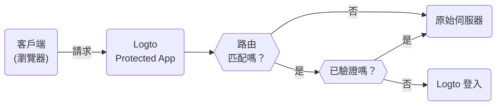

# Protected App — 非 SDK 驗證 (Authentication) 整合

Protected App 的設計旨在透過將 [驗證 (Authentication)](https://auth.wiki/authentication) 層與應用程式分離，消除 [SDK 整合](/quick-starts) 的複雜性。我們負責處理驗證，讓你專注於核心功能。使用者驗證後，Protected App 會從你的伺服器提供內容。

## Protected App 的運作方式 \{#how-protected-app-works}

由 Cloudflare 提供支持的 Protected App 在全球邊緣網路上運行，確保你的應用程式具有低延遲和高可用性。

Protected App 維護會話狀態和使用者資訊。如果使用者未經驗證，Protected App 會將他們重定向到登入頁面。驗證後，Protected App 會將使用者的請求包裹上驗證和使用者資訊，然後轉發到原始伺服器。

此過程在以下流程圖中可視化：



## 保護你的原始伺服器 \{#protect-your-origin-server}

原始伺服器可以是 Logto 的 Protected App 不擁有的實體或虛擬設備，是你的應用程式內容所在的位置。類似於內容傳遞網路 (CDN) 伺服器，Protected App 管理驗證過程並從你的原始伺服器檢索內容。因此，如果使用者直接訪問你的原始伺服器，他們可以繞過驗證，應用程式將不再受保護。

因此，保護原始連接非常重要，這可以防止攻擊者在未經驗證的情況下發現和訪問你的原始伺服器。有幾種方法可以做到這一點：

1. HTTP Header 驗證
2. JSON Web Tokens (JWT) 驗證

### HTTP Header 驗證 \{#http-header-validation}

可以使用 [HTTP Basic Authentication](https://developer.mozilla.org/en-US/docs/Web/HTTP/Authentication#basic_authentication_scheme) 來保護你的原始伺服器。

每個來自 Protected App 的請求都包含以下標頭：

```
Authorization: Basic base64(appId:appSecret)
```

通過驗證此標頭，你可以確認請求來自 Protected App，並拒絕任何不包含此標頭的請求。

如果你使用 Nginx 或 Apache，可以參考以下指南在原始伺服器上實施 HTTP Basic Authentication：

1. Nginx：[配置 HTTP Basic Authentication](https://docs.nginx.com/nginx/admin-guide/security-controls/configuring-http-basic-authentication/)
2. Apache：[驗證 (Authentication) 和授權 (Authorization)](https://httpd.apache.org/docs/2.4/howto/auth.html)

要在應用程式中檢查標頭，請參考 Cloudflare 提供的 [HTTP Basic Authentication 範例](https://developers.cloudflare.com/workers/examples/basic-auth/) 以了解如何使用 HTTP Basic 模式限制訪問。

### JSON Web Tokens (JWT) 驗證 \{#json-web-tokens-jwt-validation}

另一種保護原始伺服器的方法是使用 JSON Web Tokens (JWT)。

每個來自 Protected App 的已驗證請求都包含以下標頭：

```
Logto-ID-Token: <JWT>
```

JWT 被稱為 [ID 權杖 (ID Token)](https://auth.wiki/id-token)，由 Logto 簽署並包含使用者資訊。通過驗證此 JWT，你可以確認請求來自 Protected App，並拒絕任何不包含此標頭的請求。

權杖被加密並簽署為 [JWS](https://auth.wiki/jws) 權杖。

驗證步驟：

1. [驗證 JWT](https://datatracker.ietf.org/doc/html/rfc7519#section-7.2)
2. [驗證 JWS 簽名](https://datatracker.ietf.org/doc/html/rfc7515#section-5.2)
3. 權杖的簽發者是 `https://<your-logto-domain>/oidc`（由你的 Logto 驗證伺服器簽發）

```js
const express = require('express');
const jwksClient = require('jwks-rsa');
const jwt = require('jsonwebtoken');

const ISSUER = 'https://<your-logto-domain>/oidc';
const CERTS_URL = 'https://<your-logto-domain>/oidc/jwks';

const client = jwksClient({
  jwksUri: CERTS_URL,
});

const getKey = (header, callback) => {
  client.getSigningKey(header.kid, function (err, key) {
    callback(err, key?.getPublicKey());
  });
};

const verifyToken = (req, res, next) => {
  const token = req.headers['Logto-ID-Token'];

  // 確保傳入的請求具有我們的權杖標頭
  if (!token) {
    return res.status(403).send({ status: false, message: '缺少必要的 Logto-ID-Token 標頭' });
  }

  jwt.verify(token, getKey, { issuer: ISSUER }, (err, decoded) => {
    if (err) {
      return res.status(403).send({ status: false, message: '無效的 ID 權杖' });
    }

    req.user = decoded;
    next();
  });
};

const app = express();

app.use(verifyToken);

app.get('/', (req, res) => {
  res.send('Hello World!');
});

app.listen(3000);
```

## 獲取驗證狀態和使用者資訊 \{#get-authentication-state-and-user-information}

如果你需要獲取應用程式的驗證和使用者資訊，也可以使用 `Logto-ID-Token` 標頭。

如果你只想解碼權杖，可以使用以下代碼：

```js
const express = require('express');

const decodeIdToken = (req, res, next) => {
  const token = req.headers['Logto-ID-Token'];

  if (!token) {
    return res.status(403).send({
      status: false,
      message: '缺少必要的 Logto-ID-Token 標頭',
    });
  }

  const parts = token.split('.');
  if (parts.length !== 3) {
    throw new Error('無效的 ID 權杖');
  }

  const payload = parts[1];
  const decodedPayload = atob(payload.replace(/-/g, '+').replace(/_/g, '/'));
  const claims = JSON.parse(decodedPayload);

  req.user = claims;
  next();
};

const app = express();

app.use(decodeIdToken);

app.get('/', (req, res) => {
  res.json(req.user);
});

app.listen(3000);
```

## 獲取原始主機 \{#get-the-original-host}

如果你需要獲取客戶端請求的原始主機，可以使用 `Logto-Host` 或 `x-forwarded-host` 標頭。

## 自訂驗證規則 \{#customize-authentication-rules}

預設情況下，Protected App 會保護所有路由。如果你需要自訂驗證規則，可以在 Console 中設置「自訂驗證規則」欄位。

它支援正則表達式，以下是兩個案例：

1. 僅保護路由 `/admin` 和 `/privacy`：`^/(admin|privacy)/.*`
2. 排除 JPG 圖片的驗證：`^(?!.*\.jpg$).*$`

## 本地開發 \{#local-development}

Protected App 設計用於與你的原始伺服器一起工作。然而，如果你的原始伺服器無法公開訪問，可以使用 [ngrok](https://ngrok.com/) 或 [Cloudflare Tunnels](https://developers.cloudflare.com/pages/how-to/preview-with-cloudflare-tunnel/) 等工具將本地伺服器暴露到互聯網。

## 過渡到 SDK 整合 \{#transition-to-sdk-integration}

Protected App 設計用於簡化驗證過程。然而，如果你決定過渡到 SDK 整合以獲得更好的控制和自訂，可以在 Logto 中 [創建一個新應用程式](/integrate-logto/integrate-logto-into-your-application) 並配置 [SDK 整合](/quick-starts)。為了順利過渡，你可以重用 Protected App 的應用程式配置。Protected App 實際上是 Logto 中的「傳統 Web 應用程式」，你可以在應用程式設置中找到「[AppId](/integrate-logto/application-data-structure#application-id)」和「[AppSecret](/integrate-logto/application-data-structure#application-secret)」。過渡完成後，可以從應用程式中移除 Protected App。

## 相關資源 \{#related-resources}

<Url href="https://www.youtube.com/watch?v=ZBrXW3iZyKY">
  Protected App：點擊即可構建應用程式的驗證 (Authentication)。無需編碼。
</Url>

<Url href="https://blog.logto.io/protected-app">Protected App 背後的動機</Url>

<Url href="https://blog.logto.io/fastest-way-to-build-auth-system">構建驗證系統的最快方法</Url>
