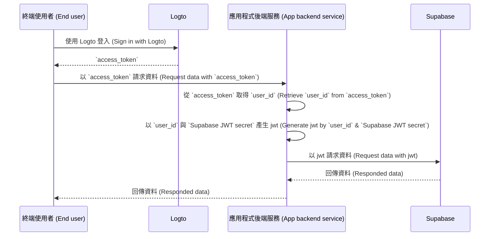

# 為你的 Supabase 應用程式新增驗證 (Authentication)

## Supabase 基礎知識 \{#supabase-basics}

Supabase 利用 [Postgres 的 Row-Level Security（行級安全性）](https://www.postgresql.org/docs/current/ddl-rowsecurity.html) 來控制資料存取權限。簡單來說，透過為資料庫中的資料表建立 Row Level Security（RLS）政策，我們可以限制並管理誰能讀取、寫入和更新資料表中的資料。

假設你的資料庫中有一個名為「posts」的資料表，內容如下：


資料表中的 `user_id` 欄位代表每筆貼文資料所屬的使用者。你可以根據 `user_id` 欄位限制每個使用者只能存取自己的貼文資料。

然而，在實作這個功能之前，Supabase 需要能夠識別目前存取資料庫的使用者。

### 將使用者資料加入 Supabase 請求 \{#add-user-data-to-the-supabase-requests}

由於 Supabase 支援 JWT，當我們的應用程式與 Supabase 互動時，可以利用 Supabase 提供的 JWT secret 產生一個包含使用者資料的 JWT，並在請求時將此 JWT 作為驗證 (Authentication) 標頭。Supabase 收到請求後，會自動驗證 JWT 的有效性，並在後續流程中允許存取其中的資料。

首先，可以在 Supabase 控制台的「Project Settings」中取得 Supabase 提供的 JWT secret：


接著，當我們使用 Supabase SDK 向 Supabase 發送請求時，就利用這個 secret 產生 JWT，並將其作為驗證 (Authentication) 標頭附加到請求上。（請注意，此流程應在你的應用程式後端服務中執行，JWT secret 絕不可暴露給第三方。）

```jsx
import { createClient } from '@supabase/supabase-js';
import { sign } from 'jsonwebtoken';

/
 * 注意：
 * 你可以在與 JWT Secret 相同的位置找到 SUPABASE_URL、SUPABASE_ANON_KEY。
 */
const SUPABASE_URL = process.env.SUPABASE_URL;
const SUPABASE_ANON_KEY = process.env.SUPABASE_ANON_KEY;

const SUPABASE_JWT_SECRET = process.env.SUPABASE_JWT_SECRET;

export const getSupabaseClient = (userId) => {
  const jwtPayload = {
    userId,
  };

  const jwt = sign(jwtPayload, SUPABASE_JWT_SECRET, {
    expiresIn: '1h', // 僅作為示範
  });

  const client = createClient(SUPABASE_URL, SUPABASE_ANON_KEY, {
    global: {
      headers: {
        Authorization: `Bearer ${jwt}`,
      },
    },
  });

  return client;
};
```

接下來，前往 Supabase 控制台的 SQL Editor，建立一個用於取得請求中 userId 的函式：


圖片中使用的程式碼如下：

```sql
create or replace function auth.user_id() returns text as $$
  select nullif(current_setting('request.jwt.claims', true)::json->>'userId', '')::text;
$$ language sql stable;
```

如程式碼所示，在 Supabase 中，你可以透過呼叫 `request.jwt.claims` 取得我們產生的 JWT 的 payload。payload 中的 `userId` 欄位即為我們設定的值。

有了這個函式，Supabase 就能判斷目前存取資料庫的使用者。

### 建立 Row-Level Security 政策 \{#create-row-level-security-policy}

接下來，我們可以建立一個 Row-Level Security 政策，根據 posts 資料表中的 `user_id` 欄位，限制每個使用者只能存取自己的貼文資料。

1. 前往 Supabase 控制台的 Table Editor 頁面，選擇 posts 資料表。
2. 點擊表格上方的「Add RLS Policy」。
3. 在彈出的視窗中點擊「Create policy」。
4. 輸入 Policy Name 並選擇 SELECT Policy 指令。
5. 在下方 `using` 區塊輸入：

```sql
auth.user_id() = user_id
```


透過這類政策，即可實現 Supabase 內的資料存取控制。

在實際應用中，你會建立各種政策來限制使用者的資料插入與修改等操作，但這超出本文範圍。更多關於 Row-Level Security（RLS）的資訊，請參閱 [Secure your data using Postgres Row Level Security](https://supabase.com/docs/guides/database/postgres/row-level-security)。

### 與 Logto 的基本整合流程 \{#basic-integration-process-with-logto}

如前所述，Supabase 透過 RLS 進行存取控制，因此與 Logto（或其他驗證 (Authentication) 服務）整合的關鍵在於取得授權使用者的 user id 並傳遞給 Supabase。整個流程如下圖所示：



接下來，我們將根據此流程圖說明如何將 Logto 與 Supabase 整合。

## Logto 整合 \{#logto-integration}

Logto 提供多種框架與程式語言的整合指南。

一般來說，這些框架與語言建構的應用程式可分為 Native app、SPA（單頁應用程式）、傳統 Web app 以及 M2M（機器對機器）app。你可以前往 [Logto 快速入門](/quick-starts) 頁面，根據你使用的技術棧將 Logto 整合進你的應用程式。之後，請依照下方說明，根據應用程式型態將 Logto 整合進你的專案。

### Native app 或 SPA \{#native-app-or-spa}

Native app 與 SPA 都在你的裝置上執行，登入後取得的憑證（存取權杖 (Access token)）會儲存在本地裝置。

因此，當你的應用程式要與 Supabase 整合時，必須透過你的後端服務與 Supabase 互動，因為你不能在每個使用者裝置上暴露敏感資訊（如 Supabase JWT secret）。

假設你使用 React 與 Express 建構 SPA，並已依照 [Logto React SDK 指南](/quick-starts/react) 成功將 Logto 整合進應用程式（可參考我們的 [react 範例程式碼](https://github.com/logto-io/js/tree/master/packages/react-sample)）。此外，你已根據 [驗證存取權杖 (Validate access tokens)](/authorization/validate-access-tokens) 指南，在後端伺服器加入 Logto 存取權杖驗證。

接下來，你將使用從 Logto 取得的存取權杖向後端伺服器請求使用者資料：

```jsx
import { useLogto } from '@logto/react';
import { useState, useEffect } from 'react';
import PostList from './PostList';

const endpoint = '<https://www.mysite.com/api/posts>';
const resource = '<https://www.mysite.com/api>';

function PostPage() {
  const { isAuthenticated, getAccessToken } = useLogto();
  const [posts, setPosts] = useState();

  useEffect(() => {
    const fetchPosts = async () => {
      const response = await fetch(endpoint, {
        headers: {
          Authorization: `Bearer ${await getAccessToken(resource)}`,
        },
      });
      setPosts(response.json());
    };

    if (isAuthenticated) {
      void fetchPosts();
    }
  }, [isAuthenticated, getAccessToken]);

  return <PostList posts={posts} />;
}

export default PostPage;
```

在你的後端伺服器中，你已透過 middleware 從存取權杖中擷取登入使用者的 id：

```jsx
// auth-middleware.ts
import { createRemoteJWKSet, jwtVerify } from 'jose';

//...

export const verifyAuthFromRequest = async (ctx, next) => {
  // 擷取權杖
  const token = extractBearerTokenFromHeaders(ctx.request.headers);

  const { payload } = await jwtVerify(
    token, // 從請求標頭擷取的原始 Bearer Token
    createRemoteJWKSet(new URL('https://<your-logto-domain>/oidc/jwks')), // 使用從 Logto 伺服器查詢的 jwks_uri 產生 jwks
    {
      // 權杖的預期簽發者，應由 Logto 伺服器簽發
      issuer: 'https://<your-logto-domain>/oidc',
      // 權杖的預期受眾，應為目前 API 的資源標示符 (resource indicator)
      audience: '<your request listener resource indicator>',
    }
  );

  // 如果你使用 RBAC
  assert(payload.scope.includes('some_scope'));

  // 自訂 payload 邏輯
  ctx.auth = {
    userId: payload.sub,
  };

  return next();
};
```

現在，你可以使用前述的 `getSupabaseClient`，將 `userId` 附加到後續請求 Supabase 所用的 JWT。你也可以建立 middleware，為需要與 Supabase 互動的請求建立 Supabase client：

```jsx
export const withSupabaseClient = async (ctx, next) => {
  ctx.supabase = getSupabaseClient(ctx.auth.userId);

  return next();
};
```

在後續處理流程中，你可以直接呼叫 `ctx.supabase` 與 Supabase 互動：

```jsx
const fetchPosts = async (ctx) => {
	cosnt { data } = await ctx.supabase.from('posts').select('*');

	return data;
}
```

在這段程式碼中，Supabase 會根據先前設定的政策，只回傳屬於目前使用者的貼文資料。

### 傳統 Web app \{#traditional-web-app}

傳統 Web app 與 Native app 或 SPA 的主要差異在於，傳統 Web app 僅在 Web 伺服器上進行頁面渲染與更新。因此，使用者憑證由 Web 伺服器直接管理，而 Native app 與 SPA 則儲存在使用者裝置上。

在 Supabase 中將 Logto 與傳統 Web app 整合時，可以直接從後端取得登入使用者的 id。

以 Next.js 專案為例，當你依照 [Next.js SDK 指南](/quick-starts/next-app-router) 將 Logto 整合進專案後，可以使用 Logto SDK 取得使用者資訊，並產生對應的 JWT 與 Supabase 互動。

```jsx
import { getLogtoContext } from '@logto/next-server-actions';
import { logtoConfig } from '@/logto';
import { getSupabaseClient } from '@/utils';
import PostList from './PostList';

export default async function PostPage() {
  const { cliams } = await getLogtoContext(logtoConfig);

  // `cliams` 中的 `sub` 值即為 user id。
  const supabase = getSupabaseClient(cliams.sub);

  const { data: posts } = await supabase.from('posts').select('*');

  return <PostList posts={posts} />;
}
```

### 機器對機器 app \{#machine-to-machine-app}

機器對機器（M2M, Machine-to-machine）常用於你的應用程式需直接與資源伺服器溝通的情境，例如靜態服務每日拉取貼文等。

你可以參考 [機器對機器：使用 Logto 驗證 (Authentication)](/quick-starts/m2m) 指南進行機器對機器 app 的驗證 (Authentication)。Supabase 與機器對機器 app 的整合方式與 Native app、SPA 類似（詳見「[Native app 或 SPA](#native-app-or-spa)」章節），即先從 Logto 取得存取權杖，再透過受保護的後端 API 驗證。

但需注意，Native app 與 SPA 通常面向終端使用者，因此取得的 user id 代表使用者本身；而機器對機器 app 的存取權杖則代表應用程式本身，access token payload 中的 `sub` 欄位是 M2M app 的 client id，而非特定使用者。因此，開發時需明確區分哪些資料是給 M2M app 使用。

此外，若你希望特定 M2M app 以整個服務的身分存取 Supabase、繞過 RLS 限制，可以使用 Supabase 的 `service_role` secret 建立 Supabase client。這在你需要執行管理或自動化任務、必須存取所有資料且不受個別使用者 RLS 政策限制時非常有用。

`service_role` secret 可在與 JWT secret 相同的頁面找到：


建立 Supabase client 時，使用 `service_role` secret，該 client 即可存取資料庫中的所有資料：

```jsx
import { createClient } from '@supabase/supabase-js';

// ...
const SUPABASE_SERVICE_ROLE_SCRET = process.env.SUPABASE_SERVICE_ROLE_SCRET;

const client = createClient(SUPABASE_URL, SUPABASE_SERVICE_ROLE_SCRET, {
  // ...options
});
```
