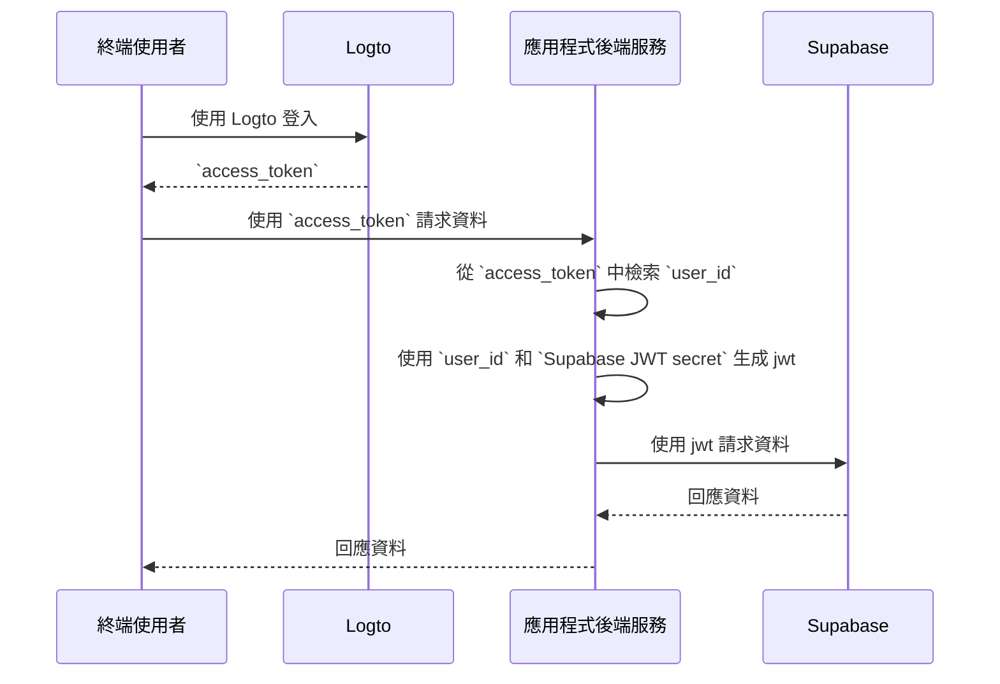

import createGetUserIdFunctionImage from '@site/docs/quick-starts/database/supabase/create-get-user-id-function.webp';
import createRlsPolicyImage from '@site/docs/quick-starts/database/supabase/create-rls-policy.webp';
import postsTableImage from '@site/docs/quick-starts/database/supabase/posts-table.webp';
import serviceRoleSecretImage from '@site/docs/quick-starts/database/supabase/service-role-secret.webp';
import supabaseApiSettingsImage from '@site/docs/quick-starts/database/supabase/supabase-api-settings.webp';

# 為你的 Supabase 應用程式新增驗證 (Authentication)

## Supabase 基礎 \{#supabase-basics}

Supabase 利用 [Postgres 的 Row-Level Security](https://www.postgresql.org/docs/current/ddl-rowsecurity.html) 來控制資料存取權限。簡單來說，透過為資料庫中的表格創建 Row Level Security 政策，我們可以限制和管理誰可以讀取、寫入和更新表格中的資料。

假設你的資料庫中有一個名為 "posts" 的表格，內容如下：


表格中的 `user_id` 欄位代表每筆貼文資料所屬的使用者。你可以根據 `user_id` 欄位限制每位使用者僅能存取自己的貼文資料。

然而，在實施此功能之前，Supabase 需要能夠識別當前存取資料庫的使用者。

### 將使用者資料新增至 Supabase 請求 \{#add-user-data-to-the-supabase-requests}

由於 Supabase 支援 JWT，當我們的應用程式與 Supabase 互動時，我們可以使用 Supabase 提供的 JWT secret 生成包含使用者資料的 JWT。然後在發送請求時將此 JWT 作為驗證 (Authentication) 標頭。收到請求後，Supabase 會自動驗證 JWT 的有效性，並在後續過程中允許存取其中包含的資料。

首先，我們可以從 Supabase 儀表板的「Project Settings」中獲取 Supabase 提供的 JWT secret：


接著，當我們使用 Supabase SDK 向 Supabase 發送請求時，我們利用此 secret 生成 JWT，並將其附加為請求的驗證 (Authentication) 標頭。（請注意，此過程發生在應用程式的後端服務中，JWT secret 不應暴露給第三方）。

```jsx
import { createClient } from '@supabase/supabase-js';
import { sign } from 'jsonwebtoken';

/*
 * 注意：
 * 你可以在找到 JWT Secret 的同一位置找到 SUPABASE_URL 和 SUPABASE_ANON_KEY。
 */
const SUPABASE_URL = process.env.SUPABASE_URL;
const SUPABASE_ANON_KEY = process.env.SUPABASE_ANON_KEY;

const SUPABASE_JWT_SECRET = process.env.SUPABASE_JWT_SECRET;

export const getSupabaseClient = (userId) => {
  const jwtPayload = {
    userId,
  };

  const jwt = sign(jwtPayload, SUPABASE_JWT_SECRET, {
    expiresIn: '1h', // 僅作為示範
  });

  const client = createClient(SUPABASE_URL, SUPABASE_ANON_KEY, {
    global: {
      headers: {
        Authorization: `Bearer ${jwt}`,
      },
    },
  });

  return client;
};
```

接下來，前往 Supabase 儀表板中的 SQL Editor，創建一個函數以檢索請求中攜帶的 userId：


圖片中使用的程式碼如下：

```sql
create or replace function auth.user_id() returns text as $$
  select nullif(current_setting('request.jwt.claims', true)::json->>'userId', '')::text;
$$ language sql stable;
```

如程式碼所示，在 Supabase 中，你可以透過呼叫 `request.jwt.claims` 來檢索我們生成的 JWT 的有效負載。有效負載中的 `userId` 欄位即為我們設定的值。

有了這個函數，Supabase 可以確定當前存取資料庫的使用者。

### 創建 Row-Level Security 政策 \{#create-row-level-security-policy}

接下來，我們可以創建一個 Row-Level Security 政策，以根據 posts 表格中的 `user_id` 欄位限制每位使用者僅能存取自己的貼文資料。

1. 前往 Supabase 儀表板中的 Table Editor 頁面，選擇 posts 表格。
2. 點擊表格頂部的 "Add RLS Policy"。
3. 在彈出的窗口中，點擊 "Create policy"。
4. 輸入政策名稱並選擇 SELECT Policy 命令。
5. 在以下程式碼的 `using` 區塊中輸入：

```sql
auth.user_id() = user_id
```


透過這樣的政策，可以實現 Supabase 中的資料存取控制。

在實際應用中，你會創建各種政策來限制使用者的資料插入和修改等操作。然而，這超出了本文的範疇。更多關於 Row-Level Security (RLS) 的資訊，請參閱 [使用 Postgres Row Level Security 保護你的資料](https://supabase.com/docs/guides/database/postgres/row-level-security)。

### 與 Logto 的基本整合過程 \{#basic-integration-process-with-logto}

如前所述，由於 Supabase 使用 RLS 進行存取控制，與 Logto（或任何其他驗證服務）的整合關鍵在於獲取授權使用者的 user id 並將其發送至 Supabase。整個過程如下圖所示：



接下來，我們將根據此過程圖解釋如何將 Logto 與 Supabase 整合。

## Logto 整合 \{#logto-integration}

Logto 提供了各種框架和程式語言的整合指南。

通常，使用這些框架和語言構建的應用程式可分為原生應用程式、SPA（單頁應用程式）、傳統 Web 應用程式和 M2M（機器對機器）應用程式。你可以訪問 [Logto 快速入門](/quick-starts) 頁面，根據你使用的技術棧將 Logto 整合到你的應用程式中。然後，根據應用程式的類型，按照以下說明將 Logto 整合到你的專案中。

### 原生應用程式或 SPA \{#native-app-or-spa}

原生應用程式和 SPA 都在你的設備上運行，登入後獲得的憑證（存取權杖）存儲在你的設備上。

因此，當將你的應用程式與 Supabase 整合時，你需要透過後端服務與 Supabase 互動，因為你不能在每個使用者的設備上暴露敏感資訊（如 Supabase JWT secret）。

假設你使用 React 和 Express 構建你的 SPA。你已經按照 [Logto React SDK 指南](/quick-starts/react) 成功將 Logto 整合到你的應用程式中（你可以參考我們的 [react 範例](https://github.com/logto-io/js/tree/master/packages/react-sample) 中的程式碼）。此外，你已經根據 [保護你的 API on Node (Express)](/authorization/api-resources/node-express) 文件在後端伺服器中新增了 Logto 存取權杖驗證。

接下來，你將使用從 Logto 獲得的存取權杖向後端伺服器請求使用者資料：

```jsx
import { useLogto } from '@logto/react';
import { useState, useEffect } from 'react';
import PostList from './PostList';

const endpoint = '<https://www.mysite.com/api/posts>';
const resource = '<https://www.mysite.com/api>';

function PostPage() {
  const { isAuthenticated, getAccessToken } = useLogto();
  const [posts, setPosts] = useState();

  useEffect(() => {
    const fetchPosts = async () => {
      const response = await fetch(endpoint, {
        headers: {
          Authorization: `Bearer ${await getAccessToken(resource)}`,
        },
      });
      setPosts(response.json());
    };

    if (isAuthenticated) {
      void fetchPosts();
    }
  }, [isAuthenticated, getAccessToken]);

  return <PostList posts={posts} />;
}

export default PostPage;
```

在你的後端伺服器中，你已經使用中介軟體從存取權杖中提取已登入使用者的 id：

```jsx
// auth-middleware.ts
import { createRemoteJWKSet, jwtVerify } from 'jose';

//...

export const verifyAuthFromRequest = async (ctx, next) => {
  // 提取權杖
  const token = extractBearerTokenFromHeaders(ctx.request.headers);

  const { payload } = await jwtVerify(
    token, // 從請求標頭中提取的原始 Bearer 權杖
    createRemoteJWKSet(new URL('https://<your-logto-domain>/oidc/jwks')), // 使用從 Logto 伺服器查詢的 jwks_uri 生成 jwks
    {
      // 權杖的預期簽發者，應由 Logto 伺服器簽發
      issuer: 'https://<your-logto-domain>/oidc',
      // 預期的受眾權杖，應為當前 API 的資源標示符
      audience: '<your request listener resource indicator>',
    }
  );

  // 如果你使用 RBAC
  assert(payload.scope.includes('some_scope'));

  // 自訂有效負載邏輯
  ctx.auth = {
    userId: payload.sub,
  };

  return next();
};
```

現在，你可以使用上述描述的 `getSupabaseClient` 將 `userId` 附加到後續請求 Supabase 所使用的 JWT 中。或者，你可以創建一個中介軟體來為需要與 Supabase 互動的請求創建 Supabase 客戶端：

```jsx
export const withSupabaseClient = async (ctx, next) => {
  ctx.supabase = getSupabaseClient(ctx.auth.userId);

  return next();
};
```

在後續的處理流程中，你可以直接呼叫 `ctx.supabase` 與 Supabase 互動：

```jsx
const fetchPosts = async (ctx) => {
  const { data } = await ctx.supabase.from('posts').select('*');

  return data;
};
```

在此程式碼中，Supabase 將根據先前設定的政策僅返回屬於當前使用者的貼文資料。

### 傳統 Web 應用程式 \{#traditional-web-app}

傳統 Web 應用程式與原生應用程式或 SPA 的主要區別在於，傳統 Web 應用程式僅在 Web 伺服器上渲染和更新頁面。因此，使用者憑證由 Web 伺服器直接管理，而在原生應用程式和 SPA 中，憑證位於使用者的設備上。

當在 Supabase 中將 Logto 與傳統 Web 應用程式整合時，你可以直接從後端檢索已登入使用者的 id。

以 Next.js 專案為例，在你按照 [Next.js SDK 指南](/quick-starts/next-app-router) 將 Logto 整合到專案後，你可以使用 Logto SDK 檢索使用者資訊並構建相應的 JWT 以與 Supabase 互動。

```jsx
import { getLogtoContext } from '@logto/next-server-actions';
import { logtoConfig } from '@/logto';
import { getSupabaseClient } from '@/utils';
import PostList from './PostList';

export default async function PostPage() {
  const { claims } = await getLogtoContext(logtoConfig);

  // `claims` 中的 `sub` 值即為使用者 id。
  const supabase = getSupabaseClient(claims.sub);

  const { data: posts } = await supabase.from('posts').select('*');

  return <PostList posts={posts} />;
}
```

### 機器對機器應用程式 \{#machine-to-machine-app}

機器對機器 (M2M) 通常用於當你的應用程式需要直接與資源伺服器通信時，例如拉取每日貼文的靜態服務等。

你可以使用 [機器對機器：使用 Logto 進行驗證 (Auth)](/quick-starts/m2m) 指南進行機器對機器應用程式的驗證。Supabase 與機器對機器應用程式的整合類似於原生應用程式和 SPA（如「[原生應用程式或 SPA](#native-app-or-spa)」部分所述）。它涉及從 Logto 獲取存取權杖，然後透過受保護的後端 API 驗證它。

然而，需要注意的是，原生應用程式和 SPA 通常是為終端使用者設計的，因此獲得的使用者 id 代表使用者本身。然而，機器對機器應用程式的存取權杖代表應用程式本身，存取權杖有效負載中的 `sub` 欄位是 M2M 應用程式的客戶端 id，而不是特定使用者。因此，在開發過程中，區分哪些資料是為 M2M 應用程式準備的至關重要。

此外，如果你希望特定的 M2M 應用程式代表整個服務存取 Supabase 以繞過 RLS 限制，你可以使用 Supabase 的 `service_role` secret 創建 Supabase 客戶端。這在你希望執行一些需要存取所有資料而不受個別使用者設定的 Row-Level Security 政策限制的管理或自動化任務時非常有用。

`service_role` secret 可以在與 JWT secret 相同的頁面上找到：


創建 Supabase 客戶端時，使用 `service_role` secret，然後此客戶端可以存取資料庫中的所有資料：

```jsx
import { createClient } from '@supabase/supabase-js';

// ...
const SUPABASE_SERVICE_ROLE_SECRET = process.env.SUPABASE_SERVICE_ROLE_SECRET;

const client = createClient(SUPABASE_URL, SUPABASE_SERVICE_ROLE_SECRET, {
  // ...options
});
```
