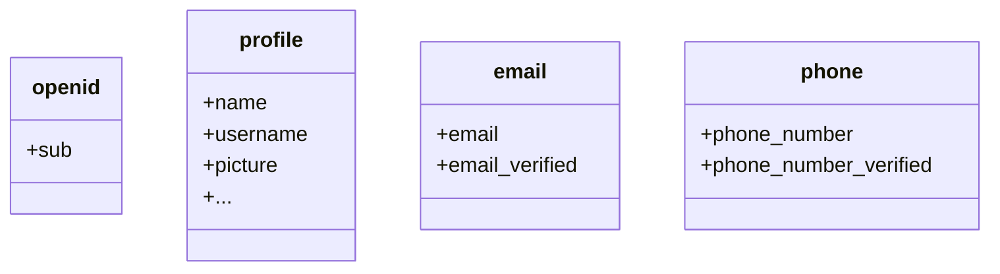

預設情況下，僅返回有限的宣告 (Claims)。如果你需要更多資訊，可以請求額外的權限範圍 (Scopes) 以存取更多宣告。

:::info
「宣告 (Claim)」是對主體所做的斷言；「權限範圍 (Scope)」是一組宣告。在目前的情況下，宣告是關於使用者的一部分資訊。
:::

以下是權限範圍與宣告關係的非規範性範例：

:::tip
「sub」宣告表示「主體 (Subject)」，即使用者的唯一識別符（例如使用者 ID）。
:::

Logto SDK 將始終請求三個權限範圍：`openid`、`profile` 和 `offline_access`。
