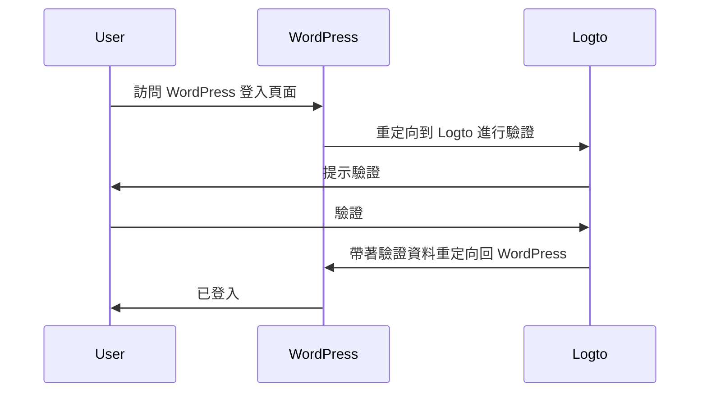
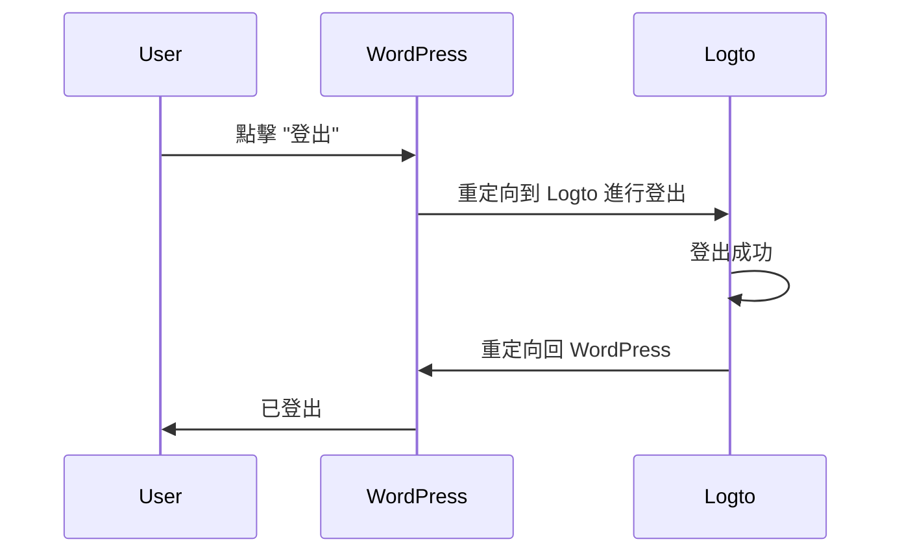

import TabItem from '@theme/TabItem';
import Tabs from '@theme/Tabs';

import FurtherReadings from '../../fragments/_further-readings.md';

# 為你的 WordPress 網站新增驗證 (Authentication) 使用 Logto 插件

本教程將向你展示如何使用我們的官方 WordPress 插件將 Logto 整合到你的 [WordPress](https://wordpress.org) 網站中。

## 先決條件 \{#prerequisites}

- 一個 [Logto Cloud](https://cloud.logto.io) 帳戶或 [自託管 Logto](/introduction/set-up-logto-oss)。
- 已建立的 Logto 傳統應用程式。
- 一個 WordPress 專案：在繼續之前，請按照官方 [WordPress 安裝指南](https://wordpress.org/support/article/how-to-install-wordpress/) 設置你的 WordPress 網站。

## 整合 \{#integration}

### 安裝插件 \{#authentication-settings}

:::info
目前，我們的插件仍在審核中，尚未在 WordPress 插件目錄中提供。一旦可用，我們將更新此頁面。
:::

<Tabs>

{/* 當插件在 WordPress 插件目錄中可用時，取消註釋以下區塊 */}
{/* <TabItem value="admin-panel" label="從 WordPress 管理面板"> */}

{/* 1. 前往 **插件** > **新增**。 */}
{/* 2. 搜尋 "Logto"。 */}
{/* 3. 點擊 **立即安裝**。 */}
{/* 4. 點擊 **啟用**。 */}

{/* </TabItem> */}

<TabItem value="upload" label="從上傳">

1. 從以下鏈接之一下載 Logto WordPress 插件：
   - [最新版本](https://github.com/logto-io/wordpress/releases)：下載名稱格式為 `logto-plugin-<version>.zip` 的文件。
     {/* 當插件在 WordPress 插件目錄中可用時，取消註釋以下行 */}
     {/* - [WordPress 插件目錄](https://wordpress.org/plugins) 並搜尋 "Logto"。 */}
2. 下載插件 ZIP 文件。
3. 在你的 WordPress 管理面板中，前往 **插件** > **新增**。
4. 點擊 **上傳插件**。
5. 選擇下載的 ZIP 文件並點擊 **立即安裝**。
6. 點擊 **啟用**。

</TabItem>

</Tabs>

### 配置插件 \{#scopes}

現在你應該能在 WordPress 管理面板側邊欄中看到 Logto 菜單。點擊 **Logto** > **設定** 來配置插件。

:::note
在配置插件之前，你應該已在 Logto Console 中建立一個 **傳統網頁** 應用程式。如果尚未建立，請參閱 [將 Logto 整合到你的應用程式中](/integrate-logto/integrate-logto-into-your-application) 以獲取更多資訊。
:::

插件的基本配置如下：

- Logto 端點：你的 Logto 租戶的端點。
- App ID：你的 Logto 應用程式的 App ID。
- App secret：你的 Logto 應用程式的有效 App secret 之一。

所有值都可以在 Logto Console 的應用程式詳細資訊頁面中找到。

填寫完值後，點擊 **儲存變更**（如果找不到按鈕，請向下滾動到頁面底部）。

### 配置重定向 URI \{#extra-params}

重定向 URI 是 Logto 在使用者驗證後將其重定向的 URL；而登出後重定向 URI 是 Logto 在使用者登出後將其重定向的 URL。

以下是一個非規範的序列圖來說明登入流程：

以下是登出流程的非規範序列圖：

要了解為什麼需要重定向，請參閱 [登入體驗說明](/concepts/sign-in-experience)。

在我們的情況下，我們需要在 Logto Console 中配置這兩個重定向 URI。要找到重定向 URI，請前往 WordPress 管理面板中的 **Logto** > **設定** 頁面。你將看到 **重定向 URI** 和 **登出後重定向 URI** 欄位。

1. 複製 **重定向 URI** 和 **登出後重定向 URI** 值，並將它們粘貼到 Logto Console 中的 **重定向 URI** 和 **登出後重定向 URI** 欄位中。
2. 在 Logto Console 中點擊 **儲存變更**。

### 檢查點：測試你的 WordPress 網站 \{#require-verified-email}

現在你可以在 WordPress 網站中測試 Logto 整合：

1. 如有需要，打開無痕瀏覽器窗口。
2. 訪問你的 WordPress 網站並點擊 **登入** 鏈接（如果適用）；或直接訪問登入頁面（例如，`https://example.com/wp-login.php`）。
3. 頁面應重定向到 Logto 登入頁面。
4. 完成登入或註冊流程。
5. 驗證成功後，你應該會被自動重定向回 WordPress 網站並自動登入。
6. 點擊 **登出** 鏈接以登出 WordPress 網站。
7. 你應該會被重定向到 Logto 登出頁面，然後返回到 WordPress 網站。
8. 你應該已從 WordPress 網站登出。

## 驗證 (Authentication) 設定 \{#require-organization-id}

雖然插件開箱即用，但你可以在 Logto 插件設定頁面上自訂驗證設定以更好地滿足你的需求。

### 權限範圍 (Scopes) \{#authorization-settings}

Logto 使用權限範圍 (Scopes) 來控制與你的應用程式共享哪些資訊。Logto WordPress 插件使用 [Logto PHP SDK](https://github.com/logto-io/php) 處理驗證過程，預設包含以下權限範圍：

- `openid`：OpenID Connect 所需的基本範圍。
- `profile`：獲取使用者的基本個人資料資訊。
- `offline_access`：獲取重新整理權杖以進行離線存取。

有關權限範圍的更多資訊，請參閱 [權限範圍和宣告](/quick-starts/php#scopes-and-claims)。

插件還預設添加了兩個額外的權限範圍：

- `email`：獲取使用者的電子郵件地址。
- `roles`：獲取使用者在 Logto 中的角色。

這兩個權限範圍用於將 Logto 電子郵件和角色映射到 WordPress 電子郵件和角色。你可以通過編輯插件設定中的 **權限範圍** 欄位來自訂權限範圍。

:::warning
如果你移除 `email` 或 `roles` 權限範圍，插件的某些功能將無法正常運作。
:::

### 額外參數 \{#role-mapping}

你可能希望在驗證請求中添加一些額外的參數以自訂驗證過程。例如，你可以添加 `first_screen` 參數來決定驗證過程中首先顯示哪個畫面。

有關額外參數的更多資訊，請參閱 [驗證參數](/end-user-flows/authentication-parameters)。

### 要求驗證過的電子郵件 \{#advanced-settings}

預設情況下，插件要求使用者在 Logto 中擁有已驗證的電子郵件地址才能登入你的 WordPress 網站。如果使用者嘗試在沒有已驗證的電子郵件地址的情況下登入，插件將拋出錯誤。

你可以通過取消選中插件設定中的 **要求驗證過的電子郵件** 選項來禁用此功能。

### 要求組織 ID \{#remember-session}

你可以要求使用者在 Logto 中擁有特定的組織成員資格才能登入你的 WordPress 網站。當指定了組織 ID 時，插件將檢查使用者的 ID 權杖中是否包含指定的組織 ID。如果沒有，將拋出錯誤。

要了解有關組織的更多資訊，請參閱 [組織](/organizations)。

## 授權 (Authorization) 設定 \{#sync-profile}

除了驗證，Logto 還提供授權功能，如 [基於角色的存取控制 (RBAC)](/authorization/role-based-access-control)。如果你正在開發自己的應用程式，實現 RBAC 需要一些自訂代碼，而 Logto WordPress 插件提供了一種內建方式將 Logto 角色映射到 [WordPress 角色](https://wordpress.org/documentation/article/roles-and-capabilities/)。

### 角色映射 \{#wordpress-form-login}

Logto WordPress 插件允許你將 Logto 角色映射到 WordPress 角色。這意味著你可以在 Logto 中為使用者分配不同的角色，插件將在使用者登入時自動為這些使用者分配相應的 WordPress 角色。

要映射角色，請在 **角色映射** 部分中點擊 **新增** 以新增一個新的角色映射。例如，如果你想將 Logto 中的 `group:editors` 角色映射到 WordPress 中的 `Editor` 角色，你可以通過新增一個具有以下值的角色映射來實現：

- Logto 角色：`group:editors`
- WordPress 角色：`editor`（WordPress 中 `Editor` 角色的角色 slug）

你可以在 [角色和功能](https://wordpress.org/documentation/article/roles-and-capabilities/) 文檔中找到所有 WordPress 角色的角色 slug。

:::note
角色 slug 是區分大小寫的。如果你輸入角色名稱如 `Editor` 而不是 `editor`，角色映射將無法運作。
:::

現在，前往 Logto Console 並在左側側邊欄中點擊 **角色**。建立一個名為 `group:editors` 的新角色並將其分配給一個使用者。然後使用該使用者登入你的 WordPress 網站。你應該會看到該使用者已被分配為 WordPress 中的 `Editor` 角色。

:::note
如果使用者已登入你的 WordPress 網站，角色映射將不會生效，直到使用者登出並重新登入。
:::

你還可以新增多個角色映射以將多個 Logto 角色映射到 WordPress 角色。目前，插件將嘗試按優先順序映射角色。例如，如果你有以下角色映射：

- Logto 角色：`group:editors`，WordPress 角色：`editor`
- Logto 角色：`group:authors`，WordPress 角色：`author`
- Logto 角色：`group:subscribers`，WordPress 角色：`subscriber`

而某個使用者在 Logto 中同時擁有 `group:editors` 和 `group:authors` 角色，該使用者將被分配為 WordPress 中的 `Editor` 角色。

## 高級設定 \{#username-strategy}

### 記住會話 \{#troubleshooting}

預設情況下，插件將記住使用者的會話 2 週。這意味著如果使用者登入你的 WordPress 網站，他們在 2 週內不會被提示再次登入。你可以通過取消選中插件設定中的 **記住會話** 選項將此時間縮短為 2 天。

### 同步個人資料 \{#callback-url-shows-404}

預設情況下，插件將在每次登入時同步使用者的個人資料。這意味著如果使用者登入你的 WordPress 網站，他們的個人資料將更新為 Logto 的最新資訊。你可以通過取消選中插件設定中的 **同步個人資料** 選項來禁用此功能。

:::warning
如果你禁用此功能，角色映射僅在使用者首次登入時生效。
:::

### WordPress 表單登入 \{#frequently-asked-questions}

預設情況下，你可以在 WordPress 登入 URL 後附加 `?form=1` 以使用 WordPress 表單登入。這對於測試目的很有用，但如果你不希望允許使用者使用 WordPress 表單登入，可以禁用此功能。

### 使用者名稱策略 \{#how-can-i-trigger-the-forgot-password-flow}

在 WordPress 中生成使用者名稱有多種方式。當你依賴電子郵件作為使用者的唯一識別符時，使用預設策略是安全的。

## 疑難排解 \{#how-can-i-use-the-wordpress-form-login}

### 回調 URL 顯示 404 \{#further-readings}

如果回調 URL 顯示 404 錯誤，可能是你的 WordPress 重寫規則已過時，需要手動刷新。為此，請前往 WordPress 管理面板中的 **設定** > **固定連結**（或直接訪問 `/wp-admin/options-permalink.php`）並點擊 **儲存變更**。

## 常見問題 \{#frequently-asked-questions}

### 如何觸發忘記密碼流程？ \{#how-can-i-trigger-the-forgot-password-flow}

有兩種方法可以觸發忘記密碼流程：

1. 點擊 Logto 登入頁面上的忘記密碼鏈接。
2. 在 WordPress 登入 URL 後附加 `?action=lostpassword`。例如，`https://example.com/wp-login.php?action=lostpassword`。
   這將重定向你到 Logto 忘記密碼頁面。

### 如何使用 WordPress 表單登入？ \{#how-can-i-use-the-wordpress-form-login}

預設情況下，你可以在 WordPress 登入 URL 後附加 `?form=1` 以使用 WordPress 表單登入。例如，`https://example.com/wp-login.php?form=1`。

如果你想禁用此功能，可以在插件設定中取消選中 **WordPress 表單登入** 選項。

## 進一步閱讀 \{#further-readings}

<FurtherReadings />
