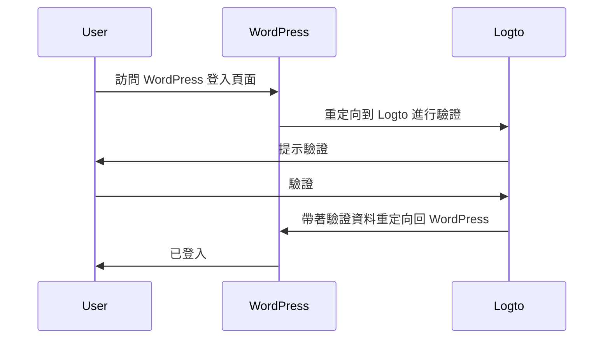
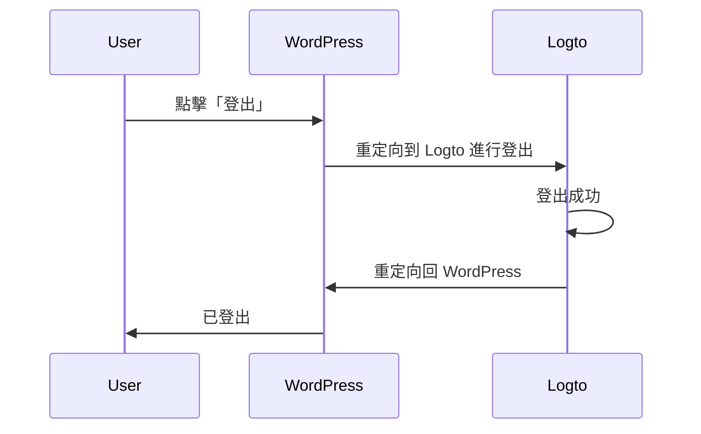

import TabItem from '@theme/TabItem';
import Tabs from '@theme/Tabs';

### 安裝插件 \{#install-the-plugin}

<Tabs>

<TabItem value="admin-panel" label="從 WordPress 管理面板">

1. 前往 **Plugins** > **Add New**。
2. 搜尋「Logto」，或在搜尋框中輸入 https://wordpress.org/plugins/logto/。
3. 點擊 **Install Now**。
4. 點擊 **Activate**。

</TabItem>

<TabItem value="upload" label="從上傳">

1. 從以下連結之一下載 Logto WordPress 插件：
   - [最新版本](https://github.com/logto-io/wordpress/releases)：下載名稱格式為 `logto-plugin-<version>.zip` 的檔案。
   - [WordPress 插件目錄](https://wordpress.org/plugins/logto/)：點擊 **Download** 按鈕下載檔案。
2. 下載插件 ZIP 檔案。
3. 在 WordPress 管理面板中前往 **Plugins** > **Add New**。
4. 點擊 **Upload Plugin**。
5. 選擇下載的 ZIP 檔案並點擊 **Install Now**。
6. 點擊 **Activate**。

</TabItem>

</Tabs>

### 配置插件 \{#configure-the-plugin}

現在你應該能在 WordPress 管理面板側邊欄看到 Logto 選單。點擊 **Logto** > **Settings** 來配置插件。

:::note
在配置插件之前，你應該已在 Logto Console 中創建了一個 **傳統網頁** 應用程式。如果尚未創建，請參閱 [將 Logto 整合到你的應用程式中](/integrate-logto/integrate-logto-into-your-application) 以獲取更多資訊。
:::

插件的基本配置如下：

- Logto endpoint：你的 Logto 租戶的端點。
- App ID：你的 Logto 應用程式的 App ID。
- App secret：你的 Logto 應用程式的有效 App secret 之一。

所有值都可以在 Logto Console 的應用程式詳細資訊頁面找到。

填寫完畢後，點擊 **Save Changes**（如果找不到按鈕，請向下滾動到頁面底部）。

### 配置重定向 URI \{#configure-redirect-uri}

重定向 URI 是 Logto 在使用者驗證後將其重定向的 URL；而登出後重定向 URI 是 Logto 在使用者登出後將其重定向的 URL。

以下是一個非規範的序列圖來說明登入流程：

以下是登出流程的非規範序列圖：

要了解為什麼需要重定向，請參閱 [登入體驗說明](/concepts/sign-in-experience)。

在我們的情況下，需要在 Logto Console 中配置這兩個重定向 URI。要找到重定向 URI，請前往 WordPress 管理面板中的 **Logto** > **Settings** 頁面。你會看到 **Redirect URI** 和 **Post sign-out redirect URI** 欄位。

1. 複製 **Redirect URI** 和 **Post sign-out redirect URI** 的值，並將它們貼到 Logto Console 中的 **Redirect URIs** 和 **Post sign-out redirect URIs** 欄位。
2. 在 Logto Console 中點擊 **Save changes**。

### 檢查點：測試你的 WordPress 網站 \{#checkpoint-test-your-website}

現在你可以在 WordPress 網站中測試 Logto 整合：

1. 如有需要，開啟無痕瀏覽視窗。
2. 訪問你的 WordPress 網站，並點擊 **Log in** 連結（如果適用）；或直接訪問登入頁面（例如，`https://example.com/wp-login.php`）。
3. 頁面應重定向到 Logto 登入頁面。
4. 完成登入或註冊流程。
5. 驗證成功後，你應該會被自動重定向回 WordPress 網站並自動登入。
6. 點擊 **Log out** 連結以登出 WordPress 網站。
7. 你應該會被重定向到 Logto 登出頁面，然後返回 WordPress 網站。
8. 你應該已從 WordPress 網站登出。