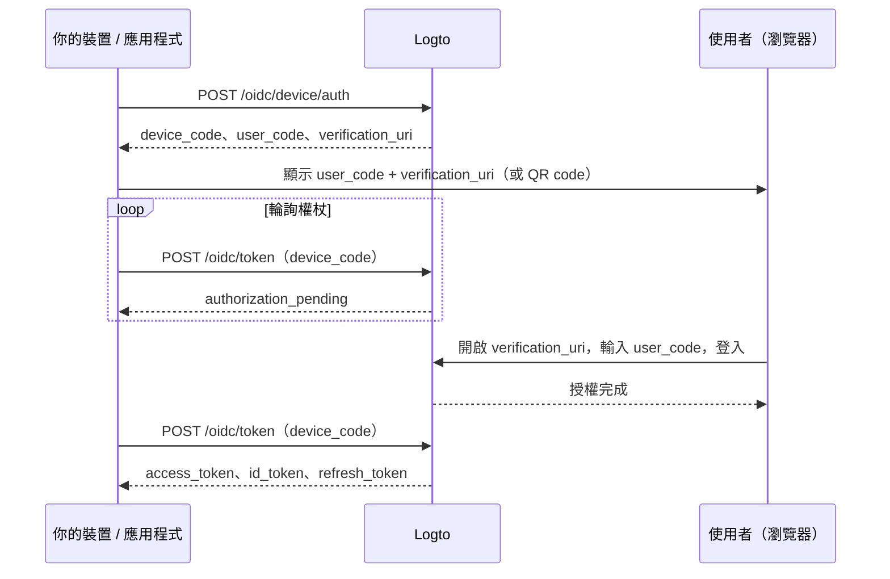

import ApiResourcesDescription from '../../fragments/_api-resources-description.md';
import FurtherReadings from '../../fragments/_further-readings.md';
import ScopeClaimList from '../../fragments/_scope-claim-list.md';
import ScopesAndClaimsIntroduction from '../../fragments/_scopes-claims-introduction.md';

# Device flow：使用 Logto 進行驗證 (Authentication)

:::note
本指南假設你已在 Logto Console 建立一個類型為「原生」且授權流程選擇 device flow 的應用程式。
:::

## 簡介 \{#introduction}

[OAuth 2.0 device authorization grant](https://auth.wiki/device-flow)（device flow）專為輸入能力有限的裝置設計，例如智慧電視、遊戲主機、CLI 工具與 IoT 裝置。它允許使用者在裝置上啟動登入流程，但在另一台有瀏覽器的裝置（如手機或筆電）上完成驗證 (Authentication)。

由於裝置本身無法處理瀏覽器登入流程，裝置會顯示一組短碼與一個網址。使用者在另一台裝置上造訪該網址、輸入短碼並登入。此時，原始裝置會持續輪詢 Logto，直到授權完成。



## 取得應用程式憑證 \{#get-application-credentials}

在 Logto Console 中，前往你的應用程式詳細頁取得以下憑證：

- **App ID**：你的應用程式唯一識別碼（亦稱 `client_id`）。
- **Logto endpoint**：你的 Logto 授權伺服器端點，可於 Logto Console「應用程式詳細資訊」中找到。

若使用 Logto Cloud，端點為 `https://{your-tenant-id}.logto.app`。

:::note
Device flow 應用程式屬於公開用戶端，因此不需要 App Secret。
:::

## 請求 device code \{#request-a-device-code}

啟動 device flow，向 device authorization 端點發送 `POST` 請求：

```bash
curl --request POST 'https://your.logto.endpoint/oidc/device/auth' \
  --header 'Content-Type: application/x-www-form-urlencoded' \
  --data-urlencode 'client_id=your-application-id' \
  --data-urlencode 'scope=openid offline_access profile'
```

回應內容包含：

| 欄位                        | 說明                                                                                                            |
| --------------------------- | --------------------------------------------------------------------------------------------------------------- |
| `device_code`               | 你的應用程式在輪詢權杖端點時使用的唯一代碼。                                                                    |
| `user_code`                 | 顯示給使用者、讓其在瀏覽器輸入的短碼。                                                                          |
| `verification_uri`          | 使用者輸入 `user_code` 的網址。                                                                                 |
| `verification_uri_complete` | 已預填 `user_code` 的網址。使用者可直接造訪此網址以略過手動輸入——你可將其呈現為 QR code、可點擊連結等任意方式。 |
| `expires_in`                | `device_code` 與 `user_code` 的存活秒數。到期後請停止輪詢。                                                     |

## 將驗證網址顯示給使用者 \{#display-verification-url}

在裝置螢幕上顯示 `user_code` 與 `verification_uri`。

你也可以使用已預填短碼的 `verification_uri_complete`，使用者只需確認即可。呈現方式可自由選擇：QR code、可點擊連結等。

## 輪詢權杖 \{#poll-for-tokens}

當使用者在瀏覽器完成驗證 (Authentication) 時，你的裝置應輪詢權杖端點。每次輪詢請至少間隔 **5 秒**：

```bash
curl --request POST 'https://your.logto.endpoint/oidc/token' \
  --header 'Content-Type: application/x-www-form-urlencoded' \
  --data-urlencode 'client_id=your-application-id' \
  --data-urlencode 'grant_type=urn:ietf:params:oauth:grant-type:device_code' \
  --data-urlencode 'device_code=DEVICE_CODE'
```

將 `DEVICE_CODE` 替換為 device authorization 回應中的 `device_code`。

**停止輪詢**的時機：

- 收到成功的權杖回應。
- device code 回應中的 `expires_in` 時間已過。
- 收到不可重試的錯誤（如 `expired_token` 或 `access_denied`）。

### 權杖回應 \{#token-response}

使用者授權後，回應內容包含：

| 欄位            | 說明                                                                                                                   |
| --------------- | ---------------------------------------------------------------------------------------------------------------------- |
| `access_token`  | 存取權杖 (Access token)。預設為不透明權杖 (Opaque token)；若有指定 `resource`，則為帶有 `aud` 為資源 URI 的 JWT。      |
| `id_token`      | 含有使用者身分宣告 (Claims) 的 ID 權杖 (ID token)。僅在請求 `openid` 權限範圍 (Scope) 時提供。                         |
| `refresh_token` | 用於無需重新驗證 (Authentication) 取得新權杖的重新整理權杖 (Refresh token)。僅在請求 `offline_access` 權限範圍時提供。 |
| `token_type`    | 一律為 `Bearer`。                                                                                                      |
| `expires_in`    | 權杖存活秒數。                                                                                                         |
| `scope`         | 授權伺服器核發的權限範圍 (Scopes)。                                                                                    |

## 檢查點：測試你的 device flow \{#checkpoint}

現在，測試你的 device flow 整合流程：

1. 執行應用程式並觸發 device flow 以取得 `device_code` 與 `user_code`。
2. 在瀏覽器開啟 `verification_uri` 並輸入 `user_code`，或直接使用 `verification_uri_complete` 省略手動輸入。
3. 在瀏覽器完成登入流程。
4. 確認應用程式輪詢後收到權杖。

## 取得使用者資訊 \{#get-user-information}

### 解碼 ID 權杖宣告 (Claims) \{#decode-id-token-claims}

權杖回應中的 `id_token` 為標準 [JSON Web Token (JWT)](https://auth.wiki/jwt)。你可以解碼 Base64URL 編碼的 payload（JWT 的第二段，以 `.` 分隔）來取得基本使用者宣告 (Claims)，無需額外網路請求。

解碼後的 payload 會包含如 `sub`（使用者 ID）、`name`、`email` 等宣告，具體內容取決於請求的權限範圍 (Scopes)。

:::tip
正式環境請務必驗證 JWT 簽章再信任其內容。可使用 Logto 端點的 JWKS（`https://your.logto.endpoint/oidc/jwks`）驗證權杖。
:::

### 從 userinfo 端點取得 \{#fetch-from-userinfo-endpoint}

ID 權杖會根據請求的權限範圍 (Scopes) 帶有基本宣告 (Claims)。部分擴充宣告（如 `custom_data`、`identities`）僅能透過 [OIDC UserInfo 端點](https://openid.net/specs/openid-connect-core-1_0.html#UserInfo) 取得：

```bash
curl --request GET 'https://your.logto.endpoint/oidc/me' \
  --header 'Authorization: Bearer ACCESS_TOKEN'
```

將 `ACCESS_TOKEN` 替換為權杖回應中取得的不透明權杖 (Opaque access token)（非 JWT 資源權杖）。回應為根據授權範圍 (Scopes) 的 JSON 使用者宣告 (Claims)。

### 請求額外宣告 (Claims) \{#request-additional-claims}

你可能會發現 ID 權杖中缺少部分使用者資訊。這是因為 OAuth 2.0 與 OpenID Connect (OIDC) 遵循最小權限原則（PoLP），而 Logto 亦以此為基礎。

<ScopesAndClaimsIntroduction />

若需額外權限範圍 (Scopes)，請在 device authorization 請求的 `scope` 參數中加入。例如請求使用者 email 與手機：

```bash
curl --request POST 'https://your.logto.endpoint/oidc/device/auth' \
  --header 'Content-Type: application/x-www-form-urlencoded' \
  --data-urlencode 'client_id=your-application-id' \
  --data-urlencode 'scope=openid offline_access profile email phone'
```

### 權限範圍 (Scopes) 與宣告 (Claims) \{#scopes-and-claims}

<ScopeClaimList />

## API 資源 (API resources) 與組織 (Organizations) \{#api-resources-and-organizations}

<ApiResourcesDescription />

### 請求 API 資源存取權 \{#request-access-for-api-resources}

若要存取特定 API 資源，請在 device authorization 請求中加入 `resource` 參數：

```bash
curl --request POST 'https://your.logto.endpoint/oidc/device/auth' \
  --header 'Content-Type: application/x-www-form-urlencoded' \
  --data-urlencode 'client_id=your-application-id' \
  --data-urlencode 'scope=openid offline_access' \
  --data-urlencode 'resource=https://your-api-resource-indicator'
```

當使用者完成授權並取得重新整理權杖 (Refresh token) 後，可取得該 API 資源的 JWT 存取權杖 (Access token)：

```bash
curl --request POST 'https://your.logto.endpoint/oidc/token' \
  --header 'Content-Type: application/x-www-form-urlencoded' \
  --data-urlencode 'client_id=your-application-id' \
  --data-urlencode 'grant_type=refresh_token' \
  --data-urlencode 'refresh_token=REFRESH_TOKEN' \
  --data-urlencode 'resource=https://your-api-resource-indicator'
```

回應將包含 `aud` 為你的 API 資源標示符 (Resource indicator) 的 JWT `access_token`。

:::note
只有在初始 device authorization 請求包含 `offline_access` 權限範圍 (Scope) 時才會取得 `refresh_token`。Logto 採用權杖輪替，請務必儲存並使用最新的 `refresh_token`。
:::

### 取得組織權杖 (Organization tokens) \{#fetch-organization-tokens}

若你對 [組織 (Organizations)](/organizations) 不熟悉，請先閱讀 [🏢 組織（多租戶，Multi-tenancy）](/organizations)。

若需請求組織相關資訊，請在 device authorization 請求中加入 `urn:logto:scope:organizations` 權限範圍 (Scope)：

```bash
curl --request POST 'https://your.logto.endpoint/oidc/device/auth' \
  --header 'Content-Type: application/x-www-form-urlencoded' \
  --data-urlencode 'client_id=your-application-id' \
  --data-urlencode 'scope=openid offline_access urn:logto:scope:organizations' \
  --data-urlencode 'resource=urn:logto:resource:organizations'
```

使用者登入後，可透過重新整理權杖 (Refresh token) 取得組織權杖 (Organization token)：

```bash
curl --request POST 'https://your.logto.endpoint/oidc/token' \
  --header 'Content-Type: application/x-www-form-urlencoded' \
  --data-urlencode 'client_id=your-application-id' \
  --data-urlencode 'grant_type=refresh_token' \
  --data-urlencode 'refresh_token=REFRESH_TOKEN' \
  --data-urlencode 'organization_id=your-organization-id'
```

回應將包含限定於指定組織的存取權杖 (Access token)。

#### 組織 API 資源 (Organization API resources) \{#organization-api-resources}

若要取得組織內 API 資源的存取權杖 (Access token)，請同時帶入 `resource` 與 `organization_id` 參數：

```bash
curl --request POST 'https://your.logto.endpoint/oidc/token' \
  --header 'Content-Type: application/x-www-form-urlencoded' \
  --data-urlencode 'client_id=your-application-id' \
  --data-urlencode 'grant_type=refresh_token' \
  --data-urlencode 'refresh_token=REFRESH_TOKEN' \
  --data-urlencode 'organization_id=your-organization-id' \
  --data-urlencode 'resource=https://your-api-resource-indicator'
```

## 延伸閱讀 \{#further-readings}

<FurtherReadings />
