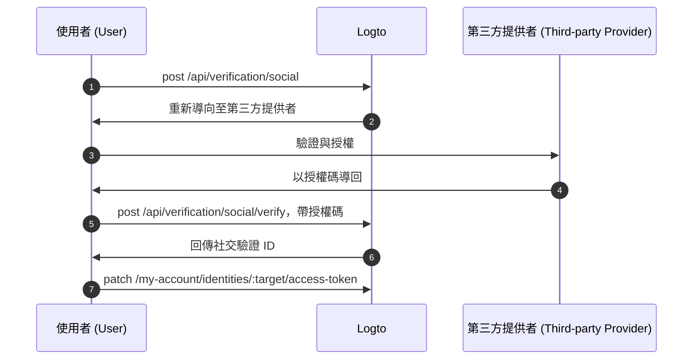

import Availability from '@components/Availability';

<Availability cloud oss={{ major: 1, minor: 31 }} />

聯邦權杖集 (Federated token set) 是儲存在 Logto Secret Vault 的一種密鑰類型，用於安全管理由聯邦第三方身分提供者簽發的存取權杖 (Access token) 與重新整理權杖 (Refresh token)。當使用者透過社交或企業級單一登入 (SSO) 連接器進行驗證時，Logto 會將簽發的權杖儲存在 Vault 中。這些權杖日後可被取出，用於代表使用者存取第三方 API，而無需再次驗證。

## 啟用聯邦權杖儲存 \{#enable-federated-token-storage}

### 社交連接器 \{#social-connectors}

:::Info
此功能僅適用於支援權杖儲存的連接器。目前支援的連接器包括：[GitHub](/integrations/github)、[Google](/integrations/google)、[Facebook](/integrations/facebook)、[標準 OAuth 2.0](/integrations/oauth2) 以及 [標準 OIDC](/integrations/oidc)。未來將逐步支援更多連接器。
:::

1. 前往 <CloudLink to="/connectors/social">Console > Connectors > Social Connectors</CloudLink>。
2. 選擇你要啟用聯邦權杖儲存的社交連接器。
3. 在「Setting」頁面，啟用 **為持久 API 存取儲存權杖**（Store tokens for persistent API access）選項。

### 企業級單一登入 (Enterprise SSO) 連接器 \{#enterprise-sso-connectors}

:::Info
所有 OIDC 企業級連接器皆支援權杖儲存。
:::

1. 前往 <CloudLink to="/enterprise-sso">Console > Enterprise SSO</CloudLink>。
2. 選擇你要啟用聯邦權杖儲存的企業級 SSO 連接器。
3. 在「SSO Experience」分頁，啟用 **為持久 API 存取儲存權杖**（Store tokens for persistent API access）選項。

請記得儲存你的變更。

## 權杖儲存 \{#token-storage}

啟用聯邦權杖儲存後，Logto 會在使用者透過社交或企業級 SSO 連接器驗證時，自動儲存由聯邦身分提供者簽發的存取權杖 (Access token) 與重新整理權杖 (Refresh token)。包含：

- [社交登入與註冊](/end-user-flows/sign-up-and-sign-in/social-sign-in)
- [企業級 SSO 登入與註冊](/end-user-flows/enterprise-sso)
- [透過 Account API 連結社交帳號](/end-user-flows/account-settings/by-account-api#link-a-new-social-connection)

儲存的權杖會綁定於使用者的社交或企業級 SSO 身分，讓他們日後可直接取用權杖以存取 API，無需再次驗證。

### 檢查權杖儲存狀態 \{#checking-token-storage-status}

你可以在 Logto Console 檢查使用者的聯邦權杖儲存狀態：

1. 前往 <CloudLink to="/users">Console > Users</CloudLink>。
2. 點擊你想檢查的使用者，進入該使用者詳細頁。
3. 滾動至 **Connections** 區塊，這裡會列出所有與該使用者關聯的社交與企業級 SSO 連接。
4. 每個連接項目會顯示權杖狀態標籤，指示該連接是否有儲存權杖。
5. 點擊連接項目可查看更多細節，包括已儲存的存取權杖 (Access token) 中繼資料與重新整理權杖 (Refresh token) 是否可用（如有）。

你也可以透過 Management API 檢查使用者第三方身分與權杖儲存狀態：

- `GET /api/users/{userId}/identities/{target}?includeTokenSecret=true`：根據指定連接器 target（如 `github`、`google` 等）取得使用者的社交身分與權杖儲存狀態。
- `GET /api/users/{userId}/sso-identities/{ssoConnectorId}?includeTokenSecret=true`：根據指定 SSO 連接器 ID 取得使用者的企業級 SSO 身分與權杖儲存狀態。

### 權杖儲存狀態 \{#token-storage-status}

- **Active（有效）**：存取權杖已儲存且有效。
- **Expired（已過期）**：存取權杖已儲存但已過期。若有重新整理權杖，可用於取得新存取權杖。
- **Inactive（未啟用）**：此連接未儲存存取權杖。可能是使用者尚未透過此連接驗證，或權杖儲存已被刪除。
- **Not applicable（不適用）**：該連接器不支援權杖儲存。

### 權杖中繼資料 \{#token-metadata}

為確保資料完整性與安全性，所有權杖在儲存至 Secret Vault 前皆經過加密。實際權杖值僅授權的終端使用者可存取。開發者僅能取得權杖集的中繼資料，以便瞭解儲存狀態而不暴露敏感內容。

- `createdAt`：首次建立連接並將權杖集儲存至 Secret Vault 的時間戳記。
- `updatedAt`：權杖集最後一次更新的時間。
  - 若無重新整理權杖，該值與 **createdAt** 相同。
  - 若有重新整理權杖，該值反映最近一次存取權杖被刷新時的時間。
- `hasRefreshToken`：是否有重新整理權杖可用。
  若連接器支援離線存取且授權請求正確設定，Logto 會在身分提供者簽發時一併儲存重新整理權杖與存取權杖。
  當存取權杖過期且有有效重新整理權杖時，Logto 會在使用者請求存取連接的提供者時自動嘗試以重新整理權杖取得新存取權杖。
- `expiresAt`：存取權杖的預估過期時間（單位：**秒**）。
  此值根據身分提供者權杖端點回傳的 `expires_in` 計算。（僅當提供者回傳 `expires_in` 時才有此欄位。）
- `scope`：存取權杖的權限範圍，表示身分提供者授予的權限。
  有助於瞭解儲存的存取權杖可執行哪些操作。（僅當提供者回傳 `scope` 時才有此欄位。）
- `tokenType`：存取權杖的型別，通常為 "Bearer"。
  （僅當提供者回傳 `token_type` 時才有此欄位。）

## 權杖擷取 \{#token-retrieval}

啟用權杖儲存並將權杖安全儲存於 Logto Secret Vault 後，終端使用者可透過整合 Logto [Account API](/end-user-flows/account-settings/by-account-api) 從你的客戶端應用程式擷取其第三方存取權杖。

- `GET /my-account/identities/:target/access-token`：根據指定連接器 target（如 github、google）取得社交身分的存取權杖。

- `GET /my-account/sso-identities/:connectorId/access-token`：根據指定連接器 ID 取得企業級 SSO 身分的存取權杖。

:::info
瞭解如何[啟用](/end-user-flows/account-settings/by-account-api#how-to-enable-account-api)與[存取](/end-user-flows/account-settings/by-account-api#access-account-api-using-access-token) Account API（使用 Logto 簽發的存取權杖）。
:::

### 權杖輪替 \{#token-rotation}

權杖擷取端點回傳：

- `200` OK：成功取得且存取權杖仍有效。
- `404` Not Found：使用者未有與指定 target 或連接器 ID 關聯的社交或企業級 SSO 身分，或未儲存存取權杖。
- `401` Unauthorized：存取權杖已過期。

若存取權杖已過期且有重新整理權杖，Logto 會自動嘗試刷新存取權杖，並於回應中回傳新存取權杖。Secret Vault 中的權杖儲存也會同步更新新存取權杖及其中繼資料。

## 權杖儲存刪除 \{#token-storage-deletion}

聯邦權杖儲存直接綁定於每位使用者的社交或企業級 SSO 連接。這表示在下列情況下，儲存的權杖集會自動刪除：

- 關聯的社交或企業級 SSO 身分自使用者帳號移除。
- 使用者帳號自你的租戶刪除。
- 社交或企業級 SSO 連接器自你的租戶刪除。

### 撤銷權杖 \{#revoking-tokens}

你也可以手動刪除使用者的第三方權杖集以撤銷存取：

- 透過 Console：
  前往使用者身分詳細頁，滾動至 **Access token** 區塊（如有權杖儲存），點擊區塊底部的 **Delete tokens** 按鈕。
- 透過 Management API：
  - `DELETE /api/secret/:id`：根據 ID 刪除特定密鑰，可於使用者身分詳細頁取得該 ID。

撤銷權杖集後，使用者需重新與第三方提供者驗證以取得新存取權杖，方可再次存取第三方 API。

## 重新驗證與權杖更新 \{#reauthentication-and-token-renewal}

當儲存的存取權杖已過期，或應用程式需請求額外 API 權限範圍時，終端使用者可重新與第三方提供者驗證以取得新的存取權杖——無需再次登入 Logto。
這可透過 Logto [Social Verification API](https://openapi.logto.io/operation/operation-createverificationbysocial) 實現，讓使用者重新啟動聯邦社交授權流程並更新其權杖集。

:::note
重新啟動聯邦授權目前僅限於社交連接器。
對於企業級 SSO 連接器，重新驗證與權杖更新需使用者重新啟動完整 Logto 驗證流程，因目前登入後不支援直接與企業級 SSO 提供者重新授權。
:::



1. 使用者呼叫 `POST /api/verification/social` 端點發起社交驗證請求。可指定自訂權限範圍（scope）以請求第三方提供者額外權限。

   ```sh
   curl -X POST https://<your-logto-domain>/api/verification/social \
     -H "Authorization: Bearer <access_token>" \
     -H "Content-Type: application/json" \
     -d '{
       "state": "<state>",
       "connectorId": "<logto_connectorId>",
       "redirectUri": "<redirect_uri>",
       "scope": "<custom_scope>"
     }'
   ```

   - **authorization header**：Logto 簽發的使用者存取權杖。
   - **connectorId**：Logto 中的社交連接器 ID。
   - **redirectUri**：驗證後導回你應用程式的 URI。需於提供者應用程式設定中註冊此 URI。
   - **scope**：（選填）自訂權限範圍，請求第三方提供者額外權限。未指定則使用連接器預設權限範圍。

2. Logto 建立新的社交驗證紀錄，並回傳社交驗證 ID 及授權 URL，讓使用者導向第三方提供者進行驗證。

   回應範例如下：

   ```json
   {
     "verificationRecordId": "<social_verification_id>",
     "authorizationUri": "<authorization_url>",
     "expiresAt": "<expiration_time>"
   }
   ```

3. 將使用者導向授權 URL。使用者於第三方提供者驗證並授權。

4. 第三方提供者以授權碼導回你的客戶端應用程式。

5. 處理授權回呼，將授權碼轉發至 Logto 驗證端點：

   ```sh
   curl -X POST https://<your-logto-domain>/api/verification/social/verify \
     -H "Authorization: Bearer <access_token>" \
     -d '{
       "verificationRecordId": "<social_verification_id>",
       "connectorData": {
         "code": "<authorization_code>",
         "state": "<state>",
         "redirectUri": "<redirect_uri>"
       }
     }'
   ```

   - **authorization header**：Logto 簽發的使用者存取權杖。
   - **verificationRecordId**：前一步回傳的社交驗證 ID。
   - **connectorData**：授權碼及第三方提供者回呼時回傳的其他資料。

   :::note
   請務必驗證 `state` 參數以防止 CSRF 攻擊。
   :::

6. Logto 驗證授權碼，並向第三方提供者換取新存取權杖與重新整理權杖，然後於回應中回傳社交驗證 ID。

7. 最後，呼叫 `PATCH /my-account/identities/:target/access-token` 端點並帶入社交驗證 ID，更新使用者的權杖儲存：

   ```sh
   curl -X PATCH https://<your-logto-domain>/my-account/identities/<target>/access-token \
     -H "Authorization: Bearer <access_token>" \
     -H "Content-Type: application/json" \
     -d '{
       "socialVerificationId": "<social_verification_id>"
     }'
   ```

   - **authorization header**：Logto 簽發的使用者存取權杖。
   - **socialVerificationId**：前一步回傳的社交驗證紀錄 ID。

   這將以新存取權杖與重新整理權杖更新 Logto Secret Vault 中的使用者權杖集，讓使用者無需再次登入 Logto 即可存取第三方 API。

   更新後的存取權杖將會回傳。
