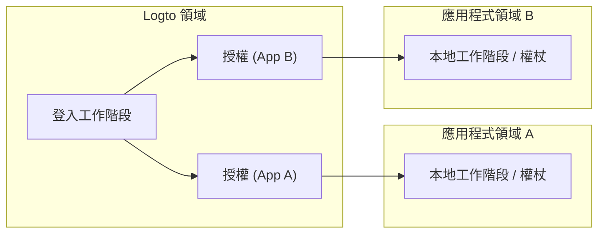
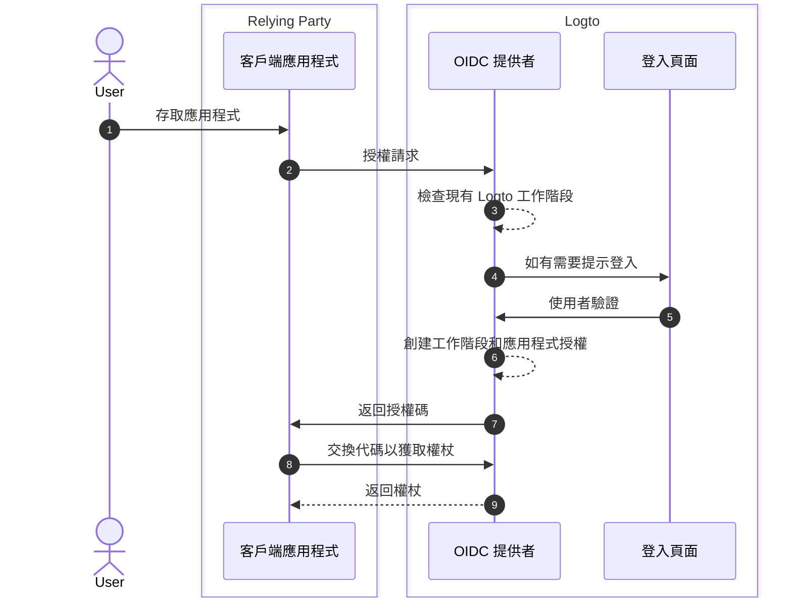
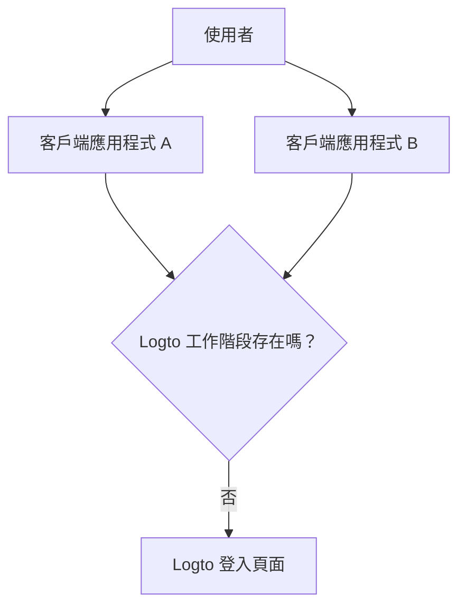

# 工作階段

在 Logto 中，工作階段定義了如何在應用程式、瀏覽器和設備之間建立、共享、刷新和撤銷驗證狀態。

實際上，使用者體驗到的「已登入」是一種狀態，但系統狀態被分為多個層次。理解這些層次是設計可預測的單一登入 (SSO)、權杖更新和登出行為的關鍵。

## Logto 中的工作階段模型 \{#session-model-in-logto}

- **Logto 登入工作階段**：集中式登入狀態，儲存在 Logto 領域的 cookie 中。這控制了當前瀏覽器上下文中的 SSO 可用性。
- **授權 (Grant)**：針對 `user + client app` 的應用程式特定授權狀態。授權是集中式登入與應用程式權杖發行之間的橋樑。
- **應用程式本地工作階段 / 權杖**：每個應用程式中的本地驗證狀態（ID / 存取 / 重新整理權杖、應用程式工作階段 cookie 等）。

## 核心概念 \{#core-concepts}

### 什麼是 Logto 工作階段？ \{#what-is-a-logto-session}

Logto 工作階段是成功登入後創建的集中式驗證狀態。如果它仍然有效，Logto 可以在同一租戶中的其他應用程式中靜默驗證使用者。如果不存在，使用者必須重新登入。

### 什麼是授權 (Grants)？ \{#what-are-grants}

授權是與特定使用者和客戶端應用程式相關的應用程式層級授權狀態。

- 一個 Logto 工作階段可以有多個應用程式的授權。
- 應用程式的權杖是在該應用程式的授權下發行的。
- 撤銷授權會影響該應用程式繼續基於權杖存取的能力。

### 工作階段、授權和應用程式驗證狀態的關係 \{#how-session-grants-and-app-auth-state-relate}

- **工作階段**回答：「這個瀏覽器現在可以與 Logto 進行 SSO 嗎？」
- **授權**回答：「這個使用者是否被授權使用這個客戶端應用程式？」
- **應用程式本地工作階段**回答：「這個應用程式目前是否將使用者視為已登入？」

## 登入和工作階段創建 \{#sign-in-and-session-creation}

## 應用程式和設備之間的工作階段拓撲 \{#session-topology-across-apps-and-devices}

### 同一瀏覽器：共享 Logto 工作階段 \{#same-browser-shared-logto-session}

同一瀏覽器中的應用程式可以共享集中式 Logto 工作階段狀態，因此 SSO 可以在不重複輸入憑證的情況下發生。

### 不同瀏覽器或設備：隔離的 Logto 工作階段 \{#different-browsers-or-devices-isolated-logto-sessions}

每個瀏覽器 / 設備都有單獨的 cookie 儲存。設備 A 上的有效工作階段並不意味著設備 B 上也有有效的工作階段。

## 工作階段生命週期 \{#session-lifecycle}

### 1. 創建 \{#1-create}

使用者驗證後，Logto 創建集中式工作階段和應用程式特定的授權。

### 2. 重用 (SSO) \{#2-reuse-sso}

只要工作階段 cookie 在同一瀏覽器中有效，新授權請求通常可以靜默完成。

### 3. 更新權杖 \{#3-renew-tokens}

應用程式存取通常透過權杖刷新流程（啟用時）繼續。這是應用程式層級的連續性，與集中式 Logto 工作階段是否仍然存在無關。

### 4. 撤銷 / 過期 \{#4-revokeexpire}

撤銷可以在不同層次發生：

- 本地應用程式登出會移除應用程式本地權杖 / 工作階段。
- 結束工作階段會移除集中式 Logto 工作階段。
- 授權撤銷會移除應用程式層級的授權連續性。

## 設計建議 \{#design-recommendations}

- 在應用程式代碼中明確處理應用程式本地工作階段。
- 將 Logto 工作階段、授權和應用程式本地工作階段視為獨立層次。
- 選擇登出應僅限於應用程式本地還是全域。
- 當需要多應用程式一致性時，使用 [後台通道登出](/end-user-flows/sign-out#federated-sign-out-back-channel-logout)。
- 有關登出行為和實施細節，請參閱 [登出](/end-user-flows/sign-out)。

## 撤銷存取的最佳實踐 \{#best-practices-for-revoking-access}

根據你的目標使用不同的撤銷策略：

- **撤銷第一方應用程式的存取**：
  使用 `revokeGrantsTarget=firstParty` 撤銷目標工作階段。
  這會讓使用者在與該工作階段相關的第一方應用程式中登出，創造一致的登出體驗。
  同時，對於已授予 `offline_access` 的第三方應用程式，授權仍可用於持續整合。
  有關工作階段撤銷的詳細資訊，請參閱 [管理使用者工作階段](/sessions/manage-user-sessions)。

- **撤銷對第三方應用程式的存取**：
  選擇以下之一：

  - 使用 `revokeGrantsTarget=all` 撤銷工作階段，以撤銷與該工作階段相關的所有授權。
  - 直接透過授權管理 API 撤銷特定授權，以移除第三方應用程式授權，而不強制完全工作階段登出。
    有關授權特定撤銷策略，請參閱 [管理使用者授權應用程式（授權）](/sessions/grants-management)。

- **使用 Logto Console 時**：
  在使用者詳細資訊頁面，Logto 提供現成的工作階段管理和授權第三方應用程式管理。
  - 撤銷工作階段同時撤銷第一方應用程式授權，以保持第一方登出行為一致。
  - 撤銷第三方應用程式授權會撤銷該第三方應用程式的授權，同時保持原始工作階段狀態不變。

## 相關資源 \{#related-resources}

<Url href="/sessions/manage-user-sessions">管理使用者工作階段</Url>
<Url href="/sessions/grants-management">管理使用者授權應用程式（授權）</Url>
<Url href="/sessions/session-configs">工作階段配置</Url>
<Url href="/end-user-flows/sign-out">登出</Url>
<Url href="/end-user-flows/sign-up-and-sign-in">註冊和登入</Url>
<Url href="/integrate-logto/integrate-logto-into-your-application/understand-authentication-flow">
  理解驗證流程
</Url>
