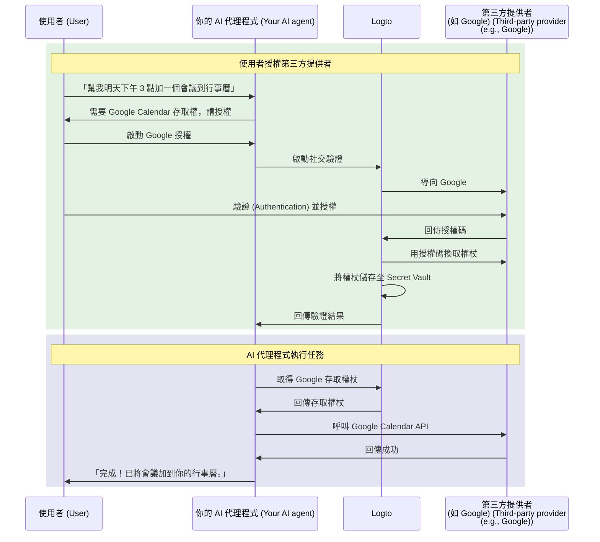

# 讓你的 AI 代理程式連接第三方 API

本指南將帶你一步步實現讓 AI 代理程式能以使用者身分存取第三方 API（如 Google Calendar、GitHub 等）。透過 Logto 的社交連接器 (Social connectors) 與 Secret Vault，你可以安全地儲存與管理存取權杖 (Access tokens)，讓代理程式自動執行任務，而無需反覆要求使用者重新驗證 (Authentication)。

你將學會：

- 設定支援第三方權杖儲存的社交連接器 (Social connectors)。
- 在初次登入時請求最小權限。
- 根據需求逐步請求額外權限。
- 取得並使用已儲存的權杖以存取第三方 API。

## 為什麼你的 AI 代理程式需要第三方 API 存取權 \{#why-your-ai-agent-needs-third-party-api-access}

AI 代理程式越來越常用於自動化需要與外部服務互動的任務。例如：

- **📅 行事曆管理**：AI 代理程式可自動排定會議、加入事件或調整 Google Calendar 上的行程。
- **📧 郵件自動化**：透過 Gmail API 發送後續郵件、整理收件匣或草擬回覆。
- **💻 程式碼管理**：建立 GitHub 問題、審查 Pull Request 或管理儲存庫。
- **📁 檔案管理**：在 Google Drive 或 Dropbox 上上傳、整理或分享檔案。

要執行這些任務，你的 AI 代理程式需要安全地存取使用者授權的第三方 API，這意味著必須正確且安全地處理 OAuth 權杖。

## 運作流程說明 \{#how-it-works}

以下為流程簡介：


```mermaid
sequenceDiagram
    participant User as 使用者 (User)
    participant Agent as 你的 AI 代理程式 (Your AI agent)
    participant Logto
    participant Google as 第三方提供者<br/>(如 Google) (Third-party provider<br/>(e.g., Google))

    rect rgba(200, 230, 200, 0.5)
        Note over User, Google: 使用者授權第三方提供者
        User->>Agent: 「幫我明天下午 3 點加一個會議到行事曆」
        Agent->>User: 需要 Google Calendar 存取權，請授權
        User->>Agent: 啟動 Google 授權
        Agent->>Logto: 啟動社交驗證
        Logto->>Google: 導向 Google
        User->>Google: 驗證 (Authentication) 並授權
        Google->>Logto: 回傳授權碼
        Logto->>Google: 用授權碼換取權杖
        Logto->>Logto: 將權杖儲存至 Secret Vault
        Logto->>Agent: 回傳驗證結果
    end

    rect rgba(200, 200, 230, 0.5)
        Note over User, Google: AI 代理程式執行任務
        Agent->>Logto: 取得 Google 存取權杖
        Logto->>Agent: 回傳存取權杖
        Agent->>Google: 呼叫 Google Calendar API
        Google->>Agent: 回傳成功
        Agent->>User: 「完成！已將會議加到你的行事曆。」
    end
```

1. **使用者請求任務**：使用者要求 AI 代理程式執行需第三方 API 存取的任務（如新增行事曆事件）。
2. **授權提示**：代理程式偵測到需要第三方存取，提示使用者授權。
3. **權杖儲存**：使用者授權後，Logto 會將存取權杖與重新整理權杖 (Refresh tokens) 安全儲存於 Secret Vault。
4. **任務執行**：代理程式取得已儲存的權杖，呼叫第三方 API 完成任務。

一旦授權，使用者可多次執行任務而無需重複授權。Logto 會安全儲存權杖，並在需要時自動重新整理，讓 AI 代理程式持續互動體驗順暢。

## 先決條件 \{#prerequisites}

開始前，請確保你已具備：

- 一個 [Logto Cloud](https://cloud.logto.io)（或自架 Logto v1.31+）租戶
- 一個具備 API 存取權的第三方服務帳號（如 [Google Cloud Console](https://console.cloud.google.com)）
- 已整合 Logto SDK 的 AI 代理程式應用（使用者可登入你的 AI 代理程式）

## 設定支援權杖儲存的社交連接器 \{#set-up-social-connector-with-token-storage}

要讓 AI 代理程式能存取第三方 API，需設定支援權杖儲存的社交連接器。這讓 Logto 能在使用者與 AI 代理程式互動時，於授權第三方服務時儲存並管理存取權杖。

以 Google 為例：

1. 前往 <CloudLink to="/connectors/social">Console > 連接器 > 社交連接器</CloudLink>。
2. 點擊 **新增社交連接器** 並選擇 **Google**。
3. 依照 [Google 連接器設定指南](/integrations/google) 設定 OAuth 用戶端憑證。
4. 在連接器設定中：
   - 啟用 **儲存權杖以持續存取 API**，將權杖儲存至 Secret Vault。
   - 設定 **Prompts** 包含 `consent`，確保使用者看到權限請求。
   - 啟用 **離線存取 (Offline access)**，以取得長效 API 存取所需的重新整理權杖。
5. 儲存設定。

:::info
你不需要將此連接器加入登入體驗。該連接器將於 AI 代理程式需要存取第三方 API 時按需授權，而非用於使用者登入。
:::

## 請求授權並存取第三方 API \{#request-authorization-and-access-third-party-apis}

當 AI 代理程式需要存取第三方 API（如 Google Calendar）時，應先檢查使用者是否已授權。若尚未授權，則提示使用者進行授權。

:::info 啟用 Account API
繼續前，請於 <CloudLink to="/sign-in-experience/account-center">Console > 登入與帳號 > 帳號中心</CloudLink> 啟用 Account API。詳見 [如何啟用 Account API](/end-user-flows/account-settings/by-account-api#how-to-enable-account-api)。
:::

### 步驟 1：檢查是否已有授權 \{#step-1-check-for-existing-authorization}

首先，嘗試取得已儲存的存取權杖，判斷使用者是否已授權：

```tsx
async function getGoogleAccessToken(userAccessToken: string) {
  const response = await fetch(
    'https://[tenant-id].logto.app/my-account/identities/google/access-token',
    {
      headers: {
        Authorization: `Bearer ${userAccessToken}`,
      },
    }
  );

  return response.json();
}
```

### 步驟 2：如有需要請求授權 \{#step-2-request-authorization-if-needed}

若無權杖、權杖已過期，或需擴展權杖權限範圍，請使用 Logto 的 [Social Verification API](/secret-vault/federated-token-set#reauthentication-and-token-renewal) 啟動授權流程：

```tsx
async function requestGoogleAuthorization(userAccessToken: string, scopes: string) {
  // 產生隨機 state 以防止 CSRF 攻擊
  const state = crypto.randomUUID();
  sessionStorage.setItem('oauth_state', state);

  // 啟動社交驗證
  const response = await fetch('https://[tenant-id].logto.app/api/verification/social', {
    method: 'POST',
    headers: {
      Authorization: `Bearer ${userAccessToken}`,
      'Content-Type': 'application/json',
    },
    body: JSON.stringify({
      connectorId: '<google_connector_id>',
      state,
      redirectUri: 'https://your-ai-agent.com/callback',
      scope: scopes,
    }),
  });

  const { verificationRecordId, authorizationUri } = await response.json();

  // 儲存 verificationRecordId 以便後續使用
  sessionStorage.setItem('verificationRecordId', verificationRecordId);

  // 導向使用者至 Google 進行授權
  window.location.href = authorizationUri;
}
```

### 步驟 3：處理授權回調 \{#step-3-handle-the-authorization-callback}

使用者授權後，Google 會導回你的應用。完成驗證並儲存權杖：

```tsx
async function handleAuthorizationCallback(
  userAccessToken: string,
  callbackParams: URLSearchParams
) {
  const verificationRecordId = sessionStorage.getItem('verificationRecordId');
  const storedState = sessionStorage.getItem('oauth_state');
  const code = callbackParams.get('code');
  const state = callbackParams.get('state');

  // 驗證 state 以防止 CSRF 攻擊
  if (state !== storedState) {
    throw new Error('Invalid state parameter');
  }

  // 驗證授權
  await fetch('https://[tenant-id].logto.app/api/verification/social/verify', {
    method: 'POST',
    headers: {
      Authorization: `Bearer ${userAccessToken}`,
      'Content-Type': 'application/json',
    },
    body: JSON.stringify({
      verificationRecordId,
      connectorData: {
        code,
        state,
        redirectUri: 'https://your-ai-agent.com/callback',
      },
    }),
  });

  // 將權杖儲存至 Logto 的 Secret Vault
  await fetch('https://[tenant-id].logto.app/my-account/identities/google/access-token', {
    method: 'PUT',
    headers: {
      Authorization: `Bearer ${userAccessToken}`,
      'Content-Type': 'application/json',
    },
    body: JSON.stringify({
      verificationRecordId,
    }),
  });

  // 清理暫存
  sessionStorage.removeItem('verificationRecordId');
  sessionStorage.removeItem('oauth_state');
}
```

### 步驟 4：呼叫第三方 API \{#step-4-call-the-third-party-api}

現在你的 AI 代理程式可以取得權杖並呼叫 API：

```tsx
async function addCalendarEvent(userAccessToken: string, eventDetails: EventDetails) {
  // 取得已儲存的 Google 存取權杖
  const tokenData = await getGoogleAccessToken(userAccessToken);

  if (!tokenData) {
    // 尚未授權，請求 calendar 權限
    await requestGoogleAuthorization(
      userAccessToken,
      'https://www.googleapis.com/auth/calendar.events'
    );
    return; // 導向授權後繼續
  }

  // 呼叫 Google Calendar API
  const response = await fetch('https://www.googleapis.com/calendar/v3/calendars/primary/events', {
    method: 'POST',
    headers: {
      Authorization: `Bearer ${tokenData.accessToken}`,
      'Content-Type': 'application/json',
    },
    body: JSON.stringify(eventDetails),
  });

  return response.json();
}
```

Logto 會自動處理權杖重新整理。如果存取權杖已過期但有重新整理權杖，Logto 會在你呼叫取得端點時自動換取新權杖。

## 請求額外權限 \{#request-additional-permissions}

隨著 AI 代理程式功能擴展，可能需要請求更多權限。例如，使用者最初僅授權唯讀行事曆，現在想建立事件，就需寫入權限。

### 為什麼要漸進式授權？ \{#why-incremental-authorization}

- **更佳的使用者體驗**：使用者在理解情境下更願意授權。
- **更高轉換率**：初始權限越少，阻力越小。
- **建立信任**：只請求必要權限的應用更受信賴。

### 範例：從唯讀升級為可寫入 \{#example-upgrading-from-read-to-write-access}

```tsx
async function createCalendarEvent(userAccessToken: string, eventDetails: EventDetails) {
  const tokenData = await getGoogleAccessToken(userAccessToken);

  if (!tokenData) {
    // 尚未授權，直接請求 calendar 寫入權限
    await requestGoogleAuthorization(userAccessToken, 'https://www.googleapis.com/auth/calendar');
    return;
  }

  // 嘗試建立事件
  const response = await fetch('https://www.googleapis.com/calendar/v3/calendars/primary/events', {
    method: 'POST',
    headers: {
      Authorization: `Bearer ${tokenData.accessToken}`,
      'Content-Type': 'application/json',
    },
    body: JSON.stringify(eventDetails),
  });

  if (response.status === 403) {
    // 權限不足，請求額外 scope
    await requestGoogleAuthorization(
      userAccessToken,
      'https://www.googleapis.com/auth/calendar' // 完整行事曆存取
    );
    return;
  }

  return response.json();
}
```

:::tip
請求額外 scope 時，使用者會看到僅有新權限的授權頁面，原有權限會被保留。
:::

## 管理權杖狀態 \{#manage-token-status}

Logto Console 可檢視每位使用者的權杖狀態：

1. 前往 <CloudLink to="/users">Console > 使用者管理</CloudLink>。
2. 點擊任一使用者以檢視詳細資料。
3. 捲動至 **連線 (Connections)** 區塊，查看所有已連結的社交帳號。
4. 每個連線會顯示權杖狀態：
   - **啟用 (Active)**：存取權杖有效，可直接使用。
   - **已過期 (Expired)**：存取權杖已過期。若有重新整理權杖，下次取得時會自動刷新。
   - **未啟用 (Inactive)**：此連線未儲存任何權杖。

## 安全最佳實踐 \{#security-best-practices}

開發可存取第三方 API 的 AI 代理程式時，請注意以下安全建議：

- **請求最小 scope**：只請求代理程式實際需要的權限。
- **採用漸進式授權**：根據情境請求額外權限，不要一次請求全部。
- **妥善處理權杖過期**：務必處理權杖過期或被撤銷的情境。
- **保護使用者存取權杖**：使用者的 Logto 存取權杖是取得第三方權杖的鑰匙，請妥善保護。
- **稽核 API 存取**：記錄 AI 代理程式存取第三方 API 的行為，便於除錯與合規。

## 相關資源 \{#related-resources}

<Url href="/secret-vault/federated-token-set">第三方權杖儲存</Url>
<Url href="/connectors/social-connectors">社交連接器</Url>
<Url href="/end-user-flows/sign-up-and-sign-in/social-sign-in">社交登入</Url>
<Url href="/end-user-flows/account-settings/by-account-api">Account API</Url>
