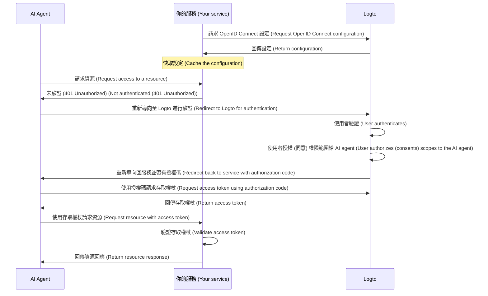

import ConfigureThirdPartyAiAgent from './fragments/_configure-third-party-ai-agent.mdx';

# 啟用第三方 AI agent 存取你的應用程式

本指南將帶你整合 Logto 與你的服務，並啟用 AI agent 存取該服務。

你將學會：

- 將 Logto 設定為你的服務的授權 (Authorization) 伺服器。
- 取得 AI agent 存取你服務所需的存取權杖 (Access token)。
- 使用 AI agent 測試整個流程。

## 第三方 AI agent 與你自己的 AI agent（或應用程式）的差異 \{#difference-between-third-party-ai-agent-and-your-own-ai-agent-or-app}

讓我們來看一個例子。假設你是一位開發者，經營一個提供天氣資料的服務。

**官方天氣應用程式（你自己的 AI agent / 應用程式）**

- 你提供一個官方天氣應用程式，讓使用者查詢天氣。
- 運作方式：官方天氣應用程式透過 Logto 連接你的服務並驗證 (Authentication) 使用者。當 Alice 登入時，她會自動取得天氣資料的存取權，不需要額外的授權頁面，因為這是你信任的應用程式。

**第三方 AI agent**

- 你希望圍繞你的服務建立生態系，因此另一位開發者建立了「WeatherBot」（一個能提供天氣更新與預報的 AI 助理），並將其作為第三方 AI agent 整合進來。
- 運作方式：WeatherBot（第三方 AI agent）希望透過你的服務存取使用者的天氣資料。當 Alice 使用她的帳號登入 WeatherBot 時：
  - 她會看到一個使用者授權頁面 (Consent screen)，詢問是否允許 WeatherBot 存取她的天氣資料。
  - Alice 可以允許或拒絕這個存取。
  - 只有她同意分享的資料會提供給 WeatherBot，WeatherBot 無法在未經明確同意的情況下存取其他資料。

這種存取（權限）控制確保了使用者資料的安全，即使你的服務管理所有資料，像 WeatherBot 這樣的第三方 AI agent 也只能存取使用者明確允許的內容。他們無法繞過這個流程，因為這是由你在服務中實作的存取控制所強制執行的。

**總結**

| 用戶端類型       | 範例                 | 需要授權頁面？ | 誰控制？     |
| ---------------- | -------------------- | -------------- | ------------ |
| 官方天氣應用程式 | 你自己的天氣應用程式 | 否             | 你（開發者） |
| 第三方 AI agent  | WeatherBot 助理      | 是             | 其他開發者   |

:::note
如果你想將服務整合到你自己的 AI agent 或應用程式，請參考我們的 [快速入門指南](/quick-starts) 以獲得更多資訊。
:::

## 先決條件 \{#prerequisites}

- 一個 [Logto Cloud](https://cloud.logto.io)（或自架）租戶
- 一個對 AI agent 開放 API 端點的服務

### 流程說明 \{#understanding-the-flow}

- **服務 (Service)**：你希望讓 AI agent 存取的服務。
- **AI agent**：將要存取你服務的 AI agent。
- **Logto**：作為 OpenID Connect 提供者（授權 (Authorization) 伺服器），管理使用者身分。

以下是一個非標準的時序圖，說明整體流程：

## 設定第三方 AI agent \{#set-up-third-party-ai-agent}

要讓第三方 AI agent 存取你的服務，請依照下列步驟操作：

1. **在 Logto 註冊 AI agent**：在 Logto 中建立一個應用程式來代表該 AI agent。
2. **設定 AI agent**：確保 AI agent 能向你的服務發送請求，並正確處理 401 Unauthorized 回應。
3. **實作授權 (Authorization) 流程**：AI agent 應能處理 OAuth 2.0 授權流程，從 Logto 取得存取權杖 (Access token)。
4. **測試整合**：使用 AI agent 存取你的服務，確認其能成功驗證 (Authentication) 並授權 (Authorization) 請求。

<ConfigureThirdPartyAiAgent />

## 在你的服務中設定授權 (Authorization) \{#set-up-authorization-in-your-service}

要在你的服務中啟用存取控制，請實作下列內容：

1. **在 Logto 定義 API 資源**：在 Logto 中建立代表 AI agent 將要存取之端點的 API 資源。
2. **實作存取控制邏輯**：在你的服務中，實作邏輯以驗證從 AI agent 收到的存取權杖 (Access token)，並檢查使用者是否有權存取所請求的資源。
3. **回應 AI agent**：如果存取權杖有效且使用者有權限，則回傳所請求的資源；否則回傳 401 Unauthorized 回應。

想進一步瞭解如何在服務中實作存取控制，請參考我們的 [授權 (Authorization) 指南](/authorization)。

## 測試整合 \{#test-the-integration}

1. 啟動你的服務。
2. 啟動 AI agent。
3. 在 AI agent 中呼叫 API 端點以存取你的服務。
4. AI agent 應能處理 401 Unauthorized 回應並將使用者導向 Logto 進行驗證 (Authentication)。
5. 驗證成功後，AI agent 應收到存取權杖 (Access token)，並用它向你的服務發送請求。
6. AI agent 應能使用存取權杖從你的服務取得資源。
