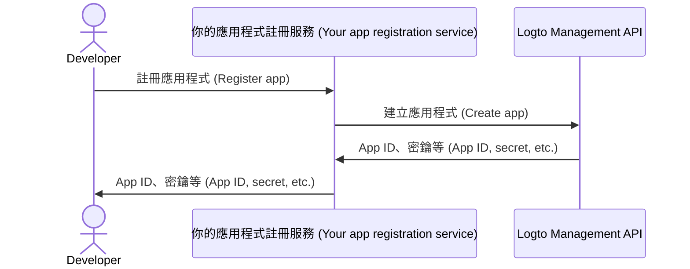

import QuickStartsReference from '../../../quick-starts/third-party/oidc/_quick-starts-reference.md';

## 在 Logto 設定第三方 AI agent \{#configure-third-party-ai-agent-in-logto}

若要讓第三方 AI agent 存取你的 {props.serviceName ?? '服務'}，你需要在 Logto 中建立一個**第三方應用程式 (third-party app)**。這個應用程式將代表 AI agent，並取得驗證 (Authentication) 與授權 (Authorization) 所需的憑證。

:::info[什麼是第三方應用程式？]
**第三方應用程式 (third-party app)** 是由外部開發者（非資源擁有者）建立的應用程式，需要使用者同意才能存取受保護資源。與第一方應用程式（你自己的應用程式）不同，第三方應用程式會顯示使用者授權頁面 (Consent screen)，要求使用者在存取其資料前批准特定權限。這確保使用者能掌控與外部服務分享哪些資料。

想了解更多，請參閱 [第三方應用程式](/integrate-logto/third-party-applications)。
:::

### 允許開發者在 Logto 建立第三方應用程式 \{#allow-developers-to-create-third-party-apps-in-logto}

如果你正在打造市集或希望開發者能在 Logto 建立第三方應用程式，可以利用 [Logto Management API](/integrate-logto/interact-with-management-api) 以程式方式建立第三方應用程式。這讓開發者能註冊他們的應用程式並取得驗證所需的憑證。

你需要自行架設服務來處理 client 註冊流程。該服務會與 Logto Management API 互動，代表開發者建立第三方應用程式。

```mermaid
sequenceDiagram
  actor Developer
  participant Server as 你的應用程式註冊服務 (Your app registration service)
  participant Logto as Logto Management API
  Developer->>Server: 註冊應用程式 (Register app)
  Server->>Logto: 建立應用程式 (Create app)
  Logto->>Server: App ID、密鑰等 (App ID, secret, etc.)
  Server->>Developer: App ID、密鑰等 (App ID, secret, etc.)
```

你也可以在 Logto Console 手動建立第三方應用程式，以熟悉整個流程。

### 在 Logto 手動建立第三方應用程式 \{#manually-create-a-third-party-app-in-logto}

你可以在 Logto Console 手動建立第三方應用程式，作為測試或臨時整合之用。這在你想快速測試整合、尚未實作完整 client 註冊流程時特別有用。

1. 登入你的 Logto Console。
2. 前往 <CloudLink to="/applications">**應用程式 (Applications)**</CloudLink> → **建立應用程式 (Create application)** → **第三方應用程式 (Third-party app)** -> **OIDC**。
3. 輸入應用程式名稱及其他必要欄位，然後點擊 **建立應用程式 (Create application)**。
4. 點選 **權限 (Permissions)** 分頁，在 **使用者 (User)** 區塊點擊「新增 (Add)」。
5. 在開啟的對話框 -> **使用者資料 (User data)** -> 勾選 **`profile`**、**`email`** 權限，然後點擊 **儲存 (Save)**。
6. 在第三方應用程式中，設定 scopes 以請求 `openid profile email` 權限（scopes）。

   **注意**：`openid` 為 OIDC 必填，`profile` 與 `email` 則是你在前一步新增的權限。

7. 依需求設定你的第三方應用程式的 **redirect URI**，並記得在 Logto 中同步更新 redirect URI。

---

<QuickStartsReference />
