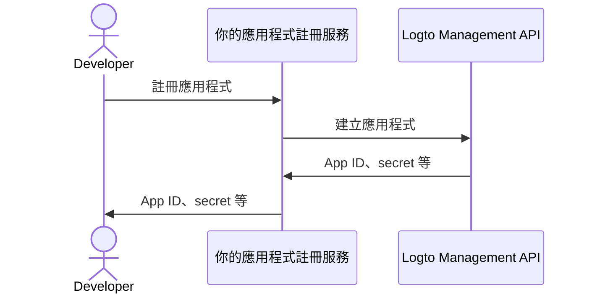

import QuickStartsReference from '../../quick-starts/third-party/oidc/_quick-starts-reference.md';

import thirdPartyAppPermissions from './assets/third-party-app-permissions.png';
import Prerequisites from './fragments/_mcp-prerequisites.mdx';
import SampleCode from './fragments/_mcp-sample-code.mdx';
import SetUpServer from './fragments/_mcp-set-up-server.mdx';

# 啟用第三方 AI agent 存取你的 MCP 伺服器

本指南將帶你整合 Logto 與你的 MCP 伺服器，使用 [mcp-auth](https://mcp-auth.dev)，讓你能透過標準 OpenID Connect 流程驗證 (Authentication) 使用者並安全取得其身分資訊。

你將學會：

- 將 Logto 設定為 MCP 伺服器的授權 (Authorization) 伺服器。
- 在 MCP 伺服器中設置「whoami」工具，回傳當前使用者的身分宣告 (Claims)。
- 使用第三方 AI agent（MCP client）測試整個流程。

完成本教學後，你的 MCP 伺服器將能：

- 在你的 Logto 租戶中驗證 (Authentication) 使用者。
- 在呼叫「whoami」工具時，回傳身分宣告（`sub`、`username`、`name`、`email` 等）。

## 第三方 AI agent（MCP client）與你自己的 MCP client 的差異 \{#difference-between-third-party-ai-agent-mcp-client-and-your-own-mcp-client}

舉個例子，假設你是一位開發者，運行 MCP 伺服器來管理電子郵件存取與自動化。

**官方郵件應用程式（你自己的 MCP client）**

- 你提供一個官方郵件應用程式，讓使用者閱讀與管理郵件。
- 運作方式：官方郵件應用程式透過 Logto 連接你的 MCP 伺服器進行驗證 (Authentication)。當 Alice 登入時，會自動取得郵件存取權，不需額外授權頁面，因為這是你信任的應用程式。

**第三方 AI agent（第三方 MCP client）**

- 你希望打造 MCP 伺服器生態系，另一位開發者建立了「SmartMail AI」（一個能自動摘要郵件與排程會議的 AI 助理），並以第三方 client 方式整合。
- 運作方式：SmartMail AI（第三方 MCP client）希望透過你的 MCP 伺服器存取使用者郵件。當 Alice 使用她的帳號登入 SmartMail AI 時：
  - 會顯示授權頁面 (Consent screen)，請求 SmartMail AI 存取她的郵件與行事曆。
  - Alice 可以允許或拒絕這項存取。
  - 只有她同意的資料會分享給 SmartMail AI，SmartMail AI 無法在未經明確同意下存取其他資料。

這種存取（權限）控制確保使用者資料安全，即使 MCP 伺服器管理所有資料，像 SmartMail AI 這類第三方應用程式也只能存取使用者明確允許的內容。這個流程無法被繞過，因為它由你在 MCP 伺服器中的存取控制實作所強制執行。

**總結**

| Client 類型      | 範例                 | 需要授權頁面？ | 誰控制？     |
| ---------------- | -------------------- | -------------- | ------------ |
| 官方郵件應用程式 | 你自己的郵件應用程式 | 否             | 你（開發者） |
| 第三方 AI agent  | SmartMail AI 助理    | 是             | 其他開發者   |

:::note
如果你想將 MCP 伺服器與你自己的 AI agent 或應用程式整合，請參考 [為你的 MCP 應用程式啟用 Logto 驗證 (Authentication)](./mcp-server-add-auth) 指南。
:::

<Prerequisites isThirdParty />

## 設定第三方 AI agent \{#set-up-third-party-ai-agent}

要讓第三方 AI agent 能存取你的 MCP 伺服器，你需要完成以下設定：

1. client 需能發送 MCP 請求，呼叫 MCP 伺服器所公開的工具。
2. client 需能處理 401 Unauthorized 回應。詳見 [授權流程步驟 (Authorization Flow Steps)](https://modelcontextprotocol.io/specification/2025-03-26/basic/authorization#2-5-authorization-flow-steps)。
3. 驗證 (Authentication) 成功後，client 需能使用從 Logto 取得的存取權杖 (Access token) 向 MCP 伺服器發送請求。

## 在 Logto 中設定 AI agent \{#set-up-ai-agent-in-logto}

要讓第三方 AI agent 存取你的 MCP 伺服器，你需要在 Logto 中建立一個**第三方應用程式**。這個應用程式將代表 AI agent 並取得驗證 (Authentication) 與授權 (Authorization) 所需的憑證。

### 允許開發者在 Logto 建立第三方應用程式 \{#allow-developers-to-create-third-party-apps-in-logto}

如果你正在打造市集或希望開發者能在 Logto 建立第三方應用程式，可以利用 [Logto Management API](/integrate-logto/interact-with-management-api) 以程式化方式建立第三方應用程式。這讓開發者能註冊他們的應用程式並取得驗證所需的憑證。

你需要自行架設服務來處理 client 註冊流程。該服務會與 Logto Management API 互動，代表開發者建立第三方應用程式。

你也可以在 Logto Console 手動建立第三方應用程式，以熟悉整個流程。

### 在 Logto Console 手動建立第三方應用程式 \{#manually-create-a-third-party-app-in-logto}

你可以在 Logto Console 手動建立第三方應用程式，用於測試或臨時整合。這適合想快速驗證整合效果而不需實作完整 client 註冊流程的情境。

1. 登入你的 Logto Console。
2. 前往 <CloudLink to="/applications">**應用程式 (Applications)**</CloudLink> → **建立應用程式 (Create application)** → **第三方應用程式 (Third-party app)** -> **OIDC**。
3. 輸入應用程式名稱及其他必要欄位，點擊 **建立應用程式 (Create application)**。
4. 點選 **權限 (Permissions)** 分頁，在 **使用者 (User)** 區塊點選「新增」。
5. 在開啟的對話框 -> **使用者資料 (User data)** -> 勾選 **`profile`**、**`email`** 權限，然後點擊 **儲存 (Save)**。
6. 在第三方應用程式中，設定 scopes 以請求 `openid profile email` 權限。
7. 根據需求設定你的第三方應用程式 **redirect URI**，並記得同步更新 Logto 中的 redirect URI。

---

<QuickStartsReference />

<SetUpServer />

## 測試整合 \{#test-the-integration}

1. 啟動 MCP 伺服器。
2. 啟動 AI agent。
3. 在 client 端呼叫 `whoami` 工具，取得當前使用者的身分宣告 (Claims)。
4. client 應處理 401 Unauthorized 回應並將使用者導向 Logto 進行驗證 (Authentication)。
5. 驗證成功後，client 會收到存取權杖 (Access token)，並用它向 MCP 伺服器發送請求。
6. client 應能使用存取權杖 (Access token) 從 MCP 伺服器取得身分宣告 (Claims)。

<SampleCode />
