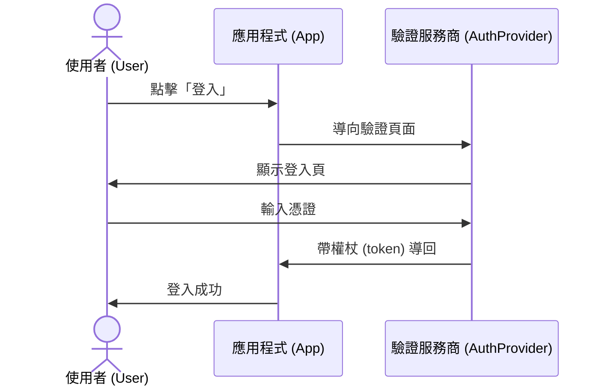
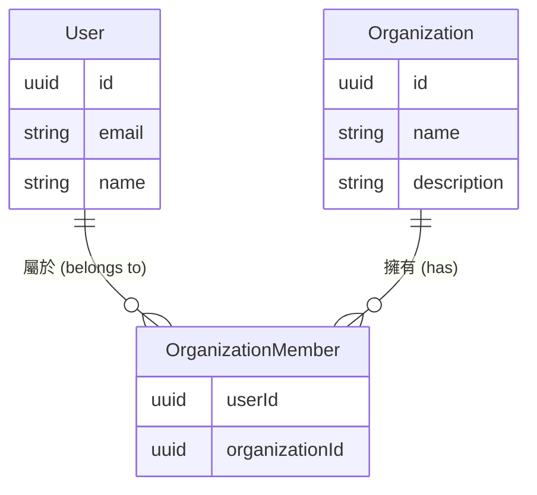
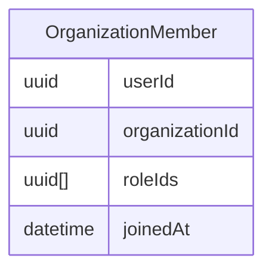
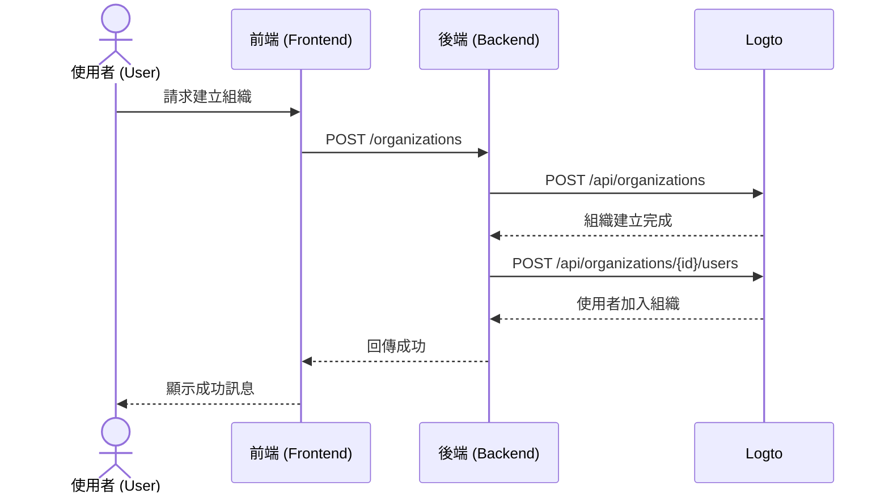

<head>
  <link rel="canonical" href="https://blog.logto.io/build-multi-tenant-saas-application" />
</head>

<style>
  {`
    .twoColumn {
      display: grid;
      grid-template-columns: 1fr 1fr;
      gap: 24px;
    }
    .twoColumn + .twoColumn {
      margin-top: 24px;
    }
  `}
</style>

# 建立多租戶 SaaS 應用程式：從設計到實作的完整指南

Notion、Slack 或 Figma 這類應用程式是怎麼打造的？這些多租戶 SaaS 應用程式看起來簡單易用，但要自己動手做？那又是另一回事了。

當我第一次想要打造這種複雜巨獸時，腦袋直接爆炸：

- 使用者需要多種登入選項（Email、Google、GitHub）
- 每個使用者可以建立並屬於多個組織 (Organizations)
- 每個組織內有不同的權限等級
- 企業組織需要特定網域自動加入
- 敏感操作需多重要素驗證 (MFA)
- 還有更多...

「老闆，產品設計兩週後再談，我現在卡在泥沼裡。」

但當我真的開始動手時，**我發現其實沒那麼可怕。**

我只花了很少的力氣，就**打造出一套具備這些功能的系統！**


<div className="twoColumn">
  
  
</div>

我會帶你從零開始設計並實作這樣的系統——你會驚訝於 2025 年用現代工具和正確架構方法，這一切其實有多簡單。

> **完整原始碼已開源於 [Github Repo](https://github.com/logto-io/multi-tenant-saas-sample)。讓我們開始吧！**

我們以一個 AI 文件 SaaS 產品 DocuMind 為例。

DocuMind 是一款以多租戶模型設計的 AI 文件 SaaS 產品，支援個人、小型企業與大型企業。

這個平台為組織內的文件管理提供強大的 AI 能力，包括自動摘要產生、重點提取與智慧內容推薦。

## SaaS 驗證 (Authentication) 與授權 (Authorization) 需要哪些功能？\{#what-features-are-required-for-saas-authentication-and-authorization}

首先，讓我們回顧一下必要需求。你需要哪些功能？

### 多租戶架構 \{#multi-tenant-architecture}

要實現多租戶架構，你需要一個稱為 **組織 (Organization)** 的實體層。想像有一個共用的使用者池，這些使用者可以存取多個工作區。每個組織代表一個工作區，使用者以單一身分根據分配的角色存取不同工作區（組織）。


這是驗證 (Authentication) 服務商常見的功能。身分管理系統中的組織對應到你的 SaaS 應用程式的工作區、專案或租戶。


### 成員資格 (Membership) \{#membership}

成員是一個暫時性的概念，用來表示某個身分在組織中的成員狀態。

舉例來說，Sarah 用她的 email **sarah@gmail.com** 註冊你的應用程式。她可以屬於不同的工作區。如果 Sarah 屬於 **Workspace A** 但不屬於 **Workspace B**，那她就是 **Workspace A** 的成員，但不是 **Workspace B** 的成員。

### 角色與權限設計 \{#role-and-permission-design}

在多租戶架構下，使用者需要有特定 **角色 (Role)** 與 **權限 (Permission)** 來存取其租戶資源。
權限 (Permission) 是細緻的存取控制，定義具體行為，例如 `read: order` 或 `write: order`，決定能對特定資源執行哪些操作。

角色 (Role) 則是在多租戶環境下指派給成員的一組權限。

你需要定義這些角色與權限，然後將角色指派給使用者，有時還會包含自動化流程。例如：

1. 加入組織的使用者自動獲得 **member** 角色。
2. 第一個建立工作區的使用者自動獲得 **admin** 角色。

### 註冊與登入流程 \{#sign-up-and-login-flow}

確保使用者友善且安全的註冊與驗證 (Authentication) 流程，包括基本登入與註冊選項：

1. **Email 與密碼登入**：傳統的 email / 密碼登入方式。
2. **無密碼登入**：使用 email 驗證碼，簡單又安全。
3. **帳號管理**：帳號中心，讓使用者更新 email、密碼等資訊。
4. **社交登入**：如 Google、GitHub 等快速登入選項。
5. **多重要素驗證 (MFA)**：支援如 Duo 等驗證器 App 增強安全性。

### 租戶建立與邀請 \{#tenant-creation-and-invitation}

在多租戶 SaaS 應用程式中，使用者流程的一大差異是需要支援租戶建立與成員邀請。這個流程對產品啟動與成長至關重要，需要仔細規劃與執行。

以下是你需要考慮的典型使用流程：

| 使用者類型             | 進入點                    |
| ---------------------- | ------------------------- |
| 新帳號                 | 從登入 / 註冊頁建立新租戶 |
| 已有帳號               | 在產品內建立另一個租戶    |
| 已有帳號收到新租戶邀請 | 從登入 / 註冊頁進入       |
| 已有帳號收到新租戶邀請 | 從邀請信進入              |
| 新帳號收到新租戶邀請   | 從登入 / 註冊頁進入       |
| 新帳號收到新租戶邀請   | 從邀請信進入              |

這些是幾乎每個 SaaS 應用程式都會遇到的常見情境。你可以參考這些流程激發產品與設計團隊靈感，也可以根據需求自訂流程。

<div className="twoColumn">
  
  
</div>

<div className="twoColumn">
  
  
</div>

<div className="twoColumn">
  
  
</div>

## 技術架構與系統設計 \{#technical-architecture-and-system-design}

了解所有產品需求後，讓我們進入實作階段。

### 定義驗證 (Authentication) 策略 \{#define-authentication-strategy}

驗證 (Authentication) 看起來很可怕。使用者需要：

- Email / 密碼註冊 / 登入
- Google / Github 一鍵登入
- 忘記密碼時重設
- 企業客戶團隊登入
- ...

光是這些基本功能就可能要開發好幾週。

但現在，**我們完全不用自己實作這些！**

現代驗證 (Authentication) 服務商（這次我選 [Logto](https://logto.io/)）已經幫我們包好所有功能。驗證流程非常直觀：



**從數週開發縮短到 15 分鐘設定**，Logto 幫我們處理所有複雜流程！整合步驟會在後面實作章節說明。現在我們可以專注打造 DocuMind 核心功能！

### 建立多租戶架構 \{#establish-multi-tenant-architecture}

組織系統讓使用者可以建立並加入多個組織。來看看核心關係：



在這個系統中，每個使用者可以屬於多個組織，每個組織也可有多位成員。

```mermaid
graph TD
    App[應用程式 (Application)]
    O1[組織 1 (Organization 1)]
    O2[組織 2 (Organization 2)]
    M1[成員 (Member)]
    M2[成員 (Member)]
    M3[成員 (Member)]

    App --> O1
    App --> O2
    O1 --> M1
    O1 --> M2
    O2 --> M2
    O2 --> M3

    style O1 fill:#e6ffe6
    style O2 fill:#e6ffe6
```

### 在多租戶應用中啟用存取控制 \{#enable-access-control-in-multi-tenant-app}

**角色型存取控制 (RBAC, Role-Based Access Control)** 對多租戶 SaaS 應用的安全與擴展性至關重要。

在多租戶應用中，權限與角色設計通常一致，源自產品設計。例如多個工作區通常有 admin 與 member 角色。Logto 作為驗證 (Authentication) 服務商，提供以下組織層級 RBAC 設計：

1. **統一權限定義**：權限於系統層級定義，適用於所有組織，確保權限管理一致且易於維護
2. **組織範本 (Organization templates)**：預設角色與權限組合，簡化組織初始化

權限關係如下：

```mermaid
graph TD
    subgraph organization_template[組織範本 (OrganizationTemplate)]
        subgraph role_2[角色 2 (Role2)]
            permission_c[權限 C (Permission C)]
            permission_d[權限 D (Permission D)]
        end

        subgraph role_1[角色 1 (Role1)]
            permission_a[權限 A (Permission A)]
            permission_b[權限 B (Permission B)]
        end
    end

    style organization_template fill:#e6ffe6
    style role_1 fill:#ffe6e6
    style role_2 fill:#ffe6e6
```

由於每個使用者在每個組織中都需要自己的角色，角色與組織的關係必須能反映每位使用者的角色指派：



我們已設計好組織系統與存取控制系統，現在可以開始打造產品！

## 技術選型 \{#tech-stack}

我選擇了新手友善、可攜式的技術組合：

1. **前端**：React（也可輕鬆轉換到 Vue / Angular / Svelte）
2. **後端**：Express（簡單直觀的 API）

為什麼前後端分離？因為架構清晰、易學易換技術棧。驗證 (Authentication) 服務商以 Logto 為例。

而以下教學的模式適用於：任何前端、任何後端、任何驗證 (Authentication) 系統。

## 為你的應用程式新增基本驗證 (Authentication) 流程 \{#add-basic-authentication-flow-to-your-app}

這是最簡單的一步。我們只需將 Logto 整合進專案，然後在 Logto Console 根據需求設定登入 / 註冊方式。

### 安裝 Logto 到你的應用程式 \{#install-logto-to-your-app}

首先登入 [Logto Cloud](https://cloud.logto.io/)。如果還沒有帳號可以免費註冊。建立一個 Development Tenant 進行測試。

在 Tenant Console 點選左側「Application」按鈕，選擇 React 開始建立應用程式。

依照頁面指引操作，約 5 分鐘即可完成 Logto 整合！

以下是我的整合程式碼：

```jsx
const config: LogtoConfig = {
  endpoint: "<YOUR_LOGTO_ENDPOINT>",
  appId: "<YOUR_LOGTO_APP_ID>",
};

function App() {
  return (
    <LogtoProvider config={config}>
      <div className="min-h-screen bg-gradient-to-b from-gray-50 to-gray-100">
        <Routes>
          {/* 此 callback 處理 Logto 登入導回 */}
          <Route path="/callback" element={<Callback />} />
          <Route path="/*" element={<AppContent />} />
        </Routes>
      </div>
    </LogtoProvider>
  );
}

function AppContent() {
  const { isAuthenticated } = useLogto();

  if (!isAuthenticated) {
    // 未驗證 (Authentication) 使用者顯示首頁
    return <Landing />;
  }

  // 已驗證 (Authentication) 使用者顯示主應用
  return (
    <Routes>
      {/* 儀表板顯示所有可用組織 */}
      <Route path="/" element={<Dashboard />} />

      {/* 點擊儀表板組織後進入組織頁 */}
      <Route path="/:orgId" element={<Organization />} />
    </Routes>
  );
}
```


小技巧：我們的登入頁同時有「登入」與「註冊」按鈕。註冊按鈕會直接導向 Logto 的註冊頁。這是透過 Logto 的 [first screen](/end-user-flows/authentication-parameters/first-screen) 功能實現，可決定驗證 (Authentication) 流程的第一步。

如果你的產品預期新用戶很多，可以預設導向註冊頁。

```jsx
function LandingPage() {
  const { signIn } = useLogto();

  return (
    <div className="landing-container">
      <div className="auth-buttons">
        <button
          className="sign-in-button"
          onClick={() => {
            signIn({
              redirectUri: '<YOUR_APP_CALLBACK_URL>',
            });
          }}
        >
          Sign In
        </button>

        <button
          className="register-button"
          onClick={() => {
            signIn({
              redirectUri: '<YOUR_APP_CALLBACK_URL>',
              firstScreen: 'register',
            });
          }}
        >
          Register
        </button>
      </div>
    </div>
  );
}
```

點擊登入後會進入 Logto 登入頁。登入（或註冊）成功後，恭喜！你的應用程式已經有第一位使用者（你自己）！

當你想登出時，呼叫 `useLogto` hook 的 `signOut` 函式即可。

```jsx
function SignOutButton() {
  const { signOut } = useLogto();

  return <button onClick={() => signOut('<YOUR_POST_LOGOUT_REDIRECT_URL>')}>Sign Out</button>;
}
```

### 自訂登入與註冊方式 \{#customize-sign-in-and-sign-up-methods}

在 Logto Console 點選左側選單「Sign-in Experience」，再點選「Sign-up and sign-in」分頁。
依照頁面指示設定 Logto 的登入 / 註冊方式。


登入流程會長這樣：


### 啟用多重要素驗證 (MFA) \{#enable-multi-factor-authentication}

在 Logto 啟用 MFA 很簡單。只需在 Logto Console 點選「Multi-factor auth」按鈕，然後在多重要素驗證頁啟用即可。


MFA 流程會長這樣：

<div className="twoColumn">
  
  
</div>

一切都超簡單！我們只花幾分鐘就建立了一套複雜的使用者驗證 (Authentication) 系統！

## 新增多租戶組織體驗 \{#adding-multi-tenant-organization-experience}

現在我們有第一位使用者！但這個使用者還不屬於任何組織，也還沒建立任何組織。

Logto 內建多租戶支援。你可以在 Logto 建立任意數量的組織，每個組織可有多位成員。

```mermaid
graph TD
    T[Logto tenant] --> OrgA[組織 A (Organization A)]
    T --> OrgB[組織 B (Organization B)]
    OrgA --> MA1[成員 (Member)]
    OrgA --> MA2[成員 (Member)]
    OrgB --> MB1[成員 (Member)]
    OrgB --> MB2[成員 (Member)]

    style OrgA fill:#e6ffe6
    style OrgB fill:#e6ffe6

```

每個使用者都可以從 Logto 取得自己的組織資訊，這就是多租戶支援的關鍵。

### 取得使用者的組織資訊 \{#get-a-user-s-organization-information}

要從 Logto 取得使用者的組織資訊，分兩步：

在 Logto Config 宣告組織資訊存取權。設定對應的 `scopes` 與 `resources`。

```jsx
import { UserScope, ReservedResource } from "@logto/react";
const config: LogtoConfig = {
  endpoint: "<YOUR_LOGTO_ENDPOINT>",
  appId: "<YOUR_LOGTO_APP_ID>",
  scopes: [UserScope.Organizations], // 值："urn:logto:scope:organizations"
  resources: [ReservedResource.Organization], // 值："urn:logto:resource:organizations"
};

```

用 Logto 的 `fetchUserInfo` 方法取得使用者資訊（包含組織資料）。

```jsx
function Dashboard() {
  // 取得使用者資訊
  const { fetchUserInfo } = useLogto();
  const [organizations, setOrganizations] = useState<OrganizationData[]>([]);
  const [loading, setLoading] = useState(false);

  useEffect(() => {
    const loadOrganizations = async () => {
      try {
        setLoading(true);
        // 取得使用者資訊
        const userInfo = await fetchUserInfo();
        // 取得使用者的組織資訊
        const organizationData = userInfo?.organization_data || [];
        setOrganizations(organizationData);
      } catch (error) {
        console.error('Failed to fetch organizations:', error);
      } finally {
        setLoading(false);
      }
    };

    loadOrganizations();
  }, [fetchUserInfo]);

  if (loading) {
    return <div>Loading...</div>;
  }

  if (organizations.length === 0) {
    return <div>你尚未加入任何組織</div>;
  }

  return <div>Organizations: {organizations.map(org => org.name).join(', ')}</div>;
}

```

完成這些步驟後，需重新登入。因為我們修改了請求的 scope 與 resource。

此時你還沒建立任何組織，使用者也沒加入任何組織，儀表板會顯示「你尚未加入任何組織」。


接下來，我們要為使用者建立組織並將其加入。

多虧 Logto，我們不用自己實作複雜的組織關係。只需在 Logto 建立組織並將使用者加入即可。建立組織有兩種方式：

1. 透過 Logto Console 手動建立組織
2. 用 Logto Management API 建立組織，特別適合讓使用者自行建立組織（工作區）的 SaaS 流程

### 在 Logto Console 建立組織 \{#create-organization-in-logto-console}

點選 Logto Console 左側「Organizations」選單，建立一個組織。

現在你有第一個組織了。


接著將使用者加入這個組織。

進入組織詳情頁，切換到 Members 分頁，點選「+ Add member」按鈕，從左側清單選擇你的登入使用者，點右下角「Add members」按鈕。現在你已成功將使用者加入組織。


重新整理 APP 頁面，你會看到使用者已屬於某個組織！


## 實作自助式組織建立體驗 \{#implement-self-serve-organization-creation-experience}

在 Console 建立組織還不夠。你的 SaaS 應用需要讓終端使用者能輕鬆建立與管理自己的工作區。要實作這個功能，請使用 Logto Management API。

請參考 [Interact with Management API](/integrate-logto/interact-with-management-api) 文件設置與 Logto 的 API 通訊。

### 了解組織驗證 (Authentication) 互動流程 \{#understand-organization-auth-interaction-flow}

以組織建立流程為例。流程如下：



此流程有兩個關鍵驗證 (Authentication) 要求：

1. **保護後端服務 API**：
   - 前端存取後端服務 API 需驗證 (Authentication)
   - API 端點透過驗證使用者的 Logto 存取權杖 (Access token) 保護
   - 確保只有已驗證 (Authentication) 使用者能存取服務
2. **存取 Logto Management API**：
   - 後端服務需安全呼叫 Logto Management API
   - 請依 [Interact with Management API](/integrate-logto/interact-with-management-api) 指南設置
   - 使用機器對機器 (Machine-to-Machine) 驗證 (Authentication) 取得存取憑證

### 保護你的後端 API \{#protect-your-backend-api}

首先，在後端服務建立一個建立組織的 API 端點。

```jsx
app.post('/organizations', async (req, res) => {
  // 使用 Logto Management API 實作
  // ...
});
```

後端服務 API 僅允許已驗證 (Authentication) 使用者。我們需用 Logto 保護 API，並取得目前使用者資訊（如 user ID）。

在 Logto 與 OAuth 2.0 概念中，後端服務是資源伺服器 (resource server)。使用者從前端帶著 Access token 存取 DocuMind 資源伺服器，資源伺服器驗證權杖，通過則回傳資源。

我們來建立一個 API Resource 代表後端服務。

進入 Logto Console。

1. 點選右側「API resources」按鈕。
2. 點「Create API resource」，彈窗選 Express。
3. API 名稱填「DocuMind API」，API 識別碼填「[https://api.documind.com](https://api.documind.com/)」。
4. 點選建立。

不用擔心這個 API 識別碼 URL，它只是 Logto 內唯一識別你的 API，與實際後端服務 URL 無關。

你會看到一份 API resource 教學，可依照教學或以下步驟操作。

我們來建立 requireAuth middleware 保護 POST /organizations 端點。

```jsx
const { createRemoteJWKSet, jwtVerify } = require('jose');

const getTokenFromHeader = (headers) => {
  const { authorization } = headers;
  const bearerTokenIdentifier = 'Bearer';

  if (!authorization) {
    throw new Error('Authorization header missing');
  }

  if (!authorization.startsWith(bearerTokenIdentifier)) {
    throw new Error('Authorization token type not supported');
  }

  return authorization.slice(bearerTokenIdentifier.length + 1);
};

const requireAuth = (resource) => {
  if (!resource) {
    throw new Error('Resource parameter is required for authentication');
  }

  return async (req, res, next) => {
    try {
      // 取得權杖
      const token = getTokenFromHeader(req.headers);

      const { payload } = await jwtVerify(
        token,
        createRemoteJWKSet(new URL(process.env.LOGTO_JWKS_URL)),
        {
          issuer: process.env.LOGTO_ISSUER,
          audience: resource,
        }
      );

      // 將使用者資訊加到 request
      req.user = {
        id: payload.sub,
      };

      next();
    } catch (error) {
      console.error('Auth error:', error);
      res.status(401).json({ error: 'Unauthorized' });
    }
  };
};

module.exports = {
  requireAuth,
};
```

要用這個 middleware，需要以下環境變數：

- LOGTO_JWKS_URL
- LOGTO_ISSUER

這些變數可從 Logto tenant 的 OpenID Configuration 端點取得。造訪 `https://<your-tenant-id>.logto.app/oidc/.well-known/openid-configuration`，回傳的 JSON 會有：

```json
{
  "jwks_uri": "<https://tenant-id.logto.app/oidc/jwks>",
  "issuer": "<https://tenant-id.logto.app/oidc>"
}
```

現在在 POST /organizations 端點使用 requireAuth middleware。

```jsx
app.post('/organizations', requireAuth('<https://api.documind.com>'), async (req, res) => {
  // 處理組織建立邏輯
  // ...
});
```

這樣就保護了 POST /organizations 端點，只有持有有效 Logto 存取權杖的使用者才能存取。

我們可以在前端從 Logto 取得權杖，使用者即可透過這個權杖經由後端服務建立組織。middleware 也會給我們 user ID，方便加入組織。

在前端程式碼中，於 Logto config 宣告這個 API resource，並將其識別碼加到 resources 陣列。

```jsx
const config: LogtoConfig = {
  endpoint: "<YOUR_LOGTO_ENDPOINT>",
  appId: "<YOUR_LOGTO_APP_ID>",
  scopes: [UserScope.Organizations],
  resources: [ReservedResource.Organization, "<https://api.documind.com>"], // 新增的 API resource 識別碼
};

```

如同之前，更新 Logto config 後需重新登入。

在 Dashboard 建立組織時，取得 Logto 存取權杖，並用這個權杖存取後端服務 API。

```jsx
// 取得 "DocuMind API" 的 access token
const token = await getAccessToken('<https://api.documind.com>');

// 用權杖存取後端服務 API
const response = await fetch('<http://localhost:3000/organizations>', {
  method: 'POST',
  headers: {
    'Content-Type': 'application/json',
    Authorization: `Bearer ${token}`,
  },
  body: JSON.stringify({
    name: 'Organization A',
    description: 'Organization A description',
  }),
});
```

現在我們可以正確存取 DocuMind 後端服務 API。

### 呼叫 Logto Management API \{#calling-logto-management-api}

我們來用 Logto Management API 實作組織建立。

如同前端呼叫後端，後端呼叫 Logto 也需要 Access token。

在 Logto，我們用機器對機器 (Machine-to-Machine) 驗證 (Authentication) 取得 Access token。詳見 [Interact with Management API](/integrate-logto/interact-with-management-api)。

進入 Logto Console 的 applications 頁面，建立一個 Machine-to-Machine 應用程式，指派「Logto Management API access」角色，複製 Token endpoint、App ID、App Secret，這些用來取得 Access token。


現在我們可以透過這個 M2M 應用取得 Logto Management API 的 Access token。

```jsx
async function fetchLogtoManagementApiAccessToken() {
  const response = await fetch(process.env.LOGTO_MANAGEMENT_API_TOKEN_ENDPOINT, {
    method: 'POST',
    headers: {
      'Content-Type': 'application/x-www-form-urlencoded',
      Authorization: `Basic ${Buffer.from(
        `${process.env.LOGTO_MANAGEMENT_API_APPLICATION_ID}:${process.env.LOGTO_MANAGEMENT_API_APPLICATION_SECRET}`
      ).toString('base64')}`,
    },
    body: new URLSearchParams({
      grant_type: 'client_credentials',
      resource: process.env.LOGTO_MANAGEMENT_API_RESOURCE,
      scope: 'all',
    }).toString(),
  });
  const data = await response.json();
  return data.access_token;
}
```

用這個 access token 呼叫 Logto Management API。

我們會用到這些 Management API：

- `POST /api/organizations`：建立組織（參考：[Create organization API reference](https://openapi.logto.io/operation/operation-createorganization)）
- `POST /api/organizations/{id}/users`：將使用者加入組織（參考：[Add users to organization API reference](https://openapi.logto.io/operation/operation-addusers)）

```jsx
app.post('/organizations', requireAuth('<https://api.documind.com>'), async (req, res) => {
  const accessToken = await fetchLogtoManagementApiAccessToken();
  // 在 Logto 建立組織並將使用者加入
  const response = await fetch(`${process.env.LOGTO_ENDPOINT}/api/organizations`, {
    method: 'POST',
    headers: {
      'Content-Type': 'application/json',
      Authorization: `Bearer ${accessToken}`,
    },
    body: JSON.stringify({
      name: req.body.name,
      description: req.body.description,
    }),
  });

  const createdOrganization = await response.json();

  await fetch(`${process.env.LOGTO_ENDPOINT}/api/organizations/${createdOrganization.id}/users`, {
    method: 'POST',
    headers: {
      'Content-Type': 'application/json',
      Authorization: `Bearer ${accessToken}`,
    },
    body: JSON.stringify({
      userIds: [req.user.id],
    }),
  });

  res.json({ data: createdOrganization });
});
```

我們已經透過 Logto Management API 實作組織建立與成員加入。

來 Dashboard 測試這個功能。


點擊「Create Organization」


建立成功！

下一步是邀請使用者加入組織。本教學暫不實作這功能。你已經知道如何用 Management API，可參考 [**租戶建立與邀請**](#tenant-creation-and-invitation) 作為產品設計參考，並依照這篇部落格：[How we implement user collaboration within a multi-tenant app](https://blog.logto.io/implement-user-collaboration-in-your-app) 輕鬆實作。

## 為多租戶應用實作存取控制 \{#implement-access-control-to-your-multi-tenant-app}

接下來進入組織存取控制。

我們想達成：

- 使用者只能存取自己組織的資源：可用 Logto 的 `組織權杖 (Organization token)`
- 使用者在組織內有特定角色（含不同權限）以執行授權操作：可用 Logto 的組織範本 (Organization template) 功能實作

來看看如何實作這些功能。

### 使用 Logto 組織權杖 (Organization token) \{#using-logto-organization-token}

和前面提到的 Logto 存取權杖 (Access token) 類似，Logto 會針對特定資源發放存取權杖，使用者用這個權杖存取後端受保護資源。對應地，Logto 會針對特定組織發放組織權杖 (Organization token)，使用者用這個權杖存取後端受保護的組織資源。

在前端應用中，可用 Logto 的 `getOrganizationToken` 方法取得存取特定組織的權杖。

```jsx
const { getOrganizationToken } = useLogto();
const organizationToken = await getOrganizationToken(organizationId);
```

這裡的 `organizationId` 是使用者所屬組織的 id。

在使用 `getOrganization` 或任何組織功能前，需確保 Logto config 已包含 `urn:logto:scope:organizations` scope 與 `urn:logto:resource:organization` resource。前面已宣告過，這裡不再重複。

在組織頁面中，我們用組織權杖取得組織內文件。

```jsx
function OrganizationPage() {
  const { organizationId } = useParams();
  const navigate = useNavigate();
  const { signOut, getOrganizationToken } = useLogto();
  const [error, setError] = useState<Error | null>(null);
  const [documents, setDocuments] = useState([]);

  const fetchDocuments = useCallback(async () => {
    if (!organizationId) return;

    try {
      const organizationToken = await getOrganizationToken(organizationId);
      const response = await fetch(`http://localhost:3000/documents`, {
          headers: {
          'Content-Type': 'application/json',
          Authorization: `Bearer ${organizationToken}`,
        },
      });
      const documents = await response.json();
      setDocuments(documents);
    } catch (error: unknown) {
      if (error instanceof Error) {
        setError(error);
      } else {
        setError(new Error(String(error)));
      }
    }
  },[getOrganizationToken, organizationId]);

  useEffect(() => {
    void fetchDocuments();
  }, [fetchDocuments]);

  if (error) {
    return <div>Error: {error.message}</div>;
  }

  return <div>
    <h1>Organization Documents</h1>
    <ul>
      {documents.map((document) => (
        <li key={document.id}>{document.name}</li>
      ))}
    </ul>
  </div>
}

```

這裡有兩個重點：

1. 如果傳給 `getOrganizationToken` 的 `organizationId` 不是目前使用者所屬的組織 id，這個方法無法取得權杖，確保使用者只能存取自己的組織。
2. 請求組織資源時，我們用組織權杖而非存取權杖，因為組織資源要用組織權限控管，而非單一使用者權限（等下實作 `GET /documents` API 會更清楚）。

接著我們在後端服務建立 `GET /documents` API。和保護 `POST /organizations` API 一樣，這裡用組織專屬資源標示符 (resource indicator) 保護 `GET /documents` API。

先建立 `requireOrganizationAccess` middleware 保護組織資源。

```jsx
const getTokenFromHeader = (headers) => {
  const { authorization } = headers;
  const bearerTokenIdentifier = 'Bearer';

  if (!authorization) {
    throw new Error('Authorization header missing');
  }

  if (!authorization.startsWith(bearerTokenIdentifier)) {
    throw new Error('Authorization token type not supported');
  }

  return authorization.slice(bearerTokenIdentifier.length + 1);
};

const extractOrganizationId = (aud) => {
  if (!aud || typeof aud !== 'string' || !aud.startsWith('urn:logto:organization:')) {
    throw new Error('Invalid organization token');
  }
  return aud.replace('urn:logto:organization:', '');
};

const decodeJwtPayload = (token) => {
  try {
    const [, payloadBase64] = token.split('.');
    if (!payloadBase64) {
      throw new Error('Invalid token format');
    }
    const payloadJson = Buffer.from(payloadBase64, 'base64').toString('utf-8');
    return JSON.parse(payloadJson);
  } catch (error) {
    throw new Error('Failed to decode token payload');
  }
};

const requireOrganizationAccess = () => {
  return async (req, res, next) => {
    try {
      // 取得權杖
      const token = getTokenFromHeader(req.headers);

      // 動態取得 audience
      const { aud } = decodeJwtPayload(token);
      if (!aud) {
        throw new Error('Missing audience in token');
      }

      // 驗證權杖與 audience
      const { payload } = await jwtVerify(
        token,
        createRemoteJWKSet(new URL(process.env.LOGTO_JWKS_URL)),
        {
          issuer: process.env.LOGTO_ISSUER,
          audience: aud,
        }
      );

      // 從 audience 取出組織 ID
      const organizationId = extractOrganizationId(payload.aud);

      // 將組織資訊加到 request
      req.user = {
        id: payload.sub,
        organizationId,
      };

      next();
    } catch (error) {
      console.error('Organization auth error:', error);
      res.status(401).json({ error: 'Unauthorized - Invalid organization access' });
    }
  };
};
```

然後用 `requireOrganizationAccess` middleware 保護 `GET /documents` API。

```jsx
app.get('/documents', requireOrganizationAccess(), async (req, res) => {
  // 可透過 req.user 取得目前使用者 id 與 organizationId
  console.log('userId', req.user.id);
  console.log('organizationId', req.user.organizationId);

  // 依 organizationId 從資料庫取得文件
  // ....
  const documents = await getDocumentsByOrganizationId(req.user.organizationId);

  res.json(documents);
});
```

這樣就實現了用組織權杖存取組織資源。在後端服務可依組織 id 取出對應資源。

有些軟體需組織間資料隔離，進一步討論與實作可參考：[Multi-tenancy implementation with PostgreSQL: Learn through a simple real-world example](https://blog.logto.io/implement-multi-tenancy)。

### 實作組織層級角色型存取控制設計 \{#implement-organization-level-role-based-access-control-design}

我們已實作用組織權杖存取組織資源，接下來要用 RBAC 實作組織內使用者權限控管。

假設 DocuMind 有兩種角色：Admin 與 Collaborator。

Admin 可建立與存取文件，Collaborator 只能存取文件。

因此組織需有這兩個角色：Admin 與 Collaborator。

Admin 擁有 `read:documents` 與 `create:documents` 權限，Collaborator 只有 `read:documents` 權限。

- Admin
  - `read:documents`
  - `create:documents`
- Collaborator
  - `read:documents`

這時就用到 Logto 的組織範本 (Organization template) 功能。

組織範本 (Organization template) 是每個組織存取控制模型的藍圖：定義所有組織通用的角色與權限。

> 為什麼要有組織範本 (Organization template)？
>
> 因為 SaaS 產品最重要的需求之一就是可擴展性，也就是一套權限模型能適用所有客戶。

進入 Logto Console > Organization Templates > Organization permissions，建立兩個權限：`read:documents` 與 `create:documents`。


再到 organization roles 分頁建立兩個角色：Admin 與 Collaborator，並指派對應權限。


這樣就為每個組織建立了 RBAC 權限模型。

接著到組織詳情頁為成員指派適當角色。


現在組織使用者有角色了！
你也可以透過 Logto Management API 完成這些步驟：

```jsx
// 指派 'Admin' 角色給組織建立者
app.post('/organizations', requireAuth('https://api.documind.com'), async (req, res) => {
  const accessToken = await fetchLogtoManagementApiAccessToken();
  // 在 Logto 建立組織
  // 既有程式碼...

  // 在 Logto 將使用者加入組織
  await fetch(`${process.env.LOGTO_ENDPOINT}/api/organizations/${createdOrganization.id}/users`, {
    method: 'POST',
    headers: {
      'Content-Type': 'application/json',
      Authorization: `Bearer ${accessToken}`,
    },
    body: JSON.stringify({
      userIds: [req.user.id],
    }),
  });

  // 指派 `Admin` 角色給第一位使用者
  const rolesResponse = await fetch(`${process.env.LOGTO_ENDPOINT}/api/organization-roles`, {
    method: 'GET',
    headers: {
      'Content-Type': 'application/json',
      Authorization: `Bearer ${accessToken}`,
    },
  });

  const roles = await rolesResponse.json();

  // 找到 `Admin` 角色
  const adminRole = roles.find((role) => role.name === 'Admin');

  // 指派 `Admin` 角色給第一位使用者
  await fetch(
    `${process.env.LOGTO_ENDPOINT}/api/organizations/${createdOrganization.id}/users/${req.user.id}/roles`,
    {
      method: 'POST',
      headers: {
        'Content-Type': 'application/json',
        Authorization: `Bearer ${accessToken}`,
      },
      body: JSON.stringify({
        organizationRoleIds: [adminRole.id],
      }),
    }
  );

  // 既有程式碼...
});
```

現在我們可以透過檢查權限實作使用者權限控管。

在程式碼中，需要讓使用者的組織權杖帶有權限資訊，並在後端驗證這些權限。

在前端 Logto config 宣告組織內需要請求的權限，加入 `read:documents` 與 `create:documents` 到 `scopes`。

```jsx
const config: LogtoConfig = {
  endpoint: "<YOUR_LOGTO_ENDPOINT>",
  appId: "<YOUR_LOGTO_APP_ID>",
  scopes: [UserScope.Organizations, "read:documents", "create:documents"],
  resources: [ReservedResource.Organization, "<https://api.documind.com>"], // 新增的 API resource 識別碼
};

```

照慣例，請用戶重新登入讓設定生效。

然後在後端 `requireOrganizationAccess` middleware 加入權限驗證。

```jsx
const hasRequiredScopes = (tokenScopes, requiredScopes) => {
  if (!requiredScopes || requiredScopes.length === 0) {
    return true;
  }
  const scopeSet = new Set(tokenScopes);
  return requiredScopes.every((scope) => scopeSet.has(scope));
};

const requireOrganizationAccess = ({ requiredScopes = [] } = {}) => {
  return async (req, res, next) => {
    try {
      //...

      // 驗證權杖與 audience
      const { payload } = await jwtVerify(
        token,
        createRemoteJWKSet(new URL(process.env.LOGTO_JWKS_URL)),
        {
          issuer: process.env.LOGTO_ISSUER,
          audience: aud,
        }
      );

      //...

      // 從權杖取得 scopes
      const scopes = payload.scope?.split(' ') || [];

      // 驗證所需 scopes
      if (!hasRequiredScopes(scopes, requiredScopes)) {
        throw new Error('Insufficient permissions');
      }

      //...

      next();
    } catch (error) {
      //...
    }
  };
};
```

然後建立 POST /documents API，並用 `requireOrganizationAccess` middleware 加上 requiredScopes 設定保護此 API 及前述 `GET /documents` API。

```jsx
// 建立文件 API
app.post(
  '/documents',
  requireOrganizationAccess({ requiredScopes: ['create:documents'] }),
  async (req, res) => {
    //...
  }
);

// 取得文件 API
app.get(
  '/documents',
  requireOrganizationAccess({ requiredScopes: ['read:documents'] }),
  async (req, res) => {
    //...
  }
);
```

這樣就能透過檢查權限實作使用者權限控管。

在前端可透過解碼組織權杖或呼叫 Logto 的 `getOrganizationTokenClaims` 方法取得使用者權限資訊。

```jsx
const [scopes, setScopes] = useState([]);
const { getOrganizationTokenClaims } = useLogto();

const loadScopes = async () => {
  const claims = await getOrganizationTokenClaims(organizationId);
  setScopes(claims.scope.split(' '));
};

// ...
```

根據 claims 中的 scopes 控制頁面元素顯示。

## 新增更多多租戶應用功能 \{#add-more-multi-tenant-app-features}

到目前為止，我們已經實作了多租戶 SaaS 系統的基本使用者與組織功能！但還有一些功能尚未涵蓋，例如為每個組織自訂登入頁品牌、根據 email 網域自動將使用者加入特定組織、整合企業級單一登入 (Enterprise SSO) 等。

這些都是開箱即用的功能，更多資訊請參考 Logto 文件：

- [企業級單一登入 (Enterprise SSO) 整合](/end-user-flows/enterprise-sso)
- [即時佈建 (Just-in-Time, JIT) 機制](/organizations/just-in-time-provisioning)
- [組織層級品牌設定](/customization/match-your-brand#organization-specific-branding)
- [組織層級多重要素驗證 (MFA)](/organizations/organization-management#require-mfa-for-organization-members)
- [組織層級管理](/end-user-flows/organization-experience/organization-management)

## 總結 \{#summary}

還記得一開始那種壓力山大的感覺嗎？使用者、組織、權限、企業功能……看起來像座爬不完的大山。

但看看我們完成了什麼：

- 一套完整的驗證 (Authentication) 系統，支援多種登入方式與 MFA
- 彈性的組織系統，支援多重成員資格
- 組織內角色型存取控制 (RBAC)

最棒的是？我們不用重造輪子。善用像 Logto 這樣的現代工具，將原本要花數月開發的功能，濃縮到幾分鐘內完成。

本教學完整原始碼請見：[Multi-tenant SaaS Sample](https://github.com/logto-io/multi-tenant-saas-sample)。

這就是 2025 年現代開發的威力——我們可以專注打造獨特產品功能，而不是和基礎設施搏鬥。現在輪到你打造屬於自己的精彩產品！

探索 Logto 的所有功能，從 Logto Cloud 到 Logto OSS，請造訪 [Logto 官網](https://logto.io/)，或立即註冊 [Logto cloud](https://cloud.logto.io/?sign_up)。
