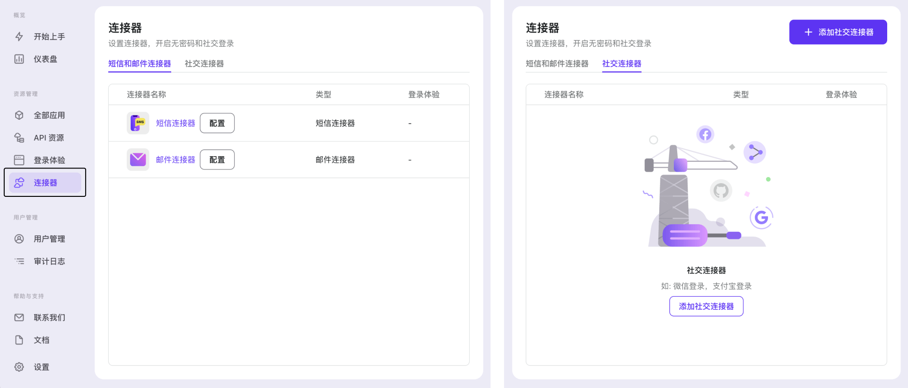

# 🪛 配置连接器

_连接器_ 是 Logto 和那些提供短信邮件的服务商以及提供用户信息的社交平台之间的桥梁。

Logto 提供了很多能让用户可以访问三方服务提供商的连接器，包括了 Google，GitHub，Facebook，SendGrid 等等。

当你想要使用 _连接器_ 的时候可能会感到迷茫，毕竟他是一个全新的概念。:sob:

但是不要悲伤不要心急，看完这篇文档可以让你轻松拿捏！:pinching_hand:

## :watch: 开始上手 :zap:

让我们先从「管理控制台」开始吧！

首先需要登录 Logto 帐号（这需要你的账号有管理员权限）。如果没有账号或者没有管理员权限的话，你需要先创建一个，详见 [创建一个管理员账户](../../tutorials/get-started/README.mdx#创建一个管理员账户)。

点按左侧侧边栏中的「连接器」按钮 :neutral_face:

:ghost: **欢迎来到 _连接器_ 的世界** :ghost:

在这里，你可以随心所欲地添加、删除、改变连接器的配置！

_连接器_ 可以分为三类：_短信连接器_，_邮件连接器_ 和 _社交连接器_。点按「[连接器](../../references/connectors/README.mdx)」查看更多关于连接器类型的阐述。

在这个页面，你可以继续去设置 _邮件连接器_ 或 _短信连接器_。同时，你也可以去到「社交连接器」标签，然后开始「添加社交连接器」。

:::note
接下来我们移步「[设置连接器小贴士](./connector-setup-tips.md)」来查看不同类型连接器的配置。
:::
