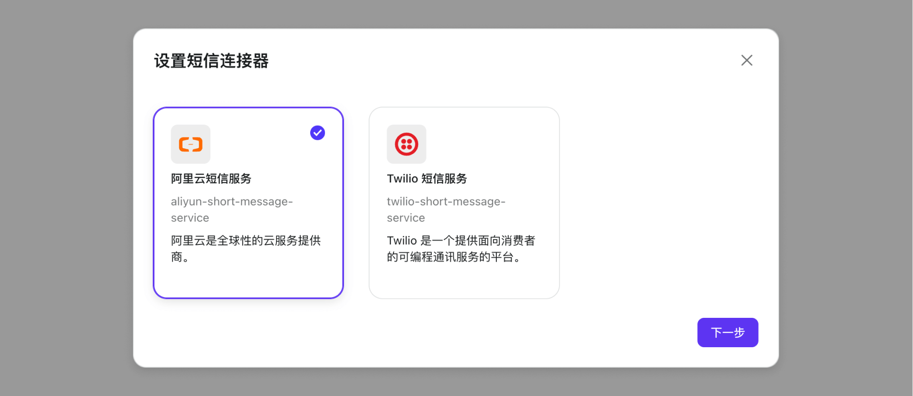
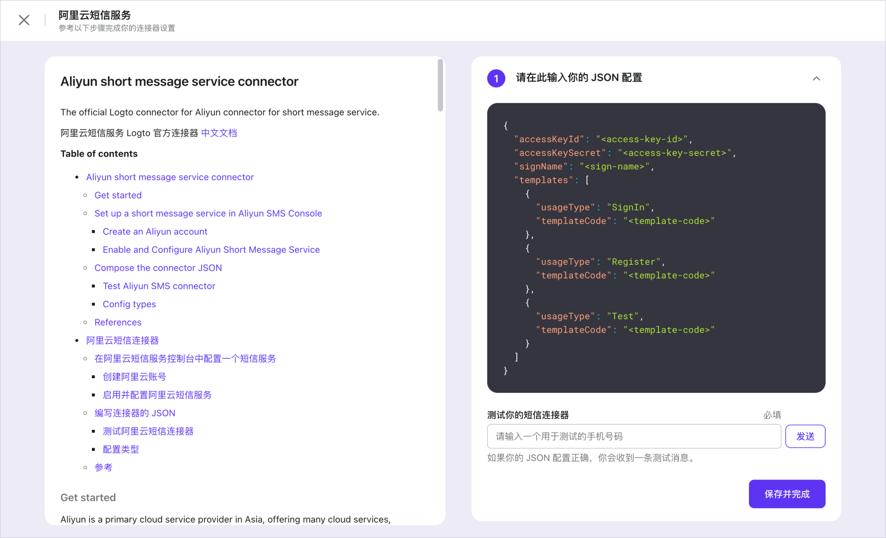
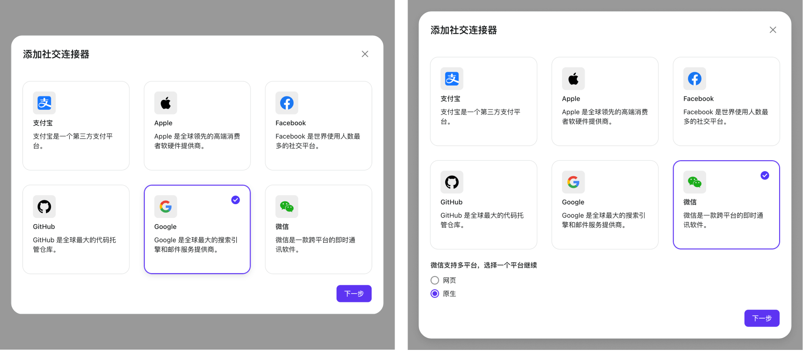
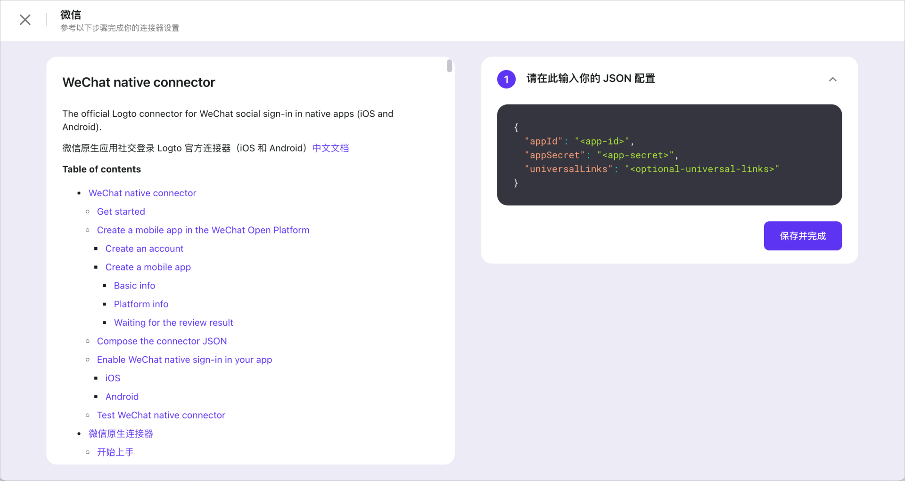

# 设置连接器小贴士

我们可以把连接器按照不同的使用场景分成两个类别：[_短信和邮件连接器_](./connector-setup-tips.md#短信和邮件连接器) 和 [_社交连接器_](./connector-setup-tips.md#社交连接器)。

让我们分别就这两种使用场景谈一些值得注意的地方。

## 短信和邮件连接器

假设现在你已经在「管理控制台」的「连接器」页面上了，点按「配置」按钮然后选择一个 _邮件连接器_ 或 _短信连接器_ 以进入连接器的配置流程。

按照顺序阅读并跟随左侧的配置指引文档，同时在右边的文本输入框里完成连接器配置的 JSON 文件。在「保存并完成」之前，你通过输入邮箱或手机号测试配置是否可以正常工作。

:::tip
我们建议在不同的场景下使用不同的 _template_，否则可能触发流量控制，这会让你的服务短时间内不能正常使用。
:::

在连接器详情页的右上角，可以进入到切换 _邮件连接器_ 或 _短信连接器_ 的页面；连接器配置的指引文档在详情页同样可以进入查看并参考。

:::note
你只能同时启用 **一个** _短信连接器_（或 _邮件连接器_）。

如果你更换了 _邮件连接器_ 或 _短信连接器_ 并点按了「保存并完成」，之前生效的 _邮件连接器_ 或 _短信连接器_ 就会被自动关闭，并且相应的配置 _config_ 就会无法回溯。 
你可以自己妥善保存以前使用的连接器的 _config_ 以便后续还需要切换回这些连接器。
:::

当你完成了连接器的设置之后，看看如何「[启用短信或邮件验证码登录](../../tutorials/get-started/enable-passcode-sign-in.mdx)」。

## 社交连接器

同样从「管理控制台」的「连接器」页面开始，去到「社交连接器」标签，点按右上角的「添加社交连接器」进入配置。

:::tip
你也许注意到了诸如 Google，Facebook，GitHub 这样的连接器没有关于平台的二级选项。这些连接器他们的 _platform_ 都是 _Universal_。查看 [_platform_](../../references/connectors/README.mdx#platform) 了解更多。

对于有关于平台的二级选项的连接器，从 _Web_ 和 _Native_ 中根据你的使用场景选择一个合适的作为 _platform_ 的值。 
当你只准备为移动端的原生应用提供服务时，尽可以只配置一个 _Native_ 连接器而不需要添加适用 _Web_ 的连接器，反之亦然。
:::

根据配置文档，很快就可以完成连接器配置的 JSON 了。

然后参考「[启用社交登录](../../tutorials/get-started/enable-social-sign-in.mdx)」，让你刚配置的 _社交连接器_ 开始工作。
