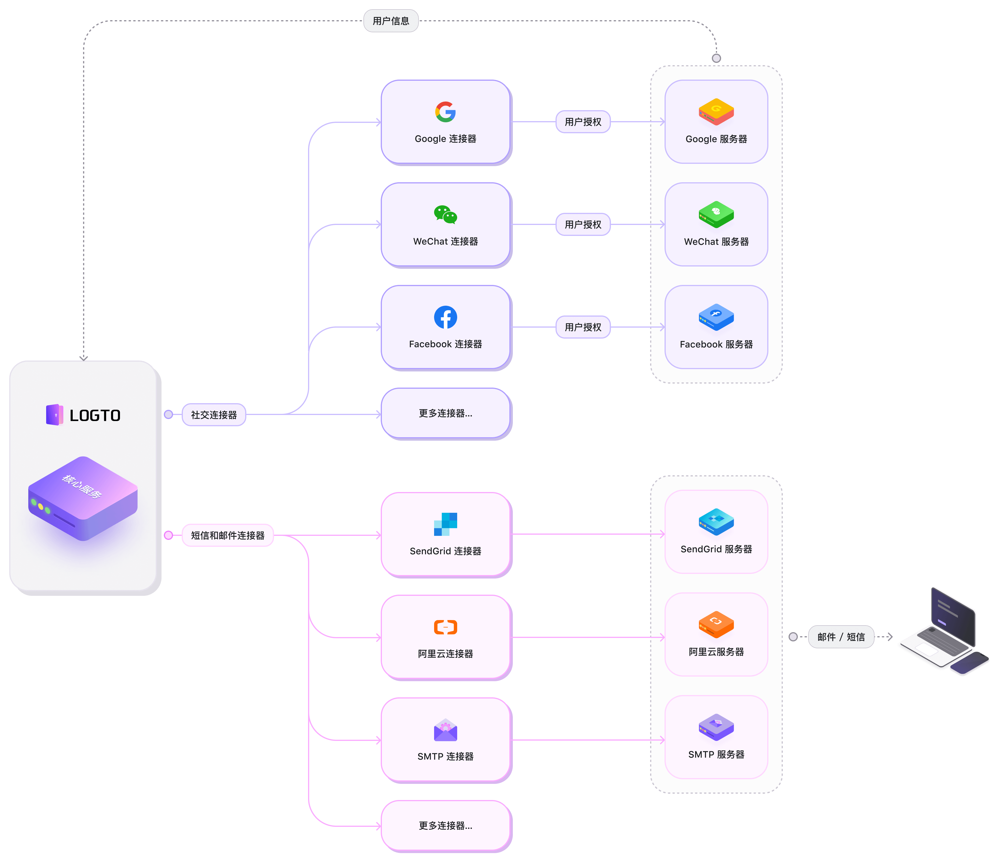

# 🧑‍🔬 创建你的连接器

目前，Logto 已经提供了许多用途广泛的社交登录连接器，诸如微信，支付宝，Google，Facebook 等等；以及阿里云，SendGrid，Twilio 等短信或邮件连接器。

下面的架构图展示了连接器是如何和 Logto 核心服务协同工作的。

他们现在来看应该能够满足多数用户的需求了，但是 _我们还会陆续推出更多的连接器_。:fire:

在我们研发更多连接器的时候，你也可以选择开发自己的连接器，我们还鼓励你把自己开发的连接器分享给整个社区来使用。

接下来就让我们看看如何搭建一个新的连接器，为 Logto 项目贡献你的力量吧！:coffee:
