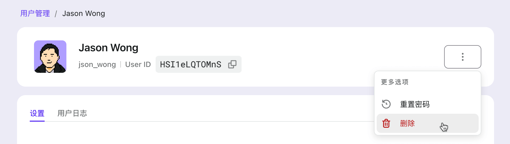
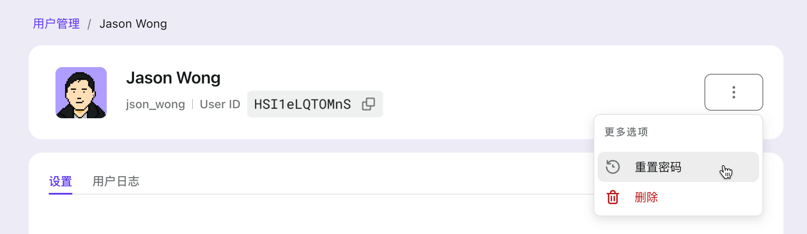

# 使用管理控制台管理用户

## 列出和搜索用户

在「管理控制台」中，点按左侧的「用户管理」标签页，你将在右侧看到一个用户表。

表中有三列：

- **用户**：用户信息，可能包括头像、全名、用户名、手机号、邮箱等。
- **注册应用**：用户最初注册的应用应用的名称。
- **最近登录**：用户上次登录的时间。

在用户表上方的搜索框中输入关键词，点按「搜索」按钮，即可在表中看到匹配的用户。

支持部分搜索的用户属性：姓名、用户名、邮箱或手机号。

## 添加用户

管理员用户可以通过「管理控制台」以终端用户的名义创建一个新帐户。

点按右上角的「+ 添加用户」按钮。
在打开的对话框中，填写用户名和全名，点按「添加用户」按钮确认。

添加用户后，复制 **用户名** 和 **初始密码** 以发送给用户。

:::caution
一旦「添加用户」对话框关闭，你将无法再查看密码。
如果忘了保存，可以 [重置用户密码](#重置用户密码)。
:::

## 查看和更新用户资料

点按用户表的某行可跳转到「用户详情」页面。
你将看到用户个人资料，包括头像、全名、用户 ID、邮箱、手机号、用户名、社交连接等。

「社交连接」是用户已连接的社交连接器列表。
假设用户使用过 Facebook 社交连接器来登录，Facebook 的条目就会出现在该列表中。
请参阅 [身份](../../references/users/social-identities.md) 以了解详情。

_全名_、_头像_ 的图片 URL 和 _自定义数据_ 是可编辑的，_社交连接_ 是可删除的，其他属性是只读的。

:::danger
在删除社交连接之前，务必确认用户还有其他登录方法，例如其他社交连接、手机号、邮箱或用户名和密码。否则，用户将无法再次登录此帐号。
:::

:::info
更新后别忘了点按「保存更改」。
:::

## 查看用户活动

在「用户详情」页面上，切换到「用户日志」子标签页。
你将在表格中看到用户最近的活动，包括操作、结果、相关的应用以及用户操作的时间。

点按表格的某行查看用户日志中的更多详细信息，例如 IP 地址、用户代理、原始数据等。

## 删除用户

在「用户详情」页面上，点按「更多选项」->「删除」按钮。

:::danger
小心！删除用户后将无法恢复。
:::

## 重置用户密码

在「用户详情」页面上，点按「更多选项」->「重置密码」按钮。

重置密码后，复制密码并发送给用户。

:::caution
一旦「重置密码」对话框关闭，你将无法再查看密码。
如果忘了保存，可以再重置一遍。
:::

