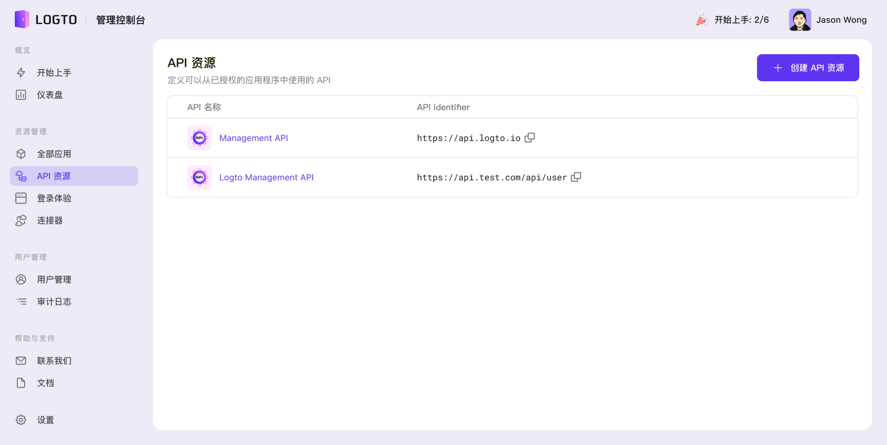
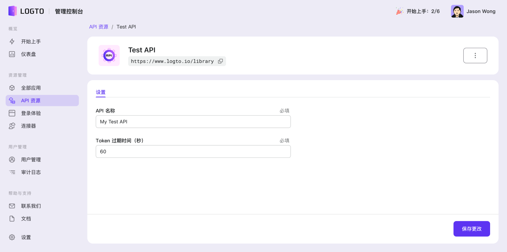

import CreateApiResource from './assets/create-api-resource.png';

# ⚔️ 保护你的 API

作为一个开箱即用的授权服务，Logto 还提供了后端 [API 资源](../../references/resources/README.md)的权限校控制系统，从而更好的保护你的 API 资源免受匿名身份的访问和侵害。让我们通过以下步骤，使用 Logto 来为你的后端应用添加权限校验。

## 在 Logto 管控制台内注册 API 资源

Logto 服务可以从每一个授权请求中识别出所申请的目标 [API 资源](../../references/resources/README.md)，并相应的颁发其专属的 `access_token` 令牌。为此，你需要先前往 Logto 的 管理控制台注册你的 [API 资源](../../references/resources/README.md)。

访问 Logto 管理控制台的 **API 资源** 页面。在列表中你会看到一个拥有 `https://api.logto.io` 作为 `API identifier` 的内置 API 资源。该资源代表了所有注册在此路由地址下，Logto 服务所提供的管理 API。它将保证我们所有的 API 都设置了权限保护，仅具有管理员角色的 Logto 授权用户才可以访问。

接下来，点按 **创建 API 资源** 按钮，并输入一下信息，来注册一个你自己的 API 资源：

- 一个可读性高的 **API 名称**，以更好的帮助你在未来能够快速识别此 API 资源
- 一个全局唯一的， **URI** 格式的，**API Identifier** (又可称之为 [Resource Indicator](../../references/resources/README.md#resource-indicator))。用来识别受保护的 API 资源。

 
 

:::caution
API Identifier 将被 Logto 用作全局唯一的 API 资源标识符。 一经创建**不可**编辑。请小心填写。
:::

创建后，新的 API 资源将显示在列表中。你可以过点按该 API 资源， 在 API 详情页面内对其进行管理或删除操作。

有关详细的 API 设置定义，请参阅 [API 资源数据格式](../../references/resources/README.md#Logto API 资源的数据格式)。

:::info
所有在 Logto 管理控制台内注册的 API 资源信息可以被所有的应用所共享。
:::

<h2 id="validate-the-api-requests-authorization-token">解析并验证 API 请求的权限令牌</h2>

Logto 为每个授权的 API 请求颁发一个标准的 [JWT](https://datatracker.ietf.org/doc/html/rfc7519) 格式授权令牌。该令牌回被加密并签名为 [JWS](https://datatracker.ietf.org/doc/html/rfc7515) 令牌。

### 了解 JWS 令牌

一个经过编码的 [JWS](https://datatracker.ietf.org/doc/html/rfc7515) 令牌由三部分构成：

- JOSE Header：声明令牌类型和编码算法
- JWS Payload：包含所有令牌的内部参数
- JWS Signature：使用 [JWK](https://datatracker.ietf.org/doc/html/rfc7517) 加密的签名

Logto 颁发的 JWS Payload 所包含的参数定义：

| 名称      | 描述                      |
| --------- | ------------------------- |
| jti       | JWT 唯一 ID               |
| sub       | 对象, 一般为请求用户的 ID |
| iat       | 代表令牌颁时间的时间戳    |
| exp       | 代表令牌过期时间的时间戳  |
| client_id | 客户端应用 ID             |
| iss       | 令牌颁发方身份标识        |
| aud       | 令牌的受众资源标识        |
| scope     | 令牌的范围标识            |

（根据不同的 OIDC 配置，JWS Payload 中你还可以自定义更多的扩展信息）

:::note
在开发环境下，想要直观地检查 JWT 内容，可以通过访问 [jwt.io](https://jwt.io/) 来解码并检查你所接收到的令牌。请小心使用（我们不推荐）任何生产环境中的令牌，因为该服务由第三方提供的公共在线服务，你的令牌存在被暴露了风险。
:::

### 验证授权令牌

一个授权令牌的验证包含以下内容：

1. [验证 JWT 令牌格式](https://datatracker.ietf.org/doc/html/rfc7519#section-7.2)
2. [验证 JWS 签名](https://datatracker.ietf.org/doc/html/rfc7515#section-5.2)
3. 令牌的颁发者是 `https://<your-logto-domain>/oidc`（由 Logto 服务器颁发）
4. 令牌的受众是当前接收令牌 API 接口的 `resource indicator`（API 专属令牌， 应与在 Logto 管理后台中注册 API 对应的 `resource indicator` 一致）
5. 令牌在有效期内

有各种开源库和工具包可以帮助我们轻松验证和解码标准的 JWT 权限令牌。你可以根据所使用的语言和框架选择一个并与不的后端应用程序集成。请查看我们的一些示例：

- [Node(Express)](./node)
- [Spring Boot](./spring-boot)
- [Python](./python)

## 参考

Logto 使用基于 authorization code-based OAuth 2.0 授权协议使 API 请求流程变得更加安全。如果你对其背后的实现感兴趣，请参阅 OAuth 2.0 的[官方文档](https://datatracker.ietf.org/doc/html/rfc6749#section-1.3.1) 了解更多详情。
