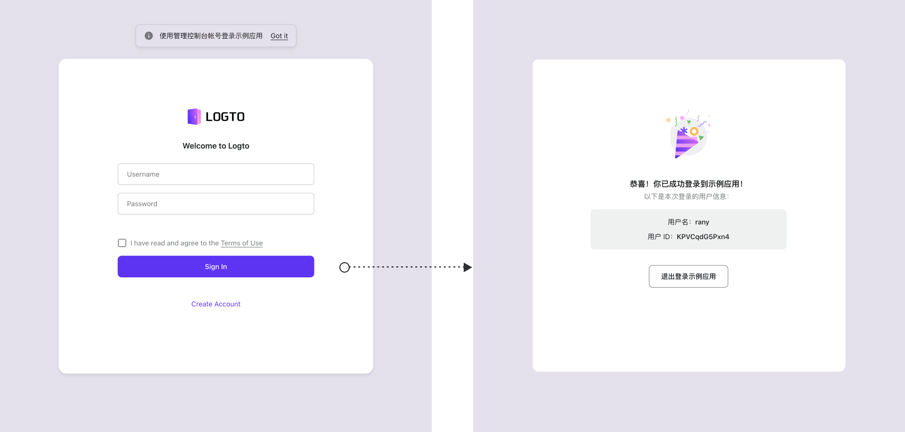

# 来试试演示应用

在「开始上手」标签页，点按右侧的「试一试」按钮。浏览器将会在新标签页中打开演示应用。你可以用刚刚注册的管理员账户信息登录这个应用或者创建一个新账户以继续。

就像创建管理员账户一样，无需配置 Logto 即可支持用户名与密码的「登录体验」。

:::note
Logto 使用唯一的用户身份系统作为 [SSOT](https://en.wikipedia.org/wiki/Single_source_of_truth)，所以你可以使用同一个身份在不同的应用之间登录。
:::

这个应用本身很简单：一个展示你账户名和 ID 的恭喜页，随后是一个登出按钮。

:::tip
在进一步探索前，登出演示应用。在完成「定制登录体验」的部分后，重新打开演示应用看看有什么不同。
:::

## 接下来

是时候创建并集成你的第一个应用了。
