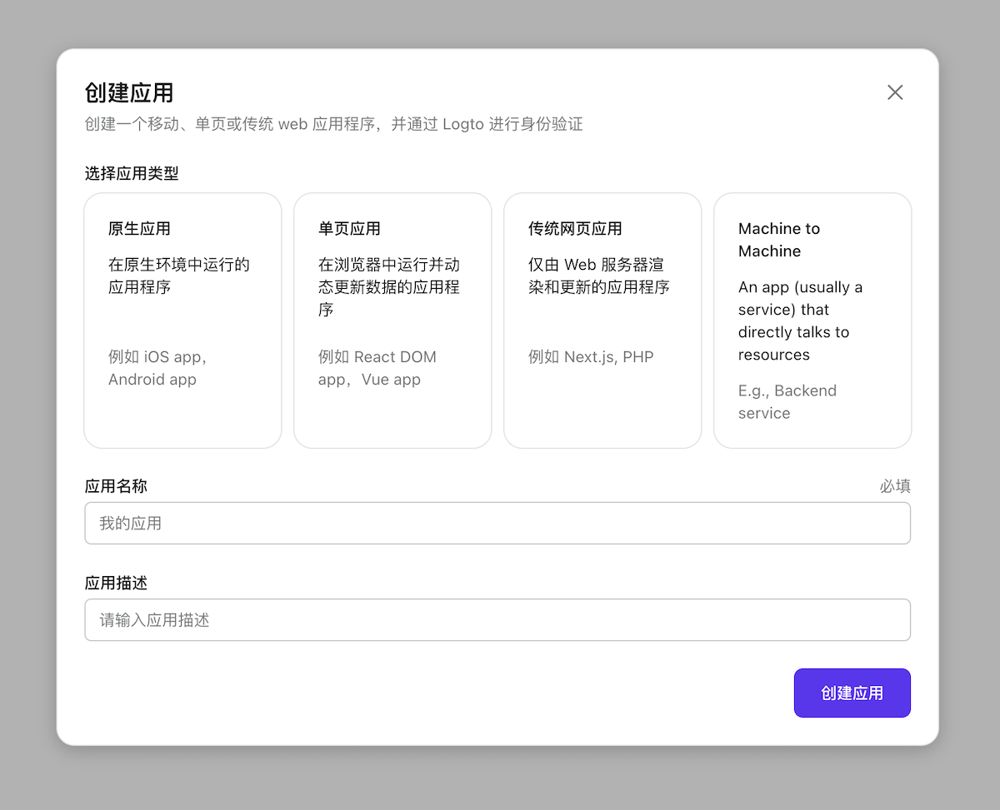

import Columns from '@components/Columns';

import ApplicationTypesIntro from '../../fragments/_application_types_intro.mdx';

# 创建并集成第一个应用

在「开始上手」标签页点按右侧的「创建按钮」，浏览器将重定向至「应用」标签页。接着点按页面中的「创建应用」按钮。

## 选择你的应用类型

在打开的对话框选择你想要集成的应用类型：

<ApplicationTypesIntro />

对于每一种应用类型，我们准备了不同的教程。选择正确的应用类型将对后续流程有很大帮助。

## 输入应用名称

输入应用名称（例如「书店」）并点按「创建应用」。

## 集成 Logto

嗒哒！你刚刚在 Logto 中成功创建了第一个应用。你将看到一个包含详细集成指南的恭喜页。跟着指南看看在你的应用体验是什么样的。

:::note
如果你不小心跳过了「管理控制台」中的指南，你也可以查看下方列表中的指南，或者点按应用详情页中的「查看指南」按钮。
:::

### 集成指南

<Columns
  columns={[
    {
      title: '原生应用',
      items: [
        { key: 'iOS', link: '/zh-cn/docs/recipes/integrate-logto/ios' },
        { key: 'Android', link: '/zh-cn/docs/recipes/integrate-logto/android' },
      ],
    },
    {
      title: '单页应用',
      items: [
        { key: '传统 JS', link: '/zh-cn/docs/recipes/integrate-logto/vanilla-js' },
        { key: 'React', link: '/zh-cn/docs/recipes/integrate-logto/react' },
        { key: 'Vue', link: '/zh-cn/docs/recipes/integrate-logto/vue' },
      ],
    },
    {
      title: '传统 web 应用',
      items: [
        { key: '传统 web', link: '/zh-cn/docs/recipes/integrate-logto/traditional' },
        { key: 'Next.js', link: '/zh-cn/docs/recipes/integrate-logto/next-js' },
        { key: 'Express', link: '/zh-cn/docs/recipes/integrate-logto/express' },
        { key: 'Go', link: '/zh-cn/docs/recipes/integrate-logto/go-web' },
      ],
    },
    {
      title: 'Machine to Machine',
      items: [
        {
          key: 'Machine to Machine',
          link: '/zh-cn/docs/recipes/integrate-logto/machine-to-machine',
        },
      ],
    },
  ]}
/>

## 接下来

让我们通过「管理控制台」给「登录体验」添加一些品牌元素。
