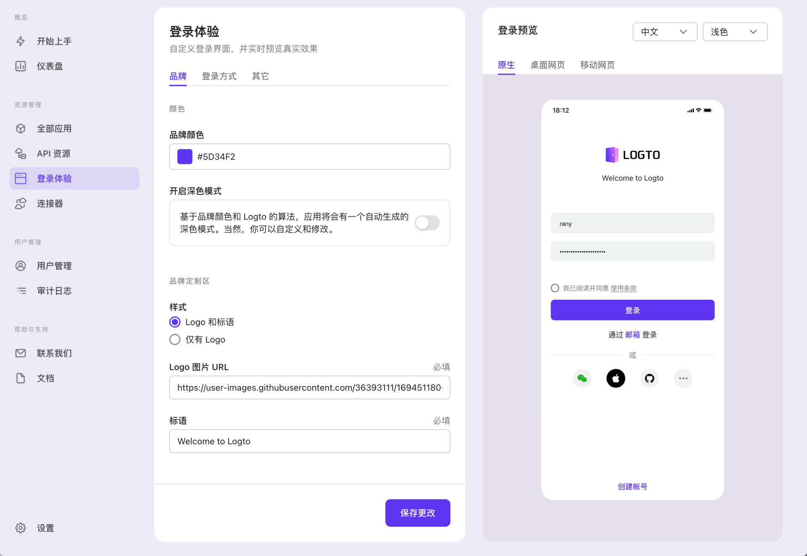

import DarkModeNote from '../../recipes/customize-sie/fragments/_dark-mode-note.md';
import sieOthers from './assets/sie-others.png';

# 自定义登录体验

在「开始上手」标签页，点按右侧的「自定义」按钮，浏览器将重定向至「登录体验」标签页。

## 登录预览

:::tip 你知道吗…
你可以实时预览结果！不管你进行了何种变更，右侧的 UI 都会同步更新以展示效果。
:::

你的用户可能在不同的条件下使用应用，条件包括平台、语言和外观；试试变更这些选项以查看不同组合产生的结果。

## 品牌

在这个区域，你可以自定义一些主要的品牌露出元素：颜色，Logo 和标语。

- **品牌色** 将影响组件的主要颜色，例如按钮或链接。
- **启用深色模式** 决定了当 Logto 检测到相关系统偏好时，是否让 UI 有一种「深色的感觉」。
- 其他选项比较直接，我们在此跳过。

<DarkModeNote />

## 其他

我们先跳过「登录方式」，来到「其他」标签页。

### 使用条款

一个应用在线上通常会有「使用条款」，并且在登录或注册前必须接受。

打开「启用使用条款」并输入 URL 以确保这个流程。Logto 会通过 `<iframe>` 载入它。

### 语言

This section allows you to specify the languages that will be displayed to the end user.

There are two options here that could require your special attention: the first one is **Enable auto-detect** switch and the second one is **select a default language** selector.

In the default configuration, your app will automatically detect the user's locale settings and switch to one of the supported languages in Logto. However, if the detected language is not supported, the default language will be used as a backup.

If you disable the feature, only the default language will be displayed in your app. Since doing so will restrict your access to potential users, it is not generally recommended.

This article is merely an easy starter to help you get a feel for your app language preferences. Go to [Localization](../../../../../../../docs/docs/recipes/localization/README.mdx) for more advanced scenarios and setting recommendations.

## 接下来

是的，是的。无密码登录是一种潮流。Logto 肯定不会错过它，并已经有内置支持。选择一个你感兴趣的以继续：

- [启用短信或邮箱验证码登录](./enable-passcode-sign-in.mdx)
- [启用社交登录](./enable-social-sign-in.mdx)
