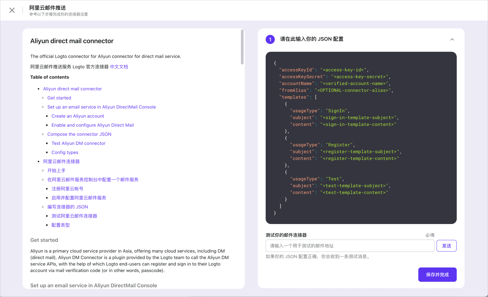

import Columns from '@components/Columns';

import ConnectorsIntro from './fragments/_connectors-intro.md';
import ConnectorsWip from './fragments/_connectors-wip.md';

# 启用短信或邮件验证码登录

在「开始上手」标签页，点按右侧的「启用」按钮，浏览器将重定向至「连接器」->「短信和邮件连接器」标签页。

短信和邮件的启用流程非常接近，所以我们将它们合并成一个教程。

<ConnectorsIntro />

## 选择一个连接器

根据你想启用的连接器类型，点按位于「类型」列左侧的「设置」按钮。启用的对话框将询问你具体想要设置的连接器。

<Columns
  columns={[
    {
      title: '短信连接器',
      items: [
        {
          key: 'Twilio 短信服务',
          link: 'https://github.com/logto-io/connectors/tree/master/packages/connector-twilio-sms',
        },
        {
          key: '阿里云短信服务',
          link: 'https://github.com/logto-io/connectors/tree/master/packages/connector-aliyun-sms',
        },
      ],
    },
    {
      title: '邮件连接器',
      items: [
        {
          key: 'SendGrid 邮件服务',
          link: 'https://github.com/logto-io/connectors/tree/master/packages/connector-sendgrid-email',
        },
        {
          key: '阿里云 DM',
          link: 'https://github.com/logto-io/connectors/tree/master/packages/connector-aliyun-dm',
        },
        {
          key: 'SMTP',
          link: 'https://github.com/logto-io/connectors/tree/master/packages/connector-smtp',
        },
      ],
    },
  ]}
/>

选择适合你的连接器，并点按「下一步」以继续。

<ConnectorsWip />

## 配置连接器并测试

一个全屏幕的页面将指引你正确地进行设置。跟着如下步骤以完成设置：

1. 通读左侧的 README 文档，并跟着里面的指示行事。
2. 在右侧的编辑器中填充连接器需要的 JSON。
3. 点按「下一步」，并在步骤 2 中测试连接器是否像预计中一样工作。
4. 点按「完成」以结束。

## 在登录体验中启用连接器

点按页面左侧边栏中的链接以切换到「登录体验」标签页，并点按「登录方式」标签页。

如果你之前没有添加过其他的登录方式，「启动二级登录」应该是关着的。打开它，并根据你刚才配置的连接器勾选「手机号登录」或「邮箱登录」。

现在你应该能看到，在预览中大大的「登录」按钮下面，显示着「通过手机号登录」或「通过邮箱登录」的字样。

点按「保存变更」来上线你的变更。

:::tip
再次打开演示应用并尝试新的登录方式。
:::

:::note
查看 [配置登录方式](../../recipes/customize-sie/configure-sign-in-methods.mdx) 来全面地了解如何组合各种登录方式。
:::

## 接下来

- [启用社交登录](./enable-social-sign-in.mdx) （如果你还没看过）
- [延展阅读](./further-readings.md)
