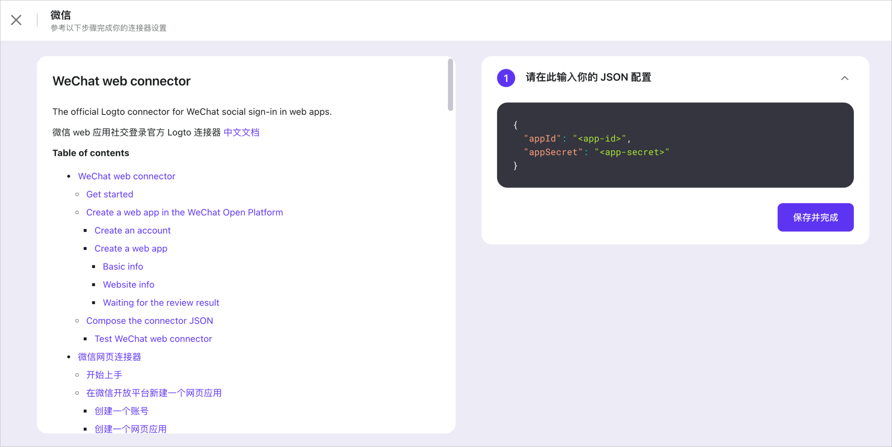
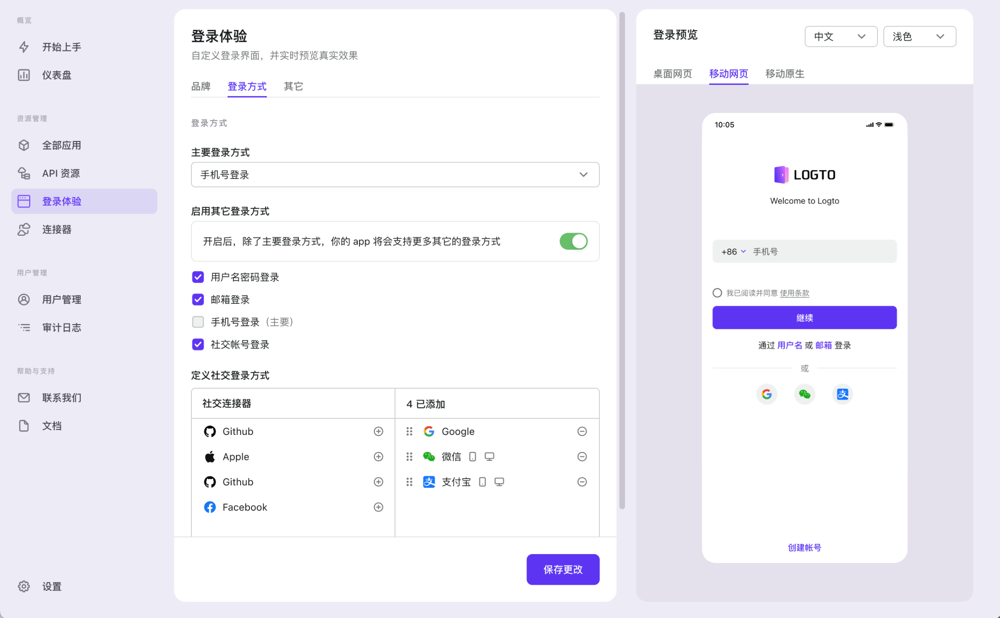

import ConnectorsIntro from './fragments/_connectors-intro.md';
import ConnectorsWip from './fragments/_connectors-wip.md';

# 启用社交登录

在「开始上手」标签页，点按右侧的「添加」按钮，浏览器将重定向至「连接器」->「社交连接器」标签页。

<ConnectorsIntro />

## 添加一个社交连接器

点按「添加社交连接器」按钮以寻找你想要的连接器。启用的对话框将展示内置的、开箱即用的连接器：

- **支付宝** [网页连接器](https://github.com/logto-io/connectors/tree/master/packages/connector-alipay-web) | [原生连接器](https://github.com/logto-io/connectors/tree/master/packages/connector-alipay-native)
- **Apple** [通用连接器](https://github.com/logto-io/connectors/tree/master/packages/connector-apple)
- **Azure AD** [Universal connector](https://github.com/logto-io/connectors/tree/master/packages/connector-azuread)
- **Discord** [Universal connector](https://github.com/logto-io/connectors/tree/master/packages/connector-discord)
- **Facebook** [通用连接器](https://github.com/logto-io/connectors/tree/master/packages/connector-facebook)
- **GitHub** [通用连接器](https://github.com/logto-io/connectors/tree/master/packages/connector-github)
- **Google** [通用连接器](https://github.com/logto-io/connectors/tree/master/packages/connector-google)
- **Naver** [Universal connector](https://github.com/logto-io/connectors/tree/master/packages/connector-naver)
- **微信** [网页连接器](https://github.com/logto-io/connectors/tree/master/packages/connector-wechat-web) | [原生连接器](https://github.com/logto-io/connectors/tree/master/packages/connector-wechat-native)

详情参见 [Connectors 仓库](https://github.com/logto-io/connectors)。

<ConnectorsWip />

## 配置社交连接器

一个全屏幕的页面将指引你正确地进行设置。跟着如下步骤以完成设置：

1. 通读左侧的 README 文档，并跟着里面的指示行事。
2. 在右侧的编辑器中填充连接器需要的 JSON。
3. 点按「完成」以结束。

## 在登录体验中启用连接器

点按页面左侧边栏中的链接以切换到「登录体验」标签页，并点按「登录方式」标签页。

如果你之前没有添加过其他的登录方式，「启动二级登录」应该是关着的。打开它，并勾选「社交登录」。

在显示的表格左列「社交连接器」中寻找你刚添加的连接器，并点按右侧的加号图标。

现在你应该能看到，在预览中大大的「登录」按钮下面，显示着代表着该连接器身份提供商的 logo。

如果你启用了多个社交连接器（显示在右列），你可以通过拖拽它们进行排序。

点按「保存变更」来上线你的变更。

:::tip
再次打开演示应用并尝试新的登录方式。
:::

:::note
查看 [配置登录方式](../../recipes/customize-sie/configure-sign-in-methods.mdx) 来全面地了解如何组合各种登录方式。
:::

## 接下来

- [启用短信或邮件验证码登录](./enable-passcode-sign-in.mdx) （如果你还没看过）
- [延展阅读](./further-readings.md)
