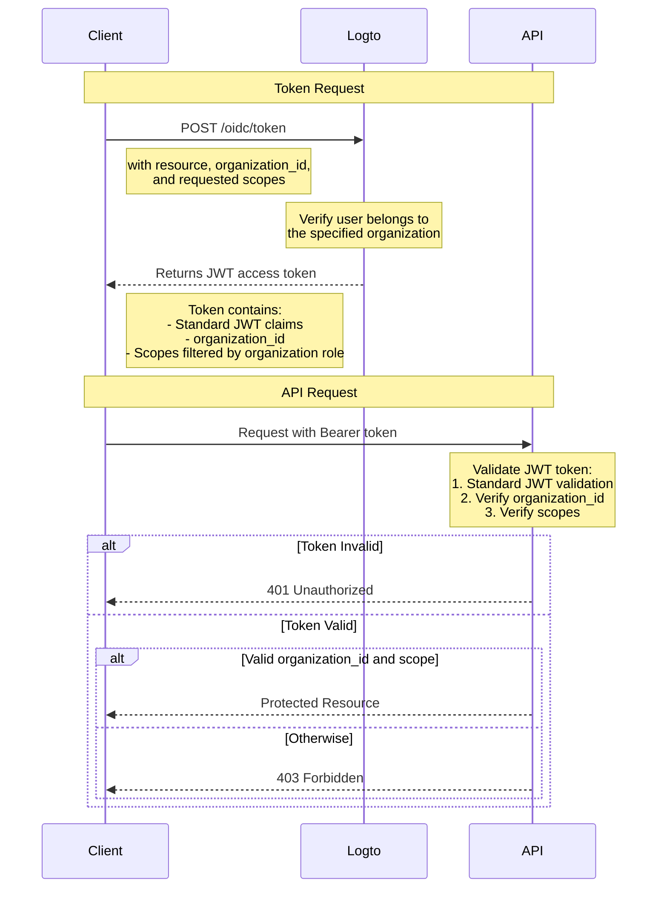

# Protect API resource with organization template

In addition to [Protect your API](/authorization/api-resources/protect-your-api) which secures resources by ensuring a valid JWT is present, organization roles can also be applied to filter the scopes. In this article, We'll focus on how organization role affects scope delegation and validation in your authentication flow.



## The additional `organization_id` parameter \{#the-additional-organization_id-parameter}

In addition to normal access token grant request, in the diagram we add an additional `organization_id` parameter, this tells Logto to narrow down the scopes to specific organization's roles.

## Client setup \{#client-setup}

If you are using Logto's SDK, you can add `organization_id` as the second parameter of the `getAccessToken` method.

```tsx
const accessToken = await logto.getAccessToken('https://my-resource.com/api', 'org_1');

// Or getting claims directly
const accessTokenClaims = await logto.getAccessTokenClaims('https://my-resource.com/api', 'org_1');
console.log(accessTokenClaims.organization_id); // 'org_1'
console.log(accessTokenClaims.aud); // 'https://my-resource.com/api'
```

Then only the scopes inherited from this organization's roles will be included in the access token, as well as an additional claim `organization_id` .

## API server validation \{#api-server-validation}

In addition to the normal JWT access token validation, you’ll need to add additional level to check if `organization_id` is present and valid.
