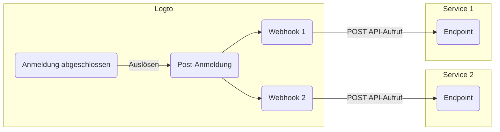

# Webhooks

Logto [Webhook](https://auth.wiki/webhook) bietet Echtzeit-Benachrichtigungen für verschiedene Ereignisse, einschließlich Änderungen an [Benutzerkonten](/user-management/user-data), [Rollen](/authorization/role-based-access-control#roles), [Berechtigungen](/authorization/role-based-access-control#permissionsscopes), [Organisationen](/organizations/organization-data), [Organisationsrollen](/authorization/organization-template#organization-role), [Organisationsberechtigungen](/authorization/organization-template#organization-permission) und [Benutzerinteraktionen](/end-user-flows).

Wenn ein Ereignis ausgelöst wird, sendet Logto eine HTTP-Anfrage an die von dir angegebene Endpoint-URL, die detaillierte Informationen über das Ereignis enthält, wie Benutzer-ID, Benutzername, E-Mail und andere relevante Details (für mehr über die im Payload und Header enthaltenen Daten siehe [Webhook-Anfrage](/developers/webhooks/webhooks-request)). Deine Anwendung kann diese Anfrage verarbeiten und benutzerdefinierte Aktionen ausführen, wie das Senden einer E-Mail oder das Aktualisieren von Daten in einer Datenbank.

Wir fügen kontinuierlich weitere Ereignisse basierend auf den Bedürfnissen der Benutzer hinzu. Wenn du spezifische Anforderungen für dein Unternehmen hast, lass es uns bitte wissen.

## Warum Webhook verwenden? \{#why-use-webhook}

Webhooks bieten Echtzeit-Kommunikation zwischen Anwendungen, eliminieren die Notwendigkeit für Polling und ermöglichen sofortige Datenaktualisierungen. Sie vereinfachen die Anwendungsintegration und Workflow-Automatisierung ohne komplexen Code oder proprietäre APIs.

Hier sind einige Beispiele für häufige Webhook-Anwendungsfälle für CIAM:

- **E-Mails senden:** Konfiguriere einen Webhook, um eine Willkommens-E-Mail an neue Benutzer bei der Registrierung zu senden oder Administratoren zu benachrichtigen, wenn sich ein Benutzer von einem neuen Gerät oder Standort aus anmeldet.
- **Benachrichtigungen senden:** Konfiguriere einen Webhook, um einen virtuellen Assistenten mit deinem CRM-System auszulösen, um Echtzeit-Kundensupport zu bieten, wenn sich Benutzer anmelden.
- **Zusätzliche API-Aufrufe durchführen**: Konfiguriere einen Webhook, um den Benutzerzugriff zu überprüfen, indem du ihre E-Mail-Domain oder IP-Adresse überprüfst und dann die Logto Management API verwendest, um entsprechende Rollen mit Ressourcenberechtigungen zuzuweisen.
- **Daten-Synchronisation:** Konfiguriere Webhook, um die Anwendung über Änderungen wie Benutzerkontosperrungen oder -löschungen auf dem Laufenden zu halten.
- **Berichte erstellen**: Richte einen Webhook ein, um Daten zur Benutzeranmeldeaktivität zu erhalten und diese zu nutzen, um Berichte über Benutzerengagement oder Nutzungsmuster zu erstellen.

## Begriffe \{#terms}

| Element                                                                                                                                                                                                                                  | Beschreibung                                                                                                                                                                                                                                        |
| ---------------------------------------------------------------------------------------------------------------------------------------------------------------------------------------------------------------------------------------- | --------------------------------------------------------------------------------------------------------------------------------------------------------------------------------------------------------------------------------------------------- |
| Ereignis                                                                                                                                                                                                                                 | Wenn eine bestimmte Aktion ausgeführt wird, löst sie ein Hook-Ereignis mit einem bestimmten Typ aus. Z. B. wird Logto ein PostRegister-Hook-Ereignis auslösen, wenn der Benutzer den Anmeldeprozess abgeschlossen und ein neues Konto erstellt hat. |
| Hook                                                                                                                                                                                                                                     | Eine einzelne oder eine Reihe von Aktionen, die an ein bestimmtes Ereignis angehängt sind. Aktionen können das Aufrufen von APIs, das Ausführen von Code-Snippets usw. sein.                                                                        |
| Webhook                                                                                                                                                                                                                                  | Ein Subtyp von Hook, der das Aufrufen einer API mit dem Ereignis-Payload anzeigt.                                                                                                                                                                   |
| Angenommen, ein Entwickler möchte eine Benachrichtigung senden, wenn sich ein Benutzer über ein neues Gerät anmeldet, kann der Entwickler einen Webhook hinzufügen, der seine Sicherheitsdienst-API für das PostSignIn-Ereignis aufruft. |

Hier ist ein Beispiel für das Aktivieren von zwei Webhooks für das `PostSignIn`-Ereignis in Logto:

## FAQs \{#faqs}

### Unterstützt Logto synchronisierte Webhooks? \{#does-logto-support-synced-webhooks}

Obwohl synchronisierte Webhooks den Benutzeranmeldefluss reibungsloser gestalten würden, unterstützen wir sie derzeit noch nicht (wir werden es in Zukunft tun). Daher erfordern Szenarien, die auf synchronisierten Webhooks basieren, derzeit alle unterschiedliche Workarounds. Wenn du Fragen hast, zögere nicht, uns zu kontaktieren.

### Wie gehe ich mit Änderungen der Benutzerberechtigungen um? \{#how-to-deal-with-user-permission-change}

Siehe [Änderung der Benutzerberechtigung verwalten](/authorization/role-based-access-control/protect-api-resources-with-rbac/#optional-handle-user-permission-change) Anleitung.

### Wie debugge ich einen Webhook-Timeout? \{#how-to-debug-webhook-timeout}

Für den Endpoint, der Webhooks empfängt, sollte er so schnell wie möglich eine 2xx-Antwort zurückgeben, um Logto mitzuteilen, dass der Webhook erfolgreich empfangen wurde. Da verschiedene Benutzer sehr unterschiedliche Verarbeitungslogiken für Webhooks haben, könnten übermäßig komplexe Aufgaben mehrere Sekunden dauern, was dazu führt, dass der Logto Webhook in einen Timeout läuft. Die beste Praxis ist es, eine eigene Ereigniswarteschlange zu pflegen; beim Empfang des Logto Webhooks das Ereignis in die Warteschlange einfügen und eine 2xx-Antwort an Logto zurückgeben. Dann lass deinen eigenen Worker die Aufgaben in der Warteschlange Schritt für Schritt verarbeiten. Wenn der Worker auf einen Fehler stößt, bearbeite ihn auf deinem eigenen Server.

### Kann ich die Client-IP-Adresse von `PostSignIn`-Webhooks erhalten? \{#can-i-get-the-client-ip-address-from-postsignin-webhooks}

Ja, du kannst IP-Adresse, Benutzeragenten usw. im Webhook-Payload erhalten. Wenn du Informationen benötigst, die derzeit nicht unterstützt werden, kannst du Funktionsanfragen auf GitHub-Issues erstellen oder uns kontaktieren.

## Verwandte Ressourcen \{#related-resources}

<Url href="https://blog.logto.io/webhooks-vs-polling">Webhooks vs. Polling</Url>
