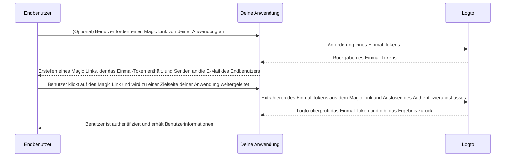

# Magic Link (Einmal-Token)

import Availability from '@components/Availability';

<Availability cloud oss={{ major: 1, minor: 27 }} />

Ähnlich wie das Einmalpasswort (OTP) ist ein Einmal-Token eine weitere passwortlose Authentifizierungsmethode, die zur Überprüfung der Identität eines Benutzers verwendet werden kann. Das Token ist für einen begrenzten Zeitraum gültig und mit einer E-Mail-Adresse des Endbenutzers verknüpft.

Manchmal möchtest du neue Benutzer zu deiner Anwendung / Organisation einladen, ohne dass sie zuerst ein Konto erstellen müssen. Oder du hast dein Passwort vergessen und möchtest dich anmelden / dein Passwort zurücksetzen, indem du schnell deine Identität per E-Mail überprüfst. In solchen Fällen kann die Anwendung einen "Magic Link" an deine E-Mail senden. Und du wirst sofort authentifiziert, wenn du auf den Link klickst.

Anwendungsentwickler können das Einmal-Token verwenden, um einen Magic Link zu erstellen und ihn an die E-Mail-Adresse des Endbenutzers zu senden.

## Einmal-Token-Fluss \{#one-time-token-flow}

Hier ist das Sequenzdiagramm des Authentifizierungsflusses mit Einmal-Token:



## Implementierungsanleitung \{#implementation-guide}

Logto bietet eine Reihe von Management APIs und Experience APIs, um die Implementierung deines Magic Links zu erleichtern.

Bevor du beginnst, stelle sicher, dass du eine Logto-Instanz bereit hast und die Maschine-zu-Maschine-Verbindung zwischen deinem Anwendungsserver und dem Logto-Endpunkt hergestellt hast (erforderlich für die Management APIs). Erfahre mehr über die [Logto Management API](/integrate-logto/interact-with-management-api).

### Schritt 1: Anfordern eines Einmal-Tokens \{#step-1-request-one-time-token}

Verwende die Logto Management API, um ein Einmal-Token zu erstellen.

```bash
POST /api/one-time-tokens
```

Beispiel für den Anforderungstext:

```json
{
  "email": "user@example.com",
  // Optional. Standardmäßig 600 (10 Minuten).
  "expiresIn": 3600,
  // Optional. Der Benutzer wird bei erfolgreicher Verifizierung den angegebenen Organisationen zugeordnet.
  "context": {
    "jitOrganizationIds": ["abcdefgh1234"]
  }
}
```

### Schritt 2: Erstellen deines Magic Links \{#step-2-compose-your-magic-link}

Nachdem du das Einmal-Token erhalten hast, kannst du einen Magic Link erstellen und ihn an die E-Mail-Adresse des Endbenutzers senden. Der Magic Link sollte mindestens das Token und die Benutzer-E-Mail als Parameter enthalten und zu einer Zielseite in deiner eigenen Anwendung navigieren. Z. B. `https://yourapp.com/landing-page`.

Hier ist ein einfaches Beispiel, wie der Magic Link aussehen könnte:

```
https://yourapp.com/landing-page?token=YHwbXSXxQfL02IoxFqr1hGvkB13uTqcd&email=user@example.com
```

:::note

Die Parameternamen im Magic Link können vollständig angepasst werden. Du kannst zusätzliche Informationen zum Magic Link hinzufügen, basierend auf den Anforderungen deiner Anwendung, sowie alle URL-Parameter kodieren.

:::

### Schritt 3: Auslösen des Authentifizierungsflusses über Logto SDK \{#step-3-trigger-the-authentication-flow-via-logto-sdk}

Nachdem der Endbenutzer auf den Magic Link geklickt und zu deiner Anwendung navigiert hat, kannst du die `token`- und `email`-Parameter aus der URL extrahieren und dann die `signIn()`-Funktion aus dem Logto SDK aufrufen, um den Authentifizierungsfluss auszulösen.

```typescript title="TokenLandingPage.tsx"
// React-Beispiel
import { useLogto } from '@logto/react';
import { useEffect } from 'react';
import { useSearchParams } from 'react-router-dom';

const TokenLandingPage = () => {
  const { signIn } = useLogto();
  const [searchParams] = useSearchParams();

  useEffect(() => {
    // Extrahiere das Token und die E-Mail aus dem Magic Link
    const oneTimeToken = searchParams.get('token');
    const email = searchParams.get('email');

    // Angenommen, dies ist deine Anmelde-Weiterleitungs-URI
    const redirectUri = 'https://yourapp.com/callback';

    if (oneTimeToken && email) {
      signIn({
        redirectUri,
        clearTokens: false, // Optional. Siehe Warnhinweis unten
        extraParams: {
          'one_time_token': oneTimeToken,
          'login_hint': email,
        },
      });
    }
  }, [searchParams, signIn]);

  return <>Bitte warten...</>;
};
```

:::warning

Wenn ein Benutzer bereits angemeldet ist, wird durch den Aufruf der `signIn()`-Funktion aus dem SDK automatisch alle zwischengespeicherten Tokens (ID-Token, Zugangstoken und Auffrischungstoken) aus dem Client-Speicher gelöscht, was dazu führt, dass der Authentifizierungsstatus des aktuellen Benutzers verloren geht.

Daher solltest du einen zusätzlichen Anmeldeparameter `clearTokens: false` angeben, um das Löschen der vorhandenen Tokens zu vermeiden. Wenn dies angegeben ist, musst du die Tokens auch manuell auf der Anmelde-Callback-Seite löschen.

Ignoriere dies, wenn deine Magic Links nicht für authentifizierte Benutzer gedacht sind.

:::

### Schritt 4: (Optional) Zwischengespeicherte Tokens auf der Anmelde-Callback-Seite löschen \{#step-4-clear-cached-tokens-in-sign-in-callback-page}

Wenn du `clearTokens: false` in der Anmeldefunktion angibst, musst du die Tokens manuell auf der Anmelde-Callback-Seite löschen.

```typescript title="Callback.tsx"
// React-Beispiel
import { useHandleSignInCallback, useLogto } from '@logto/react';
import { useEffect } from 'react';

const Callback = () => {
  const { clearAllTokens } = useLogto();

  useEffect(() => {
    void clearAllTokens();
  }, [clearAllTokens]);

  useHandleSignInCallback(() => {
    // Navigiere zu deiner Startseite
  });

  return <>Bitte warten...</>;
};
```

## FAQs \{#faqs}

<details>

<summary>

### Kann ich den Magic Link verwenden, um neue Benutzer zu meinen Organisationen einzuladen? \{#can-i-use-the-magic-link-to-invite-new-users-to-my-organizations}

</summary>

Ja, du kannst den Magic Link verwenden, um neue Benutzer zu deiner Anwendung sowie zu Organisationen einzuladen. Wenn du neue Benutzer zu deiner Organisation einladen möchtest, gib einfach die `jitOrganizationIds` im Anforderungstext an.

Der Benutzer wird automatisch den Organisationen nach erfolgreicher Verifizierung beitreten, und Standardrollen der Organisation werden zugewiesen. Sieh dir den Abschnitt "Just-in-time provisioning" auf deiner Organisationsdetailseite an und konfiguriere die Standardrollen für deine Organisationen.

</details>

<details>

<summary>

### Läuft das Einmal-Token ab? \{#does-the-one-time-token-expire}

</summary>

Ja, das Einmal-Token läuft nach der angegebenen `expiresIn`-Zeit (in Sekunden) ab. Die Standardablaufzeit beträgt 10 Minuten.

</details>

<details>

<summary>

### Wenn ich die Benutzerregistrierung in der "Anmeldeerfahrung" deaktiviere, kann ich trotzdem den Magic Link verwenden, um Benutzer einzuladen? \{#if-i-disable-user-registration-in-sign-in-experience-can-i-still-use-magic-link-to-invite-users}

</summary>

Ja, du kannst den Magic Link weiterhin verwenden, um Benutzer einzuladen, auch wenn du die Benutzerregistrierung in der "Anmeldeerfahrung" deaktivierst.

</details>

<details>

<summary>

### Was passiert, wenn ein Benutzer bereits angemeldet ist und dann auf einen anderen Magic Link klickt? \{#what-will-happen-if-a-user-already-signed-in-and-then-click-another-magic-link}

</summary>

Es gibt mehrere mögliche Szenarien:

1. Der Benutzer ist bereits angemeldet und klickt dann auf einen Magic Link, der mit dem aktuellen Benutzerkonto verknüpft ist. In diesem Fall wird Logto das Einmal-Token trotzdem überprüfen und den Benutzer bei Bedarf den angegebenen Organisationen zuordnen.
2. Der Benutzer ist bereits angemeldet und klickt dann auf einen Magic Link, der mit einem anderen Konto verknüpft ist. In diesem Fall wird Logto den Benutzer auffordern, als neues Konto fortzufahren oder mit dem aktuellen Konto zur Anwendung zurückzukehren.
   1. Wenn der Benutzer sich entscheidet, als neues Konto fortzufahren, wird Logto nach erfolgreicher Token-Verifizierung zum neuen Konto wechseln.
   2. Wenn der Benutzer sich entscheidet, beim aktuellen Konto zu bleiben, wird Logto das Token nicht überprüfen und zur Anwendung mit dem aktuellen Konto zurückkehren.
3. Wenn dein Anmelde-Prompt auf "login" gesetzt ist oder "login" enthält, wird Logto automatisch das Konto anmelden, das mit dem Einmal-Token verknüpft ist, ohne einen Wechsel vorzuschlagen.

</details>
