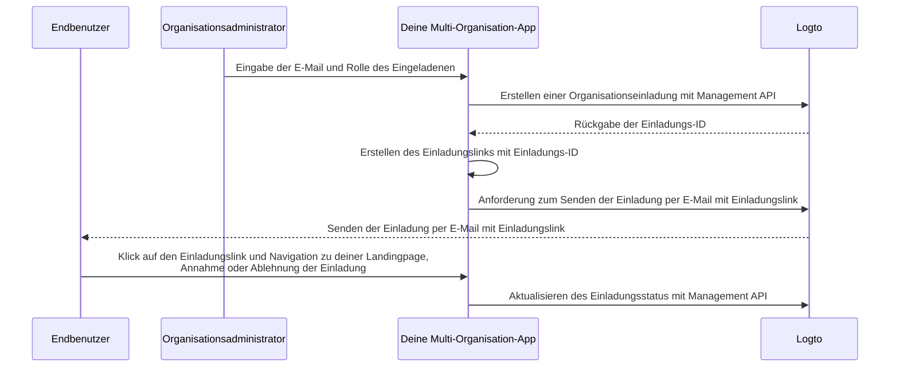

# Organisationsmitglieder einladen

Als eine Multi-Organisation-Anwendung ist es eine häufige Anforderung, Mitglieder in deine Organisation einzuladen. In diesem Leitfaden führen wir dich durch die Schritte und technischen Details, um diese Funktion in deiner Anwendung zu implementieren.

## Überblick über den Ablauf \{#flow-overview}

Der gesamte Prozess wird im folgenden Diagramm veranschaulicht:



## Organisationrollen erstellen \{#create-organization-roles}

Bevor du Mitglieder in deine Organisation einlädst, musst du Organisationrollen erstellen. Sieh dir den Leitfaden [Organisationstemplate konfigurieren](/authorization/organization-template/configure-organization-template) für detaillierte Anweisungen an.

In diesem Leitfaden erstellen wir zwei typische Organisationrollen: `admin` und `member`.

Die `admin`-Rolle hat vollen Zugriff auf alle Ressourcen in der Organisation, während die `member`-Rolle eingeschränkten Zugriff hat. Zum Beispiel kann jede Rolle einen Satz von Berechtigungen wie folgt haben:

- `admin`-Rolle:
  - `read:data` - Lesezugriff auf alle Organisationsdatenressourcen.
  - `write:data` - Schreibzugriff auf alle Organisationsdatenressourcen.
  - `delete:data` - Löschzugriff auf alle Organisationsdatenressourcen.
  - `invite:member` - Mitglieder in die Organisation einladen.
  - `manage:member` - Mitglieder in der Organisation verwalten.
  - `delete:member` - Mitglieder aus der Organisation entfernen.
- `member`-Rolle:
  - `read:data` - Lesezugriff auf alle Organisationsdatenressourcen.
  - `write:data` - Schreibzugriff auf alle Organisationsdatenressourcen.
  - `invite:member` - Mitglieder in die Organisation einladen.

Dies kann einfach in der [Logto Console](https://cloud.logto.io/) durchgeführt werden. Du kannst auch die [Logto Management API](https://openapi.logto.io/operation/operation-createorganizationrole) verwenden, um Organisationrollen programmatisch zu erstellen.

## Deinen E-Mail-Connector konfigurieren \{#configure-your-email-connector}

Da Einladungen per E-Mail versendet werden, stelle sicher, dass dein [E-Mail-Connector](/connectors/email-connectors) ordnungsgemäß konfiguriert ist. Um Einladungen zu senden, musst du einen [E-Mail-Template](/connectors/email-connectors/email-templates#email-template-types) Nutzungstyp - `OrganizationInvitation` - konfigurieren. Du kannst auch Organisation (z. B. Organisationsname, Logo) und Einladender (z. B. E-Mail des Einladenden, Name) [Variablen](/connectors/email-connectors/email-templates#email-template-variables) im Inhalt einfügen oder [mehrsprachige Templates](/connectors/email-connectors/email-templates#email-template-localization) nach Bedarf anpassen.

Ein Beispiel für ein E-Mail-Template für den Nutzungstyp `OrganizationInvitation` wird unten gezeigt:

```json
{
  "subject": "Willkommen in meiner Organisation",
  "content": "<p>Tritt {{organization.name}} über diesen <a href=\"{{link}}\" target=\"_blank\">Link</a> bei.</p>",
  "usageType": "OrganizationInvitation",
  "type": "text/html"
}
```

Der Platzhalter `{{link}}` im E-Mail-Inhalt wird beim Senden der E-Mail durch den tatsächlichen Einladungslink ersetzt. In diesem Leitfaden nehmen wir an, dass es `https://your-app.com/invitation/accept/{your-invitation-id}` wäre.

:::note

Der integrierte "Logto E-Mail-Dienst" von Logto Cloud unterstützt derzeit nicht den Nutzungstyp `OrganizationInvitation`. Stattdessen musst du deinen E-Mail-Connector (z. B. Sendgrid) konfigurieren und das `OrganizationInvitation`-Template einrichten.

:::

## Einladungen mit Logto Management API bearbeiten \{#handle-invitations-with-logto-management-api}

:::note

Falls du die Logto Management API noch nicht eingerichtet hast, sieh dir [Interaktion mit Management API](/integrate-logto/interact-with-management-api) für Details an.

:::

Wir haben eine Reihe von einladungsbezogenen Management APIs im Organisationsfeature bereitgestellt. Mit diesen APIs kannst du:

- `POST /api/organization-invitations` eine Organisationseinladung mit einer zugewiesenen Organisationrolle erstellen.
- `POST /api/organization-invitations/{id}/message` die Organisationseinladung per E-Mail an den Eingeladenen senden.
  Hinweis: Diese API-Nutzlast unterstützt eine `link`-Eigenschaft, du kannst deinen Einladungslink basierend auf der Einladungs-ID erstellen. Zum Beispiel:

  ```json
  {
    "link": "https://your-app.com/invitation/accept/{your-invitation-id}"
  }
  ```

  Dementsprechend musst du eine Landingpage implementieren, wenn dein Eingeladener über den Einladungslink zu deiner Anwendung navigiert.

- `GET /api/organization-invitations` & `GET /api/organization-invitations/{id}` alle deine Einladungen oder eine bestimmte nach ID abrufen.
  Auf deiner Landingpage kannst du diese APIs verwenden, um alle Einladungen oder Details einer Einladung, die ein Benutzer erhalten hat, aufzulisten.
- `PUT /api/organization-invitations/{id}/status` die Einladung annehmen oder ablehnen, indem der Einladungsstatus aktualisiert wird.
  Verwende diese API, um die Antwort des Benutzers auf die Einladung zu bearbeiten.

Bitte beachte, dass alle oben aufgeführten APIs ein gültiges "Organisationstoken" erfordern. [Sieh dir diesen Leitfaden an](/authorization/organization-template/protect-organization-resources#step-2-fetch-organization-token), um zu erfahren, wie du das Organisationstoken erhältst.

## Organisation rollenbasierte Zugangskontrolle (RBAC) verwenden, um Benutzerberechtigungen zu verwalten \{#use-organization-role-based-access-control-rbac-to-manage-user-permissions}

Mit den obigen Einstellungen kannst du nun Einladungen per E-Mail senden, und Eingeladene können der Organisation mit der zugewiesenen Rolle beitreten.

Benutzer mit unterschiedlichen Organisationrollen haben unterschiedliche Berechtigungen (Scopes) in ihren Organisationstokens. Daher sollten sowohl deine Client-App als auch Backend-Dienste diese Berechtigungen überprüfen, um sichtbare Funktionen und erlaubte Aktionen zu bestimmen.

## Umgang mit Aktualisierungen der Berechtigungen in Organisationstokens \{#handle-scope-updates-in-organization-tokens}

:::note

Stelle sicher, dass du die Organisation in deine App integriert hast. Sieh dir den [Integrationsleitfaden](/authorization/organization-template/protect-organization-resources) für weitere Details an.

:::

Das Verwalten von Aktualisierungen der Berechtigungen in Organisationstokens umfasst:

### Vorhandene Berechtigungen widerrufen \{#revoking-existing-scopes}

Zum Beispiel sollte das Herabstufen eines Admins zu einem Nicht-Admin-Mitglied Berechtigungen vom Benutzer entfernen. In einem solchen Fall kannst du einfach das zwischengespeicherte Organisationstoken löschen und ein neues mit Auffrischungstoken abrufen. Die reduzierten Berechtigungen werden sofort im neu ausgestellten Organisationstoken widergespiegelt.

### Neue Berechtigungen gewähren \{#granting-new-scopes}

Dies kann weiter in zwei Szenarien unterteilt werden:

#### Neue Berechtigungen gewähren, die bereits in deinem Auth-System definiert sind \{#grant-new-scopes-that-already-defined-in-your-auth-system}

Ähnlich wie beim Widerrufen von Berechtigungen, wenn die neu gewährte Berechtigung bereits beim Auth-Server registriert ist, kannst du einfach ein neues Organisationstoken ausstellen, und die neuen Berechtigungen werden sofort widergespiegelt.

#### Neue Berechtigungen gewähren, die neu in deinem Auth-System eingeführt wurden \{#grant-new-scopes-that-are-newly-introduced-your-auth-system}

In diesem Fall musst du einen erneuten Anmelde- oder Zustimmungsvorgang auslösen, um das Organisationstoken des Benutzers zu aktualisieren. Zum Beispiel durch Aufrufen der `signIn`-Methode im Logto SDK.

Erfahre mehr über [das Ausstellen eines Organisationstokens](/authorization/organization-template/protect-organization-resources/#fetch-the-organization-token).

### Implementiere eine Echtzeit-Berechtigungsprüfung und aktualisiere das Organisationstoken \{#implement-real-time-permission-check-and-update-organization-token}

Logto bietet eine Management API, um Echtzeit-Benutzerberechtigungen in der Organisation abzurufen.

- `GET /api/organizations/{id}/users/{userId}/scopes` ([API-Referenzen](https://openapi.logto.io/operation/operation-listorganizationuserscopes))

Du kannst dann die Berechtigungen im Organisationstoken des Benutzers mit den Echtzeit-Berechtigungen vergleichen, um festzustellen, ob der Benutzer befördert oder herabgestuft wurde.

- Wenn herabgestuft, kannst du einfach das zwischengespeicherte Organisationstoken löschen, und das SDK wird automatisch ein neues mit den aktualisierten Berechtigungen ausstellen.

  ```ts
  const { clearAccessToken } = useLogto();

  ...
  // Wenn die abgerufenen Echtzeit-Berechtigungen weniger Berechtigungen haben als die Organisationstoken-Berechtigungen
  await clearAccessToken();
  ```

  Dies erfordert keinen erneuten Anmelde- oder Zustimmungsvorgang. Neue Organisationstokens werden automatisch vom Logto SDK ausgestellt.

- Wenn eine neue Berechtigung in dein Auth-System eingeführt wird, löse einen erneuten Anmelde- oder Zustimmungsvorgang aus, um das Organisationstoken des Benutzers zu aktualisieren. Nehmen wir das React SDK als Beispiel:

  ```ts
  const { clearAllTokens, signIn } = useLogto();

  ...
  // Wenn die abgerufenen Echtzeit-Berechtigungen neu zugewiesene Berechtigungen haben als die Organisationstoken-Berechtigungen
  await clearAllTokens();
  signIn({
    redirectUri: '<your-sign-in-redirect-uri>',
    prompt: 'consent',
  });
  ```

  Der obige Code wird eine Seitennavigation zum Zustimmungsbildschirm auslösen und automatisch zurück zu deiner App umleiten, mit aktualisierten Berechtigungen im Organisationstoken des Benutzers.

## Verwandte Ressourcen \{#related-resources}

<Url href="https://blog.logto.io/implement-user-collaboration-in-your-app">
  Wie wir Benutzerzusammenarbeit innerhalb einer Multi-Tenant-App implementieren
</Url>
