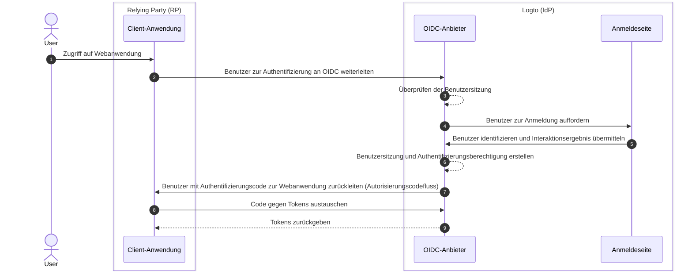

# Abmeldung

Der Abmeldeprozess in Logto (als OIDC-basierter Identitätsanbieter) ist ein vielschichtiges Konzept, da sowohl die zentralisierte Anmeldesitzung, die von Logto verwaltet wird, als auch der verteilte Authentifizierungsstatus, der von den Client-Anwendungen verwaltet wird, beteiligt sind.

## Anmeldesitzung \{#sign-in-session}

Um den Abmeldeprozess besser zu verstehen, ist es wichtig, zunächst zu verstehen, wie Benutzersitzungen und deren Authentifizierungsstatus in Logto verwaltet werden.



1. Der Benutzer greift auf die Webanwendung (RP) zu.
2. Die Client-Anwendung leitet den Benutzer zur [Authentifizierung (Authentication)](https://auth.wiki/authentication) an Logto (IdP) weiter.
3. Der OIDC-Anbieter überprüft den Status der Benutzersitzung. Wenn keine Sitzung existiert oder die Sitzung abgelaufen ist, wird der Benutzer zur Anmeldung aufgefordert.
4. Der Benutzer interagiert mit der Anmeldeseite, um sich zu authentifizieren.
5. Nach erfolgreicher Anmeldung erstellt Logto eine neue Sitzung für den Benutzer und leitet ihn mit einem Autorisierungscode zurück zur Client-Anwendung.
6. Der OIDC-Anbieter erstellt eine neue Anmeldesitzung und Authentifizierungsberechtigung für den Benutzer.
7. Der OIDC-Anbieter leitet den Benutzer mit einem Authentifizierungscode ([Autorisierungscodefluss](https://auth.wiki/authorization-code-flow)) zurück zum Client.
8. Der Client erhält den Authentifizierungscode und tauscht ihn gegen Tokens aus, um auf Benutzerinformationen zuzugreifen.
9. Tokens an die Client-Anwendung gewähren.

## Komponenten \{#components}

### Zentralisierte Anmeldesitzung, verwaltet von Logto \{#centralized-sign-in-session-managed-by-logto}

Im obigen Ablauf wird die zentralisierte Anmeldesitzung von Logto verwaltet. Die Sitzung wird erstellt, wenn der Benutzer sich erfolgreich anmeldet, und wird zerstört, wenn der Benutzer sich abmeldet. Die Sitzung wird auch zerstört, wenn die Benutzersitzung abläuft.

Die Logto-Anmeldesitzung wird mit Sitzungscookies verwaltet. Das Sitzungscookie wird gesetzt, wenn der Benutzer sich anmeldet. Alle Authentifizierungsanfragen werden gegen das Sitzungscookie validiert. Wenn das Sitzungscookie vorhanden und gültig ist, wird der Benutzer automatisch authentifiziert und direkt zur Client-Anwendung mit dem Autorisierungscode weitergeleitet. Andernfalls wird der Benutzer zur Anmeldung aufgefordert.

1. Geteiltes Logto-Sitzungscookie
   Für einen Benutzer, der sich von demselben Benutzeragenten (z. B. Browser) bei mehreren Client-Anwendungen anmeldet, wird ein gemeinsames Sitzungscookie unter der Logto-Domain vorhanden sein. Das bedeutet, dass der Benutzer sich nur einmal anmelden muss und automatisch für andere Client-Anwendungen authentifiziert wird.

   ```mermaid
    flowchart TD
    subgraph User [Benutzeragent A]
      U[Benutzer]

      subgraph Layer1 [Client-Domain A]
        A[Client-Anwendung A]
      end

      subgraph Layer1 [Client-Domain B]
        B[Client-Anwendung B]
      end

      subgraph Layer2 [Logto-Domain]
          C{{Logto-Anmeldesitzung?}}
          D[Anmeldeseite]
      end
    end

    U --> |Anmelden| A
    A --> |Weiterleitung zu Logto| C
    U --> |Anmelden| B
    B --> |Weiterleitung zu Logto| C
    C --> |Nein| D
    D --> |Sitzung erstellen| C
   ```

2. Isoliertes Logto-Sitzungscookie
   Für einen Benutzer, der sich von verschiedenen Geräten oder Browsern bei unterschiedlichen Client-Anwendungen anmeldet, werden isolierte Sitzungscookies unter der Logto-Domain vorhanden sein. Das bedeutet, dass der Benutzer sich für jede Client-Anwendung separat anmelden muss.

   ```mermaid
    flowchart TD
    U[Benutzer]

    subgraph DeviceA [Benutzeragent A]
      subgraph Layer1 [Client-Domain A]
        A[Client-Anwendung A]
      end

      subgraph Layer2 [Logto-Domain]
          C{{Logto-Anmeldesitzung?}}
          D[Anmeldeseite]
      end
    end

    subgraph DeviceB [Benutzeragent B]
      subgraph Layer3 [Client-Domain B]
        B[Client-Anwendung B]
      end

      subgraph Layer4 [Logto-Domain]
          E{{Logto-Anmeldesitzung?}}
          F[Anmeldeseite]
      end
    end

    U --> |Anmelden| A
    A --> |Weiterleitung zu Logto| C
    U --> |Anmelden| B
    B --> |Weiterleitung zu Logto| E
    C --> |Nein| D
    E --> |Nein| F
    D --> |Sitzung erstellen| C
    F --> |Sitzung erstellen| E
   ```

## Verteilter Authentifizierungsstatus, verwaltet von den Client-Anwendungen \{#distributed-authentication-status-managed-by-the-client-applications}

Jede Client-Anwendung verwaltet ihren eigenen Authentifizierungsstatus. Ob Native, SPA oder Web-Anwendung, alle haben ihre eigene Methode, den Authentifizierungsstatus des Benutzers zu verwalten.

Nach erfolgreicher Anmeldung kann die Client-Anwendung ein [ID-Token](https://auth.wiki/id-token) und ein [Zugangstoken](https://auth.wiki/access-token) erhalten. Die Client-Anwendung kann das ID-Token verwenden, um die Identität des Benutzers zu bestimmen, und das Zugangstoken, um auf die Ressourcen des Benutzers zuzugreifen. Der Authentifizierungsstatus des Benutzers wird durch die Ablaufzeit des Zugangstokens dargestellt.

- Native und SPA-Anwendungen:
  Die Client-Anwendung muss diese Tokens sicher speichern und verwalten, um den Authentifizierungsstatus des Benutzers aufrechtzuerhalten. Zum Beispiel, indem die Tokens im lokalen Speicher oder Sitzungsspeicher gespeichert werden und die Tokens gelöscht werden, wenn der Benutzer sich abmeldet.
- Web-Anwendungen:
  Web-Apps, wie die mit Frameworks wie Next.js erstellten, verwalten oft ihre eigene Sitzung für angemeldete Benutzer neben den von Logto ausgestellten Tokens. Sobald der Benutzer sich anmeldet und die Web-App die Tokens von Logto erhält, kann sie die Tokens clientseitig speichern, ähnlich wie SPA-Anwendungen, oder sie kann die Tokens serverseitig speichern und die Sitzung mit Cookies oder anderen Mechanismen verwalten.

## Abmeldemechanismen \{#sign-out-mechanisms}

### Tokens und lokale Sitzung auf der Client-Seite löschen \{#clear-tokens-and-local-session-at-the-client-side}

Auf der Client-Seite beinhaltet eine einfache Abmeldung das Löschen der lokalen Sitzung und das Entfernen der Tokens (ID-Token, Zugangstoken, Auffrischungstoken) aus dem lokalen Speicher oder Sitzungsspeicher. Dies führt zu einer nur clientseitigen Abmeldung, bei der die zentralisierte Sitzung intakt bleibt. Benutzer, die sich auf diese Weise abmelden, können möglicherweise weiterhin auf andere Anwendungen unter derselben Autorisierungsserversitzung zugreifen, bis die zentralisierte Sitzung abläuft oder aktiv zerstört wird.

### Anmeldesitzung bei Logto löschen \{#clear-sign-in-session-at-logto}

Um den Benutzer explizit abzumelden und die Sitzung bei Logto zu löschen, muss die Client-Anwendung den Benutzer zum **Ende-Sitzung-Endpunkt** von Logto weiterleiten.

Zum Beispiel: `https://{your-logto-domain}/oidc/session/end`

Der **Ende-Sitzung-Endpunkt** ist ein standardmäßiger OIDC-Endpunkt, der es der Client-Anwendung ermöglicht, den Autorisierungsserver darüber zu informieren, dass der Benutzer sich abgemeldet hat. Der Endpunkt wird die zentralisierte Anmeldesitzung bei Logto löschen.

Sobald die Sitzung gelöscht ist, erfordern alle nachfolgenden Autorisierungsanfragen, dass der Benutzer sich erneut anmeldet.

Wenn eine **Post-Logout-Redirect-URI** angegeben wird, wird der Benutzer nach dem Löschen der Sitzung zur angegebenen URI weitergeleitet. Andernfalls wird der Benutzer zur Standard-Post-Logout-Seite weitergeleitet, die von Logto gehostet wird.

## Föderierte Abmeldung: Back-Channel-Logout \{#federated-sign-out-back-channel-logout}

Für eine konsistentere Abmeldungsverwaltung unterstützt Logto [Back-Channel-Logout](https://openid.net/specs/openid-connect-backchannel-1_0-final.html). Back-Channel-Logout ist ein Mechanismus, der es Logto ermöglicht, alle Client-Anwendungen unter derselben Anmeldesitzung zu benachrichtigen, wenn der Benutzer sich abmeldet.

Dies ist besonders nützlich in Szenarien, in denen der Benutzer sich von einer Client-Anwendung abmeldet und erwartet, dass er von allen anderen Client-Anwendungen unter derselben Logto-Anmeldesitzung abgemeldet wird.

Um Back-Channel-Logout für deine Client-Anwendungen zu aktivieren, gehe zur Anwendungsdetailseite im Logto-Dashboard und registriere eine Back-Channel-Logout-URI. Logto sendet ein Logout-Token an alle registrierten URIs, wenn der Benutzer eine Abmeldeanfrage von einer beliebigen Client-Anwendung initiiert.

Wenn deine Client-Anwendung erfordert, dass die Anmeldesitzung im Logout-Token enthalten ist, aktiviere die Einstellung `Ist Sitzung erforderlich` in der Back-Channel-Logout-Konfiguration. Ein `sid`-Anspruch wird im Logout-Token enthalten sein, um die Anmeldesitzung des Benutzers bei Logto zu identifizieren.

1. Der Benutzer initiiert eine Abmeldeanfrage von einer Client-Anwendung.
2. Logto erhält die Ende-Sitzung-Anfrage, generiert ein Logout-Token und sendet das Logout-Token an alle registrierten Back-Channel-Logout-URIs.
3. Jede Client-Anwendung erhält das Logout-Token und führt Abmeldeaktionen durch.

Abmeldeaktionen für jede Client-Anwendung beim Empfang des Logout-Tokens:

- Validierung des Logout-Tokens.
- Löschen der lokalen Sitzung und Entfernen der Tokens aus dem lokalen Speicher oder Sitzungsspeicher.

## Abmeldemethoden in Logto SDKs \{#sign-out-methods-in-logto-sdks}

Wenn du Logto mit deiner Client-Anwendung unter Verwendung der Logto-SDKs integrierst:

- Für SPA und Web-Anwendungen wird die Methode `client.signOut()` den lokalen Token-Speicher löschen und den Benutzer zum Ende-Sitzung-Endpunkt von Logto weiterleiten. Du kannst eine **Post-Logout-Redirect-URI** angeben, um den Benutzer nach dem Löschen der Sitzung weiterzuleiten.
- Für native Anwendungen (einschließlich hybrider Apps wie **React Native** und **Flutter**) wird nur der lokale Token-Speicher gelöscht. Dies liegt daran, dass in nativen Anwendungen der sitzungslose Webview verwendet wird, um den Anmeldeprozess zu handhaben. Es werden keine Sitzungscookies im nativen Browser gespeichert, daher ist es nicht erforderlich, die Anmeldesitzung bei Logto zu löschen. Jede Authentifizierungsanfrage ist eine eigenständige Anfrage, die keine Sitzungscookies enthält.

:::note
Für native Anwendungen, die den sitzungslosen Webview nicht unterstützen oder die `hervorgehobenen` Einstellungen nicht erkennen (Android-App mit **React Native** oder **Flutter** SDK), kannst du den Benutzer zwingen, sich erneut anzumelden, indem du den Parameter `prompt=login` in der Autorisierungsanfrage übergibst.
:::

## FAQs \{#faqs}

<details>
  <summary>

### Ich erhalte keine Back-Channel-Logout-Benachrichtigungen. \{#im-not-receiving-the-back-channel-logout-notifications}

</summary>

- Stelle sicher, dass die Back-Channel-Logout-URI korrekt im Logto-Dashboard registriert ist.
- Stelle sicher, dass deine Client-Anwendung eine gültige aktive Anmeldesitzung hat und es sich um dieselbe Sitzung handelt, die die Abmeldeanfrage initiiert hat.

</details>

## Verwandte Ressourcen \{#related-resources}

<Url href="https://blog.logto.io/oidc-back-channel-logout/">
  Verständnis des OIDC-Back-Channel-Logouts.
</Url>
