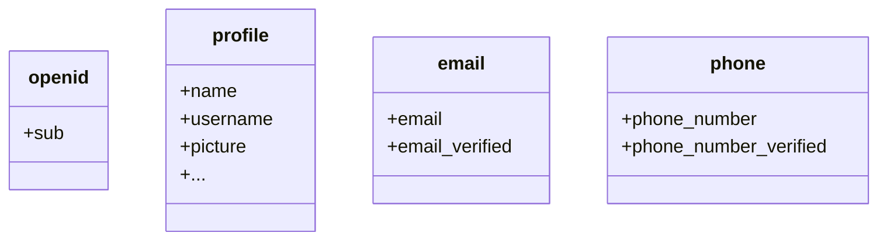

Standardmäßig werden begrenzte Ansprüche zurückgegeben. Wenn du mehr Informationen benötigst, kannst du zusätzliche Berechtigungen anfordern, um auf mehr Ansprüche zuzugreifen.

:::info
Ein "Anspruch (Claim)" ist eine Behauptung über ein Subjekt; eine "Berechtigung (Scope)" ist eine Gruppe von Ansprüchen. Im aktuellen Fall ist ein Anspruch ein Informationsstück über den Benutzer.
:::

Hier ist ein nicht-normatives Beispiel für die Beziehung zwischen Berechtigung und Anspruch:

:::tip
Der "sub"-Anspruch bedeutet "Subjekt", was der eindeutige Identifikator des Benutzers ist (d. h. Benutzer-ID).
:::

Das Logto SDK wird immer drei Berechtigungen anfordern: `openid`, `profile` und `offline_access`.
