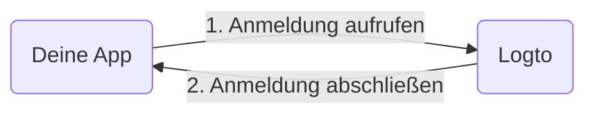

import RegardingRedirectBasedSignIn from './_regarding-redirect-based-sign-in.mdx';

Bevor wir in die Details eintauchen, hier ein kurzer Überblick über die Endbenutzererfahrung. Der Anmeldeprozess kann wie folgt vereinfacht werden:

1. Deine App ruft die Anmeldemethode auf.
2. Der Benutzer wird zur Logto-Anmeldeseite umgeleitet. Bei nativen Apps wird der Systembrowser geöffnet.
3. Der Benutzer meldet sich an und wird zurück zu deiner App umgeleitet (konfiguriert als die Redirect-URI).

<RegardingRedirectBasedSignIn />

---
