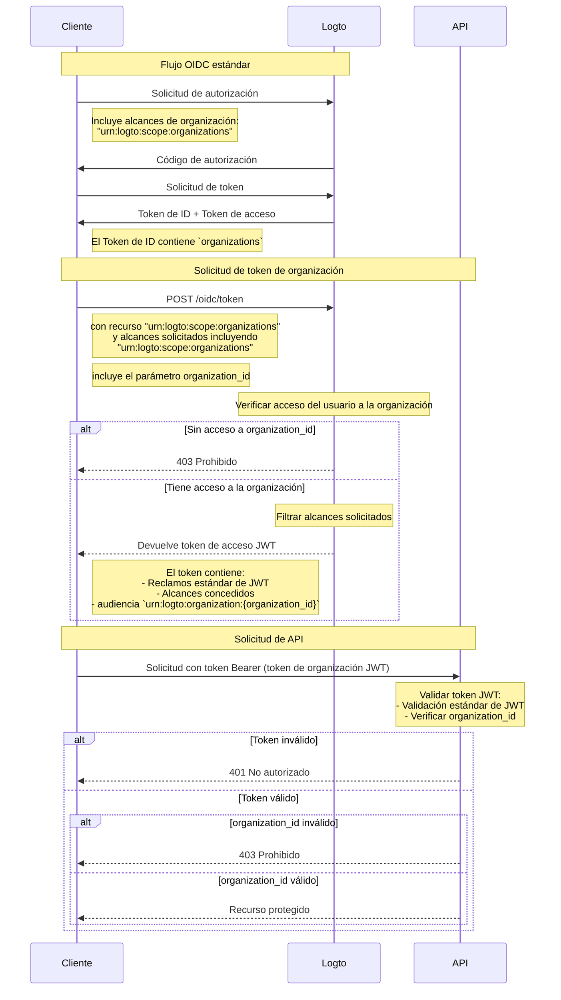

import TabItem from '@theme/TabItem';
import Tabs from '@theme/Tabs';

# Proteger recursos de la organización

Además de [Proteger tu API](/authorization/api-resources/protect-your-api), que toma la API como recurso, la organización también puede ser un recurso, y proteger tu recurso de organización de la misma manera. En este artículo, nos centraremos en cómo cambiar para proteger tu recurso de organización de manera similar.



## Paso 1: Obtener IDs de organización del flujo OIDC \{#step-1-get-organization-ids-from-oidc-flow}

Logto extiende el protocolo estándar [OpenID Connect](https://openid.net/specs/openid-connect-core-1_0.html) para permitir que tu aplicación obtenga la información de la organización del usuario. Hay dos maneras de hacerlo:

- Si estás utilizando un SDK de Logto con soporte para Organizaciones, puedes agregar el alcance `urn:logto:scope:organizations` al parámetro `scopes` del objeto de configuración. Usualmente el SDK tendrá un enum para este alcance, por ejemplo, `UserScope.Organizations` en [Logto JS SDKs](https://github.com/logto-io/js).

<Tabs groupId="sdk">

  <TabItem value="js" label="JavaScript">

```ts
import { LogtoClient, UserScope } from '@logto/browser'; // o @logto/node, @logto/client

const logto = new LogtoClient({
  // ...
  scopes: [UserScope.Organizations],
});
```

  </TabItem>
  <TabItem value="react" label="React">

```tsx
import { LogtoProvider, UserScope } from '@logto/react';

const App = () => (
  <LogtoProvider
    config={{
      // ...
      scopes: [UserScope.Organizations],
    }}
  >
    {/* ... */}
  </LogtoProvider>
);
```

  </TabItem>
  <TabItem value="python" label="Python">

```python
from logto import UserInfoScope

client = LogtoClient(
    LogtoConfig(
        # ...
        scopes=[UserInfoScope.organizations],
    )
)
```

  </TabItem>
  <TabItem value="php" label="PHP">

```php
use Logto\Sdk\Constants\UserScope;

$client = new LogtoClient(
  new LogtoConfig(
    // ...
    scopes: [UserScope::organizations],
  )
);
```

  </TabItem>
  <TabItem value="swift" label="Swift">

```swift
import Logto
import LogtoClient

let config = try? LogtoConfig(
    // ...
    scopes: [
        UserScope.organizations.rawValue,
    ],
    // ...
)
let client = LogtoClient(useConfig: config)
```

  </TabItem>
  <TabItem value="others" label="Otros">

```ts
const config = {
  // ...
  scope: 'openid offline_access urn:logto:scope:organizations',
};
```

  </TabItem>

</Tabs>
    
- Para otros casos, necesitas agregar el alcance `urn:logto:scope:organizations` al parámetro `scope` de la configuración del SDK (o solicitud de autenticación).

Una vez que el usuario finaliza el flujo de autenticación, puedes obtener la información de la organización del `idToken`:

```tsx
// Usar JavaScript como ejemplo
const idToken = await logto.getIdTokenClaims();

console.log(idToken.organizations); // Un array de cadenas de IDs de organización
```

El campo `organizations` (reclamo) también se incluirá en la respuesta del [endpoint UserInfo](https://openid.net/specs/openid-connect-core-1_0.html#UserInfo).

### Opcional: Obtener roles de la organización \{#optional-get-organization-roles}

Si aún no has configurado roles de organización, consulta [esta sección](/authorization/organization-template/configure-organization-template/#create-organization-role).

Para obtener todos los roles de organización del usuario actual:

- Si estás utilizando un SDK de Logto con soporte para Organizaciones, puedes agregar el alcance `urn:logto:scope:organization_roles` al parámetro `scopes` del objeto de configuración. Usualmente el SDK tendrá un enum para este alcance, por ejemplo, `UserScope.OrganizationRoles` en [Logto JS SDKs](https://github.com/logto-io/js).
- Para otros casos, necesitas agregar el alcance `urn:logto:scope:organization_roles` al parámetro `scope` de la configuración del SDK (o solicitud de autenticación).

Luego puedes obtener los roles de la organización del `idToken`:

```tsx
// Usar JavaScript como ejemplo
const idToken = await logto.getIdTokenClaims();

console.log(idToken.organization_roles); // Un array de cadenas de roles de organización
```

Cada cadena en el array tiene el formato `organization_id:role_id`, por ejemplo, `org_123:admin` significa que el usuario tiene el rol `admin` en la organización con ID `org_123`.

El campo `organization_roles` (reclamo) también se incluirá en la respuesta del [endpoint UserInfo](https://openid.net/specs/openid-connect-core-1_0.html#UserInfo).

## Paso 2. Obtener token de organización \{#step-2-fetch-organization-token}

Para realizar acciones en el contexto de una organización, el usuario necesita recibir un token de acceso para esa organización (token de organización). El token de organización es un token JWT que contiene el ID de la organización y los permisos (alcances) del usuario en la organización.

### Agregar parámetros a la solicitud de autenticación \{#add-parameters-to-the-authentication-request}

- Si estás utilizando un SDK de Logto con soporte para Organizaciones, puedes agregar el alcance `urn:logto:scope:organizations` al parámetro `scopes` del objeto de configuración, de la misma manera que [Obtener IDs de organización del usuario actual](/authorization/organization-template/protect-organization-resources/#step-1-get-organization-ids-from-oidc-flow).
  - El SDK de Logto con soporte para Organizaciones manejará automáticamente el resto de la configuración.
- Para otros casos, necesitas agregar los alcances `offline_access` y `urn:logto:scope:organizations` al parámetro `scope` y el recurso `urn:logto:resource:organizations` al parámetro `resource` de la configuración del SDK (o solicitud de autenticación).
  - Nota: `offline_access` es necesario para obtener el `refresh_token` que se puede usar para obtener tokens de organización.

```tsx
// Solo para otros casos. Para SDKs de Logto, ver arriba.
const config = {
  // ...
  scope: 'openid offline_access urn:logto:scope:organizations',
  resource: 'urn:logto:resource:organizations',
};
```

:::note

El recurso `urn:logto:resource:organizations` es un recurso especial que representa la plantilla de organización.

:::

### Obtener el token de organización \{#fetch-the-organization-token}

Logto extiende el tipo de concesión `refresh_token` estándar para permitir que tu aplicación obtenga tokens de organización.

- Si estás utilizando un SDK de Logto con soporte para Organizaciones, puedes llamar al método `getOrganizationToken()` (o al método `getOrganizationTokenClaims()`) del SDK.
- Para otros casos, necesitas llamar al endpoint de token con los siguientes parámetros:
  - `grant_type`: `refresh_token`.
  - `client_id`: El ID de la aplicación que el usuario usó para autenticarse.
  - `refresh_token`: El `refresh_token` que obtuviste del flujo de autenticación.
  - `organization_id`: El ID de la organización para la que deseas obtener el token.
  - `scope` (opcional): Los alcances que deseas conceder al usuario en la organización. Si no se especifica, el servidor de autorización intentará conceder los mismos alcances que el flujo de autenticación.

<Tabs groupId="sdk">

  <TabItem value="js" label="JavaScript">

```ts
const token = await logto.getOrganizationToken('<organization-id>');
```

  </TabItem>
  <TabItem value="react" label="React">

```tsx
const App = () => {
  const { getOrganizationToken } = useLogto();

  const getToken = async () => {
    const token = await getOrganizationToken('<organization-id>');
  };

  return <button onClick={getToken}>Obtener token de organización</button>;
};
```

  </TabItem>
  <TabItem value="python" label="Python">

```python
token = await client.getOrganizationToken("<organization-id>")
# o
claims = await client.getOrganizationTokenClaims("<organization-id>")
```

  </TabItem>
  <TabItem value="php" label="PHP">

```php
$token = $client->getOrganizationToken('<organization-id>');
// o
$claims = $client->getOrganizationTokenClaims('<organization-id>');
```

  </TabItem>
  <TabItem value="swift" label="Swift">

```swift
let token = try await client.getOrganizationToken(forId: "<organization-id>")
```

  </TabItem>
  <TabItem value="others" label="Otros">

```ts
// Usar JavaScript como ejemplo

const params = new URLSearchParams();

params.append('grant_type', 'refresh_token');
params.append('client_id', 'YOUR_CLIENT_ID');
params.append('refresh_token', 'REFRESH_TOKEN');
params.append('organization_id', 'org_123');

const response = await fetch('https://YOUR_LOGTO_ENDPOINT/oidc/token', {
  method: 'POST',
  headers: {
    'Content-Type': 'application/x-www-form-urlencoded',
  },
  body: params,
});
```

  </TabItem>

</Tabs>

La respuesta estará en el mismo formato que el [endpoint de token estándar](https://openid.net/specs/openid-connect-core-1_0.html#TokenEndpoint), y el `access_token` es el token de organización en formato JWT.

Además de los reclamos regulares de un token de acceso, el token de organización también contiene los siguientes reclamos:

- `aud`: La audiencia del token de organización es `urn:logto:organization:{organization_id}`.
- `scope`: Los alcances concedidos al usuario en la organización con espacio como delimitador.

### Ejemplo \{#example}

Un buen ejemplo puede superar mil palabras. Supongamos que nuestra plantilla de organización tiene la siguiente configuración:

- Permisos: `read:logs`, `write:logs`, `read:users`, `write:users`.
- Roles: `admin`, `member`.
  - El rol `admin` tiene todos los permisos.
  - El rol `member` tiene permisos `read:logs` y `read:users`.

Y el usuario tiene la siguiente configuración:

- IDs de organización: `org_1`, `org_2`.
- Roles de organización: `org_1:admin`, `org_2:member`.

En la configuración del SDK de Logto (o solicitud de autenticación), configuramos otras cosas correctamente y agregamos los siguientes alcances:

- `urn:logto:scope:organizations`
- `openid`
- `offline_access`
- `read:logs`
- `write:logs`

Ahora, cuando el usuario finaliza el flujo de autenticación, podemos obtener los IDs de organización del `idToken`:

```tsx
// Usar JavaScript como ejemplo
const idToken = await logto.getIdTokenClaims();

console.log(idToken.organizations); // ['org_1', 'org_2']
```

Si queremos obtener los tokens de organización:

```tsx
// Usar JavaScript como ejemplo
const org1Token = await logto.getOrganizationTokenClaims('org_1');
const org2Token = await logto.getOrganizationTokenClaims('org_2');

console.log(org1Token.aud); // 'urn:logto:organization:org_1'
console.log(org1Token.scope); // 'read:logs write:logs'
console.log(org2Token.aud); // 'urn:logto:organization:org_2'
console.log(org2Token.scope); // 'read:logs'

const org3Token = await logto.getOrganizationTokenClaims('org_3'); // Error: El usuario no es miembro de la organización
```

Explicación:

- Para `org_1`, el usuario tiene el rol `admin`, por lo que el token de organización debería tener todos los permisos disponibles (alcances).
- Para `org_2`, el usuario tiene el rol `member`, por lo que el token de organización debería tener permisos `read:logs` y `read:users` (alcances).

Dado que solo solicitamos los alcances `read:logs` y `write:logs` en el flujo de autenticación, los tokens de organización se han "reducido" en consecuencia, resultando en la intersección de los alcances solicitados y los alcances disponibles.

### Obtener token de organización para una aplicación máquina a máquina \{#fetch-organization-token-for-a-machine-to-machine-application}

Similar a obtener tokens de organización para usuarios, también puedes obtener tokens de organización para aplicaciones máquina a máquina. La única diferencia es que necesitas usar el tipo de concesión `client_credentials` en lugar del tipo de concesión `refresh_token`.

Para aprender más sobre aplicaciones máquina a máquina, consulta [Máquina a máquina: Autenticación con Logto](/quick-starts/m2m/).

## Paso 3. Verificar tokens de organización \{#step-3-verify-organization-tokens}

Una vez que la aplicación obtiene un token de organización, puede usar el token de la misma manera que un token de acceso regular, por ejemplo, llamar a las APIs con el token en el encabezado `Authorization` en el formato `Bearer {token}`.

En tu API, la forma de verificar el token de organización es bastante similar a [Proteger tu API](/authorization/api-resources/protect-your-api/#validate-authorization-tokens-for-api-requests). Principales diferencias:

- A diferencia de los tokens de acceso para recursos de API, un usuario NO PUEDE obtener un token de organización si no es miembro de la organización.
- La audiencia del token de organización es `urn:logto:organization:{organization_id}`.
- Para ciertos permisos (alcances), necesitas verificar el reclamo `scope` del token de organización dividiendo la cadena con espacio como delimitador.
