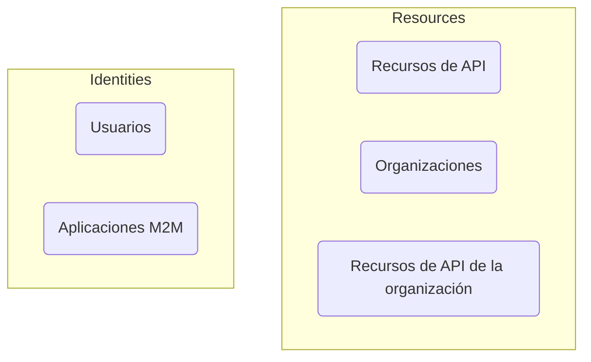

# Autenticación vs. autorización

La diferencia entre **autenticación** y **autorización** se puede resumir de la siguiente manera:

- **Autenticación (Authentication)** responde a la pregunta "¿Qué identidad posees?"
- **Autorización (Authorization)** responde a la pregunta "¿Qué puedes hacer?"

Para una introducción completa a la gestión de identidad y acceso del cliente (CIAM), puedes consultar nuestra serie de CIAM:

- [CIAM 101: Authentication, Identity, SSO](https://blog.logto.io/ciam-101-intro-authn-sso/)
- [CIAM 102: Authorization & Role-based Access Control](https://blog.logto.io/ciam-102-authz-and-rbac/)

## Autenticación \{#authentication}

Logto admite varios métodos de autenticación interactivos y no interactivos, por ejemplo:

- **Experiencia de inicio de sesión**: El proceso de autenticación para los usuarios finales.
- **Autenticación máquina a máquina (M2M)**: El proceso de autenticación para servicios o aplicaciones.

El objetivo final de la autenticación es extremadamente simple: verificar y obtener el identificador único de la entidad (en Logto, un usuario o una aplicación).

## Autorización \{#authorization}

En Logto, la autorización se realiza a través del control de acceso basado en roles (RBAC). Te da el control completo para gestionar el acceso de tus usuarios o aplicaciones M2M a lo siguiente:

- **Recursos de API (API resources)**: Una entidad global representada por un URI absoluto.
- **Organizaciones (Organizations)**: Un grupo de usuarios o aplicaciones.
- **Recursos de API de la organización (Organization API resources)**: Un recurso de API que pertenece a una organización.

Para aprender más sobre estos conceptos, puedes consultar los siguientes recursos:

- [Control de acceso basado en roles (RBAC)](/authorization/role-based-access-control)
- [Organizaciones (Multi-tenancy)](/organizations)

Aquí tienes una representación visual de la relación entre estos conceptos:

En resumen, la autorización se trata de definir las reglas que determinan qué entidades en el grupo "Identidades" pueden acceder a las entidades en el grupo "Recursos".

## Preguntas frecuentes \{#frequently-asked-questions}

### Necesito especificar qué usuarios pueden iniciar sesión en una aplicación \{#i-need-to-specify-which-users-can-sign-in-to-an-application}

Debido a la naturaleza del inicio de sesión único (SSO), Logto actualmente no admite el uso de aplicaciones como recursos. En su lugar, puedes definir recursos de API y permisos para controlar el acceso a tus recursos.

### Necesito que mis usuarios inicien sesión en una organización \{#i-need-my-users-to-sign-in-to-an-organization}

Como se mencionó anteriormente, la autenticación implica verificar la identidad de una entidad, mientras que el control de acceso se maneja a través de la autorización. Por lo tanto:

- Determinar a qué organización(es) pertenece un usuario es una preocupación de autorización.
- El proceso de inicio de sesión es una preocupación de autenticación.

Esto significa que no hay un concepto de "iniciar sesión en una organización" en Logto. Una vez que un usuario está autenticado, puede ser autorizado para acceder a todos los recursos (incluidos los recursos de la organización) basándose en los permisos definidos.

Este modelo es eficiente y claro, ya que separa las preocupaciones de autenticación y autorización. Todas las aplicaciones SaaS modernas, como GitHub y Notion, siguen este modelo.

Sin embargo, hay algunos casos en los que necesitas establecer mapeos 1-1 entre fuentes de usuarios y organizaciones. En este caso, el [SSO empresarial](/end-user-flows/enterprise-sso) y el [aprovisionamiento Just-in-Time (JIT) de la organización](/organizations/just-in-time-provisioning) pueden ser útiles.

### Nuestros clientes necesitan personalización de marca para sus páginas de inicio de sesión \{#our-customers-need-custom-branding-for-their-sign-in-pages}

Por favor, consulta [personalización específica de la aplicación](/customization/match-your-brand/#app-specific-branding) y [personalización específica de la organización](/customization/match-your-brand/#organization-specific-branding) para configuraciones relacionadas.
