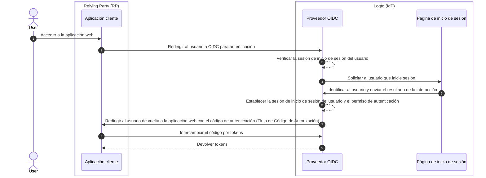

# Cierre de sesión

El proceso de cierre de sesión en Logto (como un proveedor de identidad basado en OIDC) es un concepto multifacético debido a la participación tanto de la sesión de inicio de sesión centralizada gestionada por Logto como del estado de autenticación distribuido gestionado por las aplicaciones cliente.

## Sesión de inicio de sesión \{#sign-in-session}

Para comprender mejor el proceso de cierre de sesión, es importante primero entender cómo se gestionan las sesiones de inicio de sesión de usuario y su estado de autenticación en Logto.



1. El usuario accede a la aplicación web (RP).
2. La aplicación cliente redirige al usuario a Logto (IdP) para la Autenticación (Authentication).
3. El proveedor OIDC verifica el estado de la sesión de inicio de sesión del usuario. Si no existe una sesión o la sesión ha expirado, se solicita al usuario que inicie sesión.
4. El usuario interactúa con la página de inicio de sesión para autenticarse.
5. Después de un inicio de sesión exitoso, Logto crea una nueva sesión para el usuario y redirige de vuelta a la aplicación cliente con un código de autorización.
6. El proveedor OIDC crea una nueva sesión de inicio de sesión y permiso de autenticación para el usuario.
7. El proveedor OIDC redirige al usuario de vuelta al cliente con un código de autenticación (Flujo de Código de Autorización).
8. El cliente recibe el código de autenticación y lo intercambia por tokens para acceder a la información del usuario.
9. Conceder tokens a la aplicación cliente.

## Componentes \{#components}

### Sesión de inicio de sesión centralizada gestionada por Logto \{#centralized-sign-in-session-managed-by-logto}

En el flujo anterior, la sesión de inicio de sesión centralizada es gestionada por Logto. La sesión se crea cuando el usuario inicia sesión exitosamente y se destruye cuando el usuario cierra sesión. La sesión también se destruye cuando la sesión del usuario expira.

La sesión de inicio de sesión de Logto se gestiona utilizando cookies de sesión. La cookie de sesión se establece cuando el usuario inicia sesión. Todas las solicitudes de autenticación se validan contra la cookie de sesión. Si la cookie de sesión está presente y es válida, el usuario será automáticamente autenticado y redirigido directamente a la aplicación cliente con el código de autorización. De lo contrario, se solicitará al usuario que inicie sesión.

1. Cookie de sesión compartida de Logto
   Para un usuario que inicia sesión en múltiples aplicaciones cliente desde el mismo agente de usuario (por ejemplo, navegador), el usuario tendrá una cookie de sesión compartida bajo el dominio de Logto. Esto significa que el usuario solo necesita iniciar sesión una vez y será automáticamente autenticado para otras aplicaciones cliente.

   ```mermaid
    flowchart TD
    subgraph User [Agente de usuario A]
      U[Usuario]

      subgraph Layer1 [Dominio del cliente A]
        A[Aplicación Cliente A]
      end

      subgraph Layer1 [Dominio del cliente B]
        B[Aplicación Cliente B]
      end

      subgraph Layer2 [Dominio de Logto]
          C{{¿Sesión de inicio de sesión de Logto?}}
          D[Página de inicio de sesión]
      end
    end

    U --> |Iniciar sesión| A
    A --> |Redirigir a Logto| C
    U --> |Iniciar sesión| B
    B --> |Redirigir a Logto| C
    C --> |No| D
    D --> |Crear sesión| C
   ```

2. Cookie de sesión aislada de Logto
   Para un usuario que inicia sesión en diferentes aplicaciones cliente desde diferentes dispositivos o navegadores, el usuario tendrá cookies de sesión aisladas bajo el dominio de Logto. Esto significa que el usuario necesita iniciar sesión para cada aplicación cliente por separado.

   ```mermaid
    flowchart TD
    U[Usuario]

    subgraph DeviceA [Agente de usuario A]
      subgraph Layer1 [Dominio del cliente A]
        A[Aplicación Cliente A]
      end

      subgraph Layer2 [Dominio de Logto]
          C{{¿Sesión de inicio de sesión de Logto?}}
          D[Página de inicio de sesión]
      end
    end

    subgraph DeviceB [Agente de usuario B]
      subgraph Layer3 [Dominio del cliente B]
        B[Aplicación Cliente B]
      end

      subgraph Layer4 [Dominio de Logto]
          E{{¿Sesión de inicio de sesión de Logto?}}
          F[Página de inicio de sesión]
      end
    end

    U --> |Iniciar sesión| A
    A --> |Redirigir a Logto| C
    U --> |Iniciar sesión| B
    B --> |Redirigir a Logto| E
    C --> |No| D
    E --> |No| F
    D --> |Crear sesión| C
    F --> |Crear sesión| E
   ```

## Estado de autenticación distribuido gestionado por las aplicaciones cliente \{#distributed-authentication-status-managed-by-the-client-applications}

Cada aplicación cliente mantiene su propio estado de autenticación. Ya sea una aplicación Nativa, SPA o Web, todas tienen su propia forma de gestionar el estado de autenticación del usuario.

Tras un inicio de sesión exitoso, la aplicación cliente puede recibir un Token de ID (ID token) y un Token de acceso (Access token). La aplicación cliente puede usar el Token de ID para determinar la identidad del usuario y el Token de acceso para acceder a los recursos del usuario. El estado de autenticación del usuario está representado por el tiempo de expiración del Token de acceso.

- Aplicaciones Nativas y SPA:
  La aplicación cliente necesita almacenar y gestionar de manera segura estos tokens para mantener el estado de autenticación del usuario. Por ejemplo, almacenar los tokens en el almacenamiento local o de sesión, y borrar los tokens cuando el usuario cierra sesión.
- Aplicaciones Web:
  Las aplicaciones web, como las construidas con frameworks como Next.js, a menudo gestionan su propia sesión para los usuarios que han iniciado sesión junto con los tokens emitidos por Logto. Una vez que el usuario inicia sesión y la aplicación web recibe los tokens de Logto, puede almacenar los tokens en el lado del cliente al igual que las aplicaciones SPA, o puede almacenar los tokens en el lado del servidor y gestionar la sesión utilizando cookies u otros mecanismos.

## Mecanismos de cierre de sesión \{#sign-out-mechanisms}

### Borrar tokens y sesión local en el lado del cliente \{#clear-tokens-and-local-session-at-the-client-side}

En el lado del cliente, un cierre de sesión simple implica borrar la sesión local y eliminar los tokens (Token de ID, Token de acceso, Token de actualización) del almacenamiento local o de sesión. Esto resulta en un cierre de sesión solo del lado del cliente donde la sesión centralizada permanece intacta. Los usuarios que cierran sesión de esta manera aún pueden acceder a otras aplicaciones bajo la misma sesión del servidor de autorización hasta que la sesión centralizada expire o sea destruida activamente.

### Borrar sesión de inicio de sesión en Logto \{#clear-sign-in-session-at-logto}

Para cerrar sesión explícitamente al usuario y borrar la sesión en Logto, la aplicación cliente necesita redirigir al usuario al **punto final de fin de sesión** de Logto.

Por ejemplo, `https://{tu-dominio-logto}/oidc/session/end`

El **punto final de fin de sesión** es un punto final estándar de OIDC que permite a la aplicación cliente notificar al servidor de autorización que el usuario ha cerrado sesión. El punto final borrará la sesión de inicio de sesión centralizada en Logto.

Una vez que la sesión se borra, cualquier solicitud de autorización posterior requerirá que el usuario inicie sesión nuevamente.

Si se proporciona un **URI de redirección post-cierre de sesión**, el usuario será redirigido al URI especificado después de que la sesión se borre. De lo contrario, el usuario será redirigido a la página de cierre de sesión predeterminada alojada por Logto.

## Cierre de sesión federado: Cierre de sesión por canal de fondo \{#federated-sign-out-back-channel-logout}

Para una gestión de cierre de sesión más consistente, Logto admite el [cierre de sesión por canal de fondo](https://openid.net/specs/openid-connect-backchannel-1_0-final.html). El cierre de sesión por canal de fondo es un mecanismo que permite a Logto notificar a todas las aplicaciones cliente bajo la misma sesión de inicio de sesión cuando el usuario cierra sesión.

Esto es particularmente útil en escenarios donde el usuario cierra sesión desde una aplicación cliente y espera cerrar sesión de todas las demás aplicaciones cliente bajo la misma sesión de inicio de sesión de Logto.

Para habilitar el cierre de sesión por canal de fondo para tus aplicaciones cliente, ve a la página de detalles de la aplicación en el panel de Logto y registra un URI de cierre de sesión por canal de fondo. Logto enviará un token de cierre de sesión a todos los URI registrados cuando el usuario inicie una solicitud de cierre de sesión desde cualquier aplicación cliente.

Si tu aplicación cliente requiere que la sesión de inicio de sesión se incluya en el token de cierre de sesión, activa la configuración `¿Es necesaria la sesión?` en la configuración de cierre de sesión por canal de fondo. Se incluirá un reclamo `sid` en el token de cierre de sesión para identificar la sesión de inicio de sesión del usuario en Logto.

1. El usuario inicia una solicitud de cierre de sesión desde una aplicación cliente.
2. Logto recibe la solicitud de fin de sesión, genera un token de cierre de sesión y envía el token de cierre de sesión a todos los URI de cierre de sesión por canal de fondo registrados.
3. Cada aplicación cliente recibe el token de cierre de sesión y realiza acciones de cierre de sesión.

Acciones de cierre de sesión para cada aplicación cliente al recibir el token de cierre de sesión:

- Validar el token de cierre de sesión.
- Borrar la sesión local y eliminar los tokens del almacenamiento local o de sesión.

## Métodos de cierre de sesión en los SDKs de Logto \{#sign-out-methods-in-logto-sdks}

Si estás integrando Logto con tu aplicación cliente usando los SDKs de Logto:

- Para aplicaciones SPA y web, el método `client.signOut()` borrará el almacenamiento local de tokens y redirigirá al usuario al punto final de fin de sesión de Logto. Puedes especificar un **URI de redirección post-cierre de sesión** para redirigir al usuario después de que la sesión se borre.
- Para aplicaciones nativas (incluidas aplicaciones híbridas como **React Native** y **Flutter**), solo se borra el almacenamiento local de tokens. Esto se debe a que en aplicaciones nativas, usamos el webview sin sesión para manejar el proceso de inicio de sesión. No se almacenan cookies de sesión en el navegador nativo, por lo que no hay necesidad de borrar la sesión de inicio de sesión en Logto. Cada solicitud de autenticación es una solicitud independiente que no lleva ninguna cookie de sesión.

:::note
Para aplicaciones nativas que no admiten webview sin sesión o no reconocen la configuración `emphasized` (aplicación Android usando el SDK de **React Native** o **Flutter**), puedes forzar al usuario a que se le solicite iniciar sesión nuevamente pasando el parámetro `prompt=login` en la solicitud de autorización.
:::

## Preguntas frecuentes \{#faqs}

<details>
  <summary>

### No estoy recibiendo las notificaciones de cierre de sesión por canal de fondo. \{#im-not-receiving-the-back-channel-logout-notifications}

</summary>

- Asegúrate de que el URI de cierre de sesión por canal de fondo esté correctamente registrado en el panel de Logto.
- Asegúrate de que tu aplicación cliente tenga una sesión de inicio de sesión activa válida y sea la misma sesión que inició la solicitud de cierre de sesión.

</details>

## Recursos relacionados \{#related-resources}

<Url href="https://blog.logto.io/oidc-back-channel-logout/">
  Comprendiendo el cierre de sesión por canal de fondo de OIDC.
</Url>
