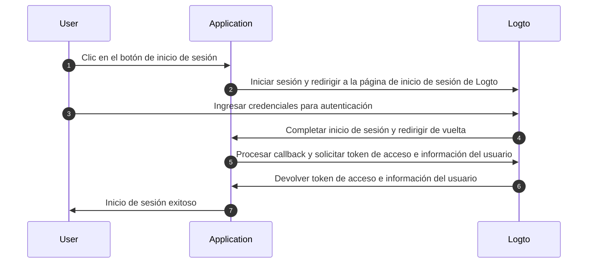
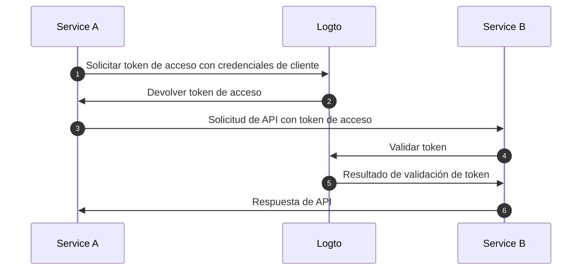
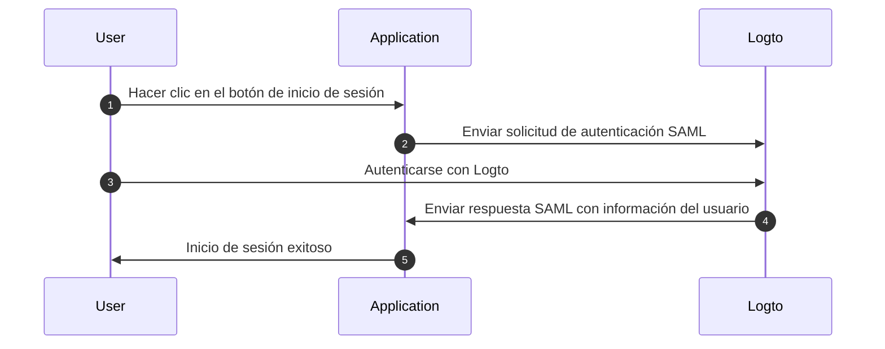

# Comprender el flujo de autenticación OIDC

Logto está construido sobre los estándares [OAuth 2.0](https://auth.wiki/oauth-2.0) y [OpenID Connect (OIDC)](https://auth.wiki/openid-connect). Comprender estos estándares de autenticación hará que el proceso de integración sea más fluido y sencillo.

### Flujo de autenticación de usuario \{#user-authentication-flow}

Esto es lo que sucede cuando un usuario inicia sesión con Logto:

En este flujo, varios conceptos clave son esenciales para el proceso de integración:

- `Application`: Esto representa tu aplicación en Logto. Crearás una configuración de aplicación en el Logto Console para establecer una conexión entre tu aplicación real y los servicios de Logto. Aprende más sobre [Application](/integrate-logto/application-data-structure/#introduction).
- `Redirect URI`: Después de que los usuarios completen la autenticación en la página de inicio de sesión de Logto, Logto los redirige de vuelta a tu aplicación a través de este URI. Necesitarás configurar el Redirect URI en la configuración de tu aplicación. Para más detalles, consulta [Redirect URIs](/integrate-logto/application-data-structure/#redirect-uris).
- `Handle sign-in callback`: Cuando Logto redirige a los usuarios de vuelta a tu aplicación, tu aplicación necesita procesar los datos de autenticación y solicitar tokens de acceso e información del usuario. No te preocupes: el Logto SDK maneja esto automáticamente.

Este resumen cubre lo esencial para una integración rápida. Para una comprensión más profunda, consulta nuestra guía [Sign-in experience explained](/concepts/sign-in-experience/).

### Flujo de autenticación máquina a máquina \{#machine-to-machine-authentication-flow}

Logto proporciona el tipo de [aplicación máquina a máquina (M2M)](/quick-starts/m2m) para habilitar la autenticación directa entre servicios, basado en el [flujo de credenciales de cliente de OAuth 2.0](https://auth.wiki/client-credentials-flow):

Este flujo de autenticación máquina a máquina (M2M) está diseñado para aplicaciones que necesitan comunicarse directamente con recursos sin interacción del usuario (por lo tanto, sin interfaz de usuario), como un servicio de API actualizando datos de usuario en Logto o un servicio de estadísticas extrayendo pedidos diarios.

En este flujo, los servicios se autentican utilizando credenciales de cliente: una combinación de [Application ID](/integrate-logto/application-data-structure/#application-id) y [Application Secret](/integrate-logto/application-data-structure/#application-secret) que identifica y autentica de manera única al servicio. Estas credenciales sirven como la identidad del servicio al solicitar [tokens de acceso](https://auth.wiki/access-token) de Logto.

### Flujo de autenticación SAML \{#saml-authentication-flow}

Además de OAuth 2.0 y OIDC, Logto también admite la autenticación SAML (Security Assertion Markup Language), actuando como un Proveedor de Identidad (IdP) para habilitar la integración con aplicaciones empresariales. Actualmente, Logto admite el flujo de autenticación iniciado por SP:

#### Flujo iniciado por SP \{#saml-authentication-flow-sp-init}

En el flujo iniciado por SP, el proceso de autenticación comienza desde el Proveedor de Servicios (tu aplicación):

En este flujo:

- El usuario inicia el proceso de autenticación desde tu aplicación (Proveedor de Servicios)
- Tu aplicación genera una solicitud SAML y redirige al usuario a Logto (Proveedor de Identidad)
- Después de una autenticación exitosa en Logto, se envía una respuesta SAML de vuelta a tu aplicación
- Tu aplicación procesa la respuesta SAML y completa la autenticación

#### Flujo iniciado por IdP \{#saml-authentication-flow-idp-init}

Logto admitirá el flujo iniciado por IdP en futuras versiones, permitiendo a los usuarios iniciar el proceso de autenticación directamente desde el portal de Logto. Mantente atento a las actualizaciones sobre esta función.

Esta integración SAML permite a las aplicaciones empresariales aprovechar Logto como su proveedor de identidad, admitiendo tanto proveedores de servicios modernos como basados en SAML heredados.

## Recursos relacionados \{#related-resources}

<Url href="https://blog.logto.io/secure-cloud-apps-with-oauth-and-openid-connect">
  Blog: Asegura aplicaciones basadas en la nube con OAuth 2.0 y OpenID Connect
</Url>

<Url href="https://blog.logto.io/sso-is-better">
  Por qué el inicio de sesión único (SSO) para múltiples aplicaciones es mejor
</Url>

<Url href="https://blog.logto.io/centralized-identity-system">
  Por qué necesitas un sistema de identidad centralizado para un negocio con múltiples aplicaciones
</Url>
