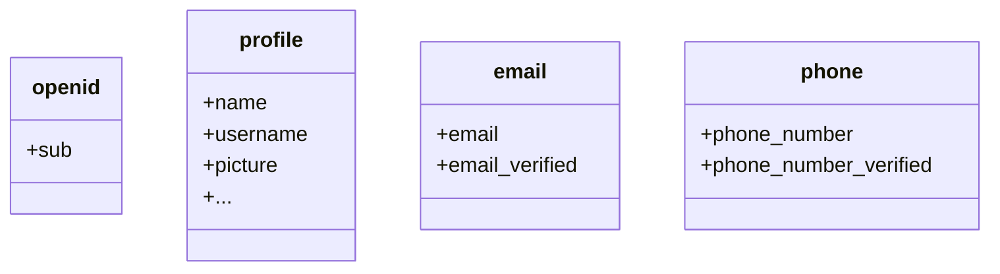

De forma predeterminada, se devuelven reclamos limitados. Si necesitas más información, puedes solicitar alcances adicionales para acceder a más reclamos.

:::info
Un "reclamo (Claim)" es una afirmación hecha sobre un sujeto; un "alcance (Scope)" es un grupo de reclamos. En el caso actual, un reclamo es una pieza de información sobre el usuario.
:::

Aquí tienes un ejemplo no normativo de la relación alcance - reclamo:

:::tip
El reclamo "sub" significa "sujeto", que es el identificador único del usuario (es decir, el ID del usuario).
:::

El SDK de Logto siempre solicitará tres alcances: `openid`, `profile` y `offline_access`.
