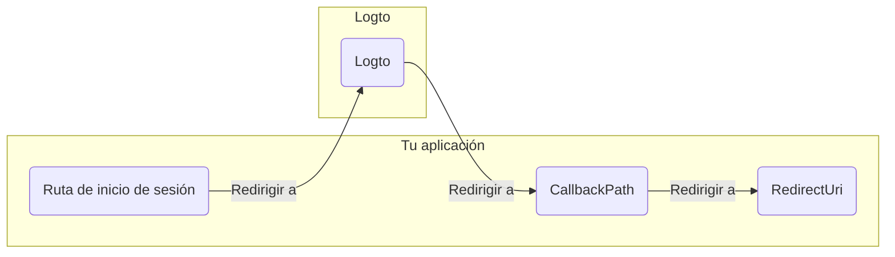

import RegardingRedirectBasedSignIn from '../../fragments/_regarding-redirect-based-sign-in.mdx';

Antes de continuar, hay dos términos confusos en el middleware de autenticación de .NET Core que necesitamos aclarar:

1. **CallbackPath**: El URI al que Logto redirigirá al usuario después de que haya iniciado sesión (el "URI de redirección" en Logto).
2. **RedirectUri**: El URI al que se redirigirá después de que se hayan realizado las acciones necesarias en el middleware de autenticación de Logto.

El proceso de inicio de sesión se puede ilustrar de la siguiente manera:

 

De manera similar, .NET Core también tiene **SignedOutCallbackPath** y **RedirectUri** para el flujo de cierre de sesión.

Para mayor claridad, los referiremos de la siguiente manera:

| Término que usamos                                | Término de .NET Core  |
| ------------------------------------------------- | --------------------- |
| URI de redirección de Logto                       | CallbackPath          |
| URI de redirección post cierre de sesión de Logto | SignedOutCallbackPath |
| URI de redirección de la aplicación               | RedirectUri           |

<RegardingRedirectBasedSignIn />
