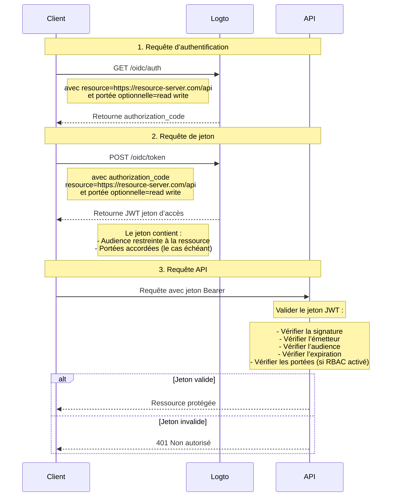

# Protégez votre API

Si vous n'avez pas besoin de politiques de contrôle d'accès flexibles et granulaires, vous pouvez simplement protéger votre API directement. Nous vous guiderons à travers un diagramme de séquence et les étapes nécessaires pour intégrer le contrôle d'accès dans votre application.



Dans ce tutoriel

- Point de terminaison Logto : `https://tenant-id.logto.app`
- Application cliente : `https://client.example.org`
- Serveur de ressources API : `https://resource-server.com/api`

Vous devez remplacer ceux-ci par vos points de terminaison réels lors de la mise en œuvre.

## Requête d’authentification \{#authentication-request}

Fournissez une liste de paramètres d'indicateur de ressource dans une [Requête d’authentification](https://openid.net/specs/openid-connect-core-1_0.html#AuthRequest). Cela indiquera toutes les ressources protégées que l'utilisateur peut demander.

```bash
GET https://tenant-id.logto.app/oidc/auth?response_type=code
    &client_id=s6BhdRkqt3
    &state=tNwzQ87pC6llebpmac_IDeeq-mCR2wLDYljHUZUAWuI
    &redirect_uri=https%3A%2F%2Fclient.example.org%2Fcb
    &resource=https%3A%2F%2Fresource-server.com%2Fapi
    &scope=read%20write
```

Logto validera et stockera ces indicateurs de ressource. Un `authorization_code` sera accordé et retourné avec des portées restreintes à ces ressources spécifiées.

Exemple de configuration du SDK Logto :

```tsx
const config: LogtoConfig = {
  // ...autres configurations
  resources: ['https://resource-server.com/api'],
  scopes: ['read', 'write'],
};
```

## Requête de jeton \{#token-request}

Lorsque le paramètre de ressource est présent dans une [Requête de jeton](https://openid.net/specs/openid-connect-core-1_0.html#TokenRequest) avec le `authorization_code` accordé ci-dessus, il spécifiera l'audience de la ressource API cible du jeton d’accès demandé.

```bash
POST https://tenant-id.logto.app/oidc/token HTTP/1.1
Content-Type: application/x-www-form-urlencoded

grant_type=authorization_code&redirect_uri=https%3A%2F%2Fclient.example.org%2Fcb&code=10esc29BWC2qZB0acc9v8zAv9ltc2pko105tQauZ&resource=https%3A%2F%2Fresource-server.com%2Fapi
```

Un jeton d’accès chiffré avec l'audience restreinte à cette ressource demandée sera accordé par Logto. Le jeton contient toutes les données dont vous aurez besoin pour représenter le statut d'autorisation de la requête. Par exemple, l'identité et le rôle de l'utilisateur de la requête, l'audience du jeton et le temps d'expiration.

Exemple de code du SDK Logto :

```tsx
const accessToken = await logtoClient.getAccessToken('https://resource-server.com/api');
```

La charge utile de l'accessToken contiendra :

```tsx
{
  iss: '<your-logto-endpoint>/oidc',
  aud: 'https://resource-server.com/api',
  scope: 'read write'
}
```

## Requête à la ressource API \{#request-to-the-api-resource}

L'utilisateur client a envoyé une requête à la ressource API en présentant le `access_token` donné dans l'en-tête Authorization.

```bash
GET https://resource-server.com/api/users
Authorization: Bearer eyJhbGciOiJIUz...
```

Logto suit le protocole standard d'autorisation basé sur les jetons pour protéger vos ressources API. Pour en savoir plus sur OAuth 2.0, veuillez vous référer au [document officiel](https://datatracker.ietf.org/doc/html/rfc6749#section-1.3.1) d'OAuth 2.0.

## Valider les jetons d’autorisation pour les requêtes API \{#validate-authorization-tokens-for-api-requests}

Logto émet un jeton d’autorisation au format standard [JWT](https://datatracker.ietf.org/doc/html/rfc7519) pour chaque requête API autorisée. Le jeton est chiffré et signé en tant que jeton [JWS](https://datatracker.ietf.org/doc/html/rfc7515).

#### Comprendre le jeton JWS \{#understanding-jws-token}

Un jeton [JWS](https://datatracker.ietf.org/doc/html/rfc7515) encodé est construit avec trois parties :

- En-tête JOSE : Déclare le type de code et l'algorithme de codage
- Charge utile JWS : Inclut toutes les revendications du jeton
- Signature JWS : Signature signée avec [JWK](https://datatracker.ietf.org/doc/html/rfc7517)

Un schéma standard de la charge utile JWS émise par Logto : (les revendications peuvent varier, en fonction de votre configuration OIDC personnalisée)

| clé       | description                     |
| --------- | ------------------------------- |
| jti       | ID JWT unique                   |
| sub       | sujet, généralement user-id     |
| iat       | horodatage du jeton émis à      |
| exp       | horodatage du jeton expirant à  |
| client_id | ID de l'application             |
| iss       | identité de l’émetteur du jeton |
| aud       | audience du jeton               |
| scope     | portées (permissions) du jeton  |

:::note

Pour le développement, pour inspecter visuellement un jeton JWT, vous pouvez visiter un [outil de décodage JWT](https://www.jstoolset.com/jwt) pour décoder et vérifier les jetons que vous avez reçus. Soyez prudent ou n'utilisez jamais les jetons d'un environnement de production. Comme il s'agit d'un service en ligne public fourni par un tiers, votre jeton peut être exposé.

:::

#### Valider le jeton d’autorisation \{#validate-the-authorization-token}

1. [Validation d'un JWT](https://datatracker.ietf.org/doc/html/rfc7519#section-7.2)
2. [Validation de la signature JWS](https://datatracker.ietf.org/doc/html/rfc7515#section-5.2)
3. L'émetteur du jeton est `https://<your-logto-domain>/oidc` (émis par votre serveur d'authentification Logto)
4. L'audience du jeton est égale à l'indicateur de ressource du récepteur actuel enregistré dans la console d'administration Logto
5. Le jeton est dans son temps d'expiration
6. ([RBAC](/authorization/role-based-access-control/protect-api-resources-with-rbac) uniquement) Le jeton a la `scope` souhaitée

Il existe diverses bibliothèques et packages open-source qui peuvent vous aider à valider et décoder facilement un jeton JWT. Vous pouvez en choisir un et l'intégrer à votre application backend en fonction du langage et du framework que vous utilisez. Veuillez consulter certains des exemples que nous avons :

- [Node (Express)](/authorization/api-resources/node-express)
- [Spring Boot](/authorization/api-resources/spring-boot)
- [Python](/authorization/api-resources/python)

## Référence \{#reference}

Logto utilise le protocole d'autorisation OAuth 2.0 basé sur le code pour sécuriser votre requête API. Si vous êtes intéressé par la stratégie qui le sous-tend, consultez la [spécification](https://datatracker.ietf.org/doc/html/rfc6749#section-1.3.1) d'OAuth 2.0 pour plus de détails.

## FAQs \{#faqs}

<details>

<summary>

### Comment tester l'interaction côté client, Logto et côté serveur sans construire le client ? \{#how-to-test-the-client-side-logto-and-server-side-interaction-without-building-the-client}

</summary>

Vous pouvez automatiser ce processus sans avoir besoin de construire le client. Une option consiste à utiliser un jeton d'accès personnel (PAT). Un PAT vous permet de simuler l'authentification côté client en représentant un utilisateur spécifique, avec différents rôles et permissions. Cela peut être utilisé pour tester votre logique côté serveur, telle que la validation du jeton d’accès ou du JWT, sans avoir besoin d'un client entièrement construit. Pour commencer, consultez le [jeton d'accès personnel](/user-management/personal-access-token).

</details>
