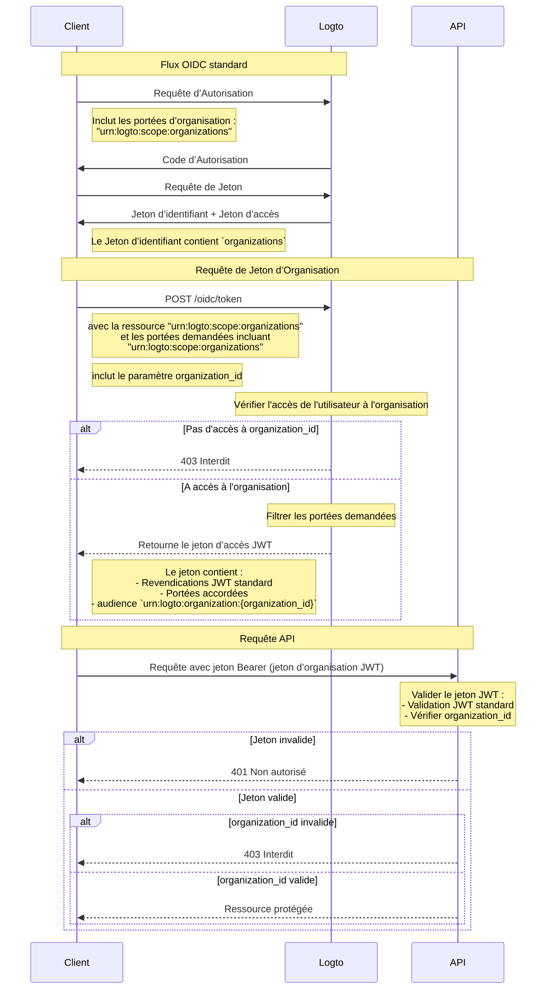

import TabItem from '@theme/TabItem';
import Tabs from '@theme/Tabs';

# Protéger les ressources de l'organisation

En plus de [Protéger votre API](/authorization/api-resources/protect-your-api) qui prend l'API comme ressource, l'organisation peut également être une ressource, et protéger votre ressource d'organisation de la même manière. Dans cet article, nous nous concentrerons sur la façon de changer pour protéger votre ressource d'organisation de manière similaire.



## Étape 1 : Obtenir les identifiants d'organisation à partir du flux OIDC \{#step-1-get-organization-ids-from-oidc-flow}

Logto étend le protocole standard [OpenID Connect](https://openid.net/specs/openid-connect-core-1_0.html) pour permettre à votre application d'obtenir les informations de l'organisation de l'utilisateur. Il existe deux façons de le faire :

- Si vous utilisez un SDK Logto avec prise en charge des Organisations, vous pouvez ajouter la portée `urn:logto:scope:organizations` au paramètre `scopes` de l'objet de configuration. Habituellement, le SDK aura un enum pour cette portée, par exemple `UserScope.Organizations` dans les [SDK Logto JS](https://github.com/logto-io/js).

<Tabs groupId="sdk">

  <TabItem value="js" label="JavaScript">

```ts
import { LogtoClient, UserScope } from '@logto/browser'; // ou @logto/node, @logto/client

const logto = new LogtoClient({
  // ...
  scopes: [UserScope.Organizations],
});
```

  </TabItem>
  <TabItem value="react" label="React">

```tsx
import { LogtoProvider, UserScope } from '@logto/react';

const App = () => (
  <LogtoProvider
    config={{
      // ...
      scopes: [UserScope.Organizations],
    }}
  >
    {/* ... */}
  </LogtoProvider>
);
```

  </TabItem>
  <TabItem value="python" label="Python">

```python
from logto import UserInfoScope

client = LogtoClient(
    LogtoConfig(
        # ...
        scopes=[UserInfoScope.organizations],
    )
)
```

  </TabItem>
  <TabItem value="php" label="PHP">

```php
use Logto\Sdk\Constants\UserScope;

$client = new LogtoClient(
  new LogtoConfig(
    // ...
    scopes: [UserScope::organizations],
  )
);
```

  </TabItem>
  <TabItem value="swift" label="Swift">

```swift
import Logto
import LogtoClient

let config = try? LogtoConfig(
    // ...
    scopes: [
        UserScope.organizations.rawValue,
    ],
    // ...
)
let client = LogtoClient(useConfig: config)
```

  </TabItem>
  <TabItem value="others" label="Autres">

```ts
const config = {
  // ...
  scope: 'openid offline_access urn:logto:scope:organizations',
};
```

  </TabItem>

</Tabs>
    
- Pour d'autres cas, vous devez ajouter la portée `urn:logto:scope:organizations` au paramètre `scope` de la configuration du SDK (ou de la requête d'authentification).

Une fois que l'utilisateur a terminé le flux d'authentification, vous pouvez obtenir les informations de l'organisation à partir du `idToken` :

```tsx
// Utiliser JavaScript comme exemple
const idToken = await logto.getIdTokenClaims();

console.log(idToken.organizations); // Un tableau de chaînes d'identifiants d'organisation
```

Le champ `organizations` (revendication) sera également inclus dans la réponse du [point de terminaison UserInfo](https://openid.net/specs/openid-connect-core-1_0.html#UserInfo).

### Optionnel : Obtenir les rôles d'organisation \{#optional-get-organization-roles}

Si vous n'avez pas encore configuré les rôles d'organisation, consultez [cette section](/authorization/organization-template/configure-organization-template/#create-organization-role).

Pour obtenir tous les rôles d'organisation de l'utilisateur actuel :

- Si vous utilisez un SDK Logto avec prise en charge des Organisations, vous pouvez ajouter la portée `urn:logto:scope:organization_roles` au paramètre `scopes` de l'objet de configuration. Habituellement, le SDK aura un enum pour cette portée, par exemple `UserScope.OrganizationRoles` dans les [SDK Logto JS](https://github.com/logto-io/js).
- Pour d'autres cas, vous devez ajouter la portée `urn:logto:scope:organization_roles` au paramètre `scope` de la configuration du SDK (ou de la requête d'authentification).

Ensuite, vous pouvez obtenir les rôles d'organisation à partir du `idToken` :

```tsx
// Utiliser JavaScript comme exemple
const idToken = await logto.getIdTokenClaims();

console.log(idToken.organization_roles); // Un tableau de chaînes de rôles d'organisation
```

Chaque chaîne dans le tableau est au format `organization_id:role_id`, par exemple `org_123:admin` signifie que l'utilisateur a le rôle `admin` dans l'organisation avec l'identifiant `org_123`.

Le champ `organization_roles` (revendication) sera également inclus dans la réponse du [point de terminaison UserInfo](https://openid.net/specs/openid-connect-core-1_0.html#UserInfo).

## Étape 2. Récupérer le jeton d'organisation \{#step-2-fetch-organization-token}

Pour effectuer des actions dans le contexte d'une organisation, l'utilisateur doit se voir accorder un jeton d’accès pour cette organisation (jeton d’organisation). Le jeton d’organisation est un jeton JWT qui contient l'identifiant de l'organisation et les permissions (portées) de l'utilisateur dans l'organisation.

### Ajouter des paramètres à la requête d'authentification \{#add-parameters-to-the-authentication-request}

- Si vous utilisez un SDK Logto avec prise en charge des Organisations, vous pouvez ajouter la portée `urn:logto:scope:organizations` au paramètre `scopes` de l'objet de configuration, de la même manière que [Obtenir les identifiants d'organisation de l'utilisateur actuel](/authorization/organization-template/protect-organization-resources/#step-1-get-organization-ids-from-oidc-flow).
  - Le SDK Logto avec prise en charge des Organisations gérera automatiquement le reste de la configuration.
- Pour d'autres cas, vous devez ajouter les portées `offline_access` et `urn:logto:scope:organizations` au paramètre `scope` et la ressource `urn:logto:resource:organizations` au paramètre `resource` de la configuration du SDK (ou de la requête d'authentification).
  - Remarque : `offline_access` est requis pour obtenir le `refresh_token` qui peut être utilisé pour récupérer des jetons d'organisation.

```tsx
// Uniquement pour d'autres cas. Pour les SDK Logto, voir ci-dessus.
const config = {
  // ...
  scope: 'openid offline_access urn:logto:scope:organizations',
  resource: 'urn:logto:resource:organizations',
};
```

:::note

La ressource `urn:logto:resource:organizations` est une ressource spéciale qui représente le modèle d'organisation.

:::

### Récupérer le jeton d'organisation \{#fetch-the-organization-token}

Logto étend le type de subvention standard `refresh_token` pour permettre à votre application de récupérer des jetons d'organisation.

- Si vous utilisez un SDK Logto avec prise en charge des Organisations, vous pouvez appeler la méthode `getOrganizationToken()` (ou la méthode `getOrganizationTokenClaims()`) du SDK.
- Pour d'autres cas, vous devez appeler le point de terminaison du jeton avec les paramètres suivants :
  - `grant_type` : `refresh_token`.
  - `client_id` : L'identifiant de l'application que l'utilisateur a utilisé pour s'authentifier.
  - `refresh_token` : Le `refresh_token` que vous avez obtenu du flux d'authentification.
  - `organization_id` : L'identifiant de l'organisation pour laquelle vous souhaitez obtenir le jeton.
  - `scope` (optionnel) : Les portées que vous souhaitez accorder à l'utilisateur dans l'organisation. Si non spécifié, le serveur d'autorisation essaiera d'accorder les mêmes portées que le flux d'authentification.

<Tabs groupId="sdk">

  <TabItem value="js" label="JavaScript">

```ts
const token = await logto.getOrganizationToken('<organization-id>');
```

  </TabItem>
  <TabItem value="react" label="React">

```tsx
const App = () => {
  const { getOrganizationToken } = useLogto();

  const getToken = async () => {
    const token = await getOrganizationToken('<organization-id>');
  };

  return <button onClick={getToken}>Obtenir le jeton d'organisation</button>;
};
```

  </TabItem>
  <TabItem value="python" label="Python">

```python
token = await client.getOrganizationToken("<organization-id>")
# ou
claims = await client.getOrganizationTokenClaims("<organization-id>")
```

  </TabItem>
  <TabItem value="php" label="PHP">

```php
$token = $client->getOrganizationToken('<organization-id>');
// ou
$claims = $client->getOrganizationTokenClaims('<organization-id>');
```

  </TabItem>
  <TabItem value="swift" label="Swift">

```swift
let token = try await client.getOrganizationToken(forId: "<organization-id>")
```

  </TabItem>
  <TabItem value="others" label="Autres">

```ts
// Utiliser JavaScript comme exemple

const params = new URLSearchParams();

params.append('grant_type', 'refresh_token');
params.append('client_id', 'YOUR_CLIENT_ID');
params.append('refresh_token', 'REFRESH_TOKEN');
params.append('organization_id', 'org_123');

const response = await fetch('https://YOUR_LOGTO_ENDPOINT/oidc/token', {
  method: 'POST',
  headers: {
    'Content-Type': 'application/x-www-form-urlencoded',
  },
  body: params,
});
```

  </TabItem>

</Tabs>

La réponse sera au même format que le [point de terminaison standard du jeton](https://openid.net/specs/openid-connect-core-1_0.html#TokenEndpoint), et le `access_token` est le jeton d'organisation au format JWT.

En plus des revendications régulières d'un jeton d’accès, le jeton d'organisation contient également les revendications suivantes :

- `aud` : L'audience du jeton d'organisation est `urn:logto:organization:{organization_id}`.
- `scope` : Les portées accordées à l'utilisateur dans l'organisation avec un espace comme délimiteur.

### Exemple \{#example}

Un bon exemple peut valoir mille mots. Supposons que notre modèle d'organisation ait la configuration suivante :

- Permissions : `read:logs`, `write:logs`, `read:users`, `write:users`.
- Rôles : `admin`, `member`.
  - Le rôle `admin` a toutes les permissions.
  - Le rôle `member` a les permissions `read:logs` et `read:users`.

Et l'utilisateur a la configuration suivante :

- Identifiants d'organisation : `org_1`, `org_2`.
- Rôles d'organisation : `org_1:admin`, `org_2:member`.

Dans la configuration du SDK Logto (ou la requête d'authentification), nous avons configuré d'autres éléments correctement, et ajouté les portées suivantes :

- `urn:logto:scope:organizations`
- `openid`
- `offline_access`
- `read:logs`
- `write:logs`

Maintenant, lorsque l'utilisateur termine le flux d'authentification, nous pouvons obtenir les identifiants d'organisation à partir du `idToken` :

```tsx
// Utiliser JavaScript comme exemple
const idToken = await logto.getIdTokenClaims();

console.log(idToken.organizations); // ['org_1', 'org_2']
```

Si nous voulons obtenir les jetons d'organisation :

```tsx
// Utiliser JavaScript comme exemple
const org1Token = await logto.getOrganizationTokenClaims('org_1');
const org2Token = await logto.getOrganizationTokenClaims('org_2');

console.log(org1Token.aud); // 'urn:logto:organization:org_1'
console.log(org1Token.scope); // 'read:logs write:logs'
console.log(org2Token.aud); // 'urn:logto:organization:org_2'
console.log(org2Token.scope); // 'read:logs'

const org3Token = await logto.getOrganizationTokenClaims('org_3'); // Erreur : L'utilisateur n'est pas membre de l'organisation
```

Explication :

- Pour `org_1`, l'utilisateur a le rôle `admin`, donc le jeton d'organisation devrait avoir toutes les permissions disponibles (portées).
- Pour `org_2`, l'utilisateur a le rôle `member`, donc le jeton d'organisation devrait avoir les permissions `read:logs` et `read:users` (portées).

Puisque nous avons seulement demandé les portées `read:logs` et `write:logs` dans le flux d'authentification, les jetons d'organisation ont été "réduits" en conséquence, résultant en l'intersection des portées demandées et des portées disponibles.

### Récupérer le jeton d'organisation pour une application machine-à-machine \{#fetch-organization-token-for-a-machine-to-machine-application}

Similaire à la récupération des jetons d'organisation pour les utilisateurs, vous pouvez également récupérer des jetons d'organisation pour des applications machine-à-machine. La seule différence est que vous devez utiliser le type de subvention `client_credentials` au lieu du type de subvention `refresh_token`.

Pour en savoir plus sur les applications machine-à-machine, voir [Machine-to-machine : Auth avec Logto](/quick-starts/m2m/).

## Étape 3. Vérifier les jetons d'organisation \{#step-3-verify-organization-tokens}

Une fois que l'application obtient un jeton d'organisation, elle peut utiliser le jeton de la même manière qu'un jeton d’accès régulier, par exemple appeler les API avec le jeton dans l'en-tête `Authorization` au format `Bearer {token}`.

Dans votre API, la façon dont vous vérifiez le jeton d'organisation est assez similaire à [Protéger votre API](/authorization/api-resources/protect-your-api/#validate-authorization-tokens-for-api-requests). Principales différences :

- Contrairement aux jetons d’accès pour les ressources API, un utilisateur NE PEUT PAS obtenir un jeton d'organisation si l'utilisateur n'est pas membre de l'organisation.
- L'audience du jeton d'organisation est `urn:logto:organization:{organization_id}`.
- Pour certaines permissions (portées), vous devez vérifier la revendication `scope` du jeton d'organisation en divisant la chaîne avec un espace comme délimiteur.
